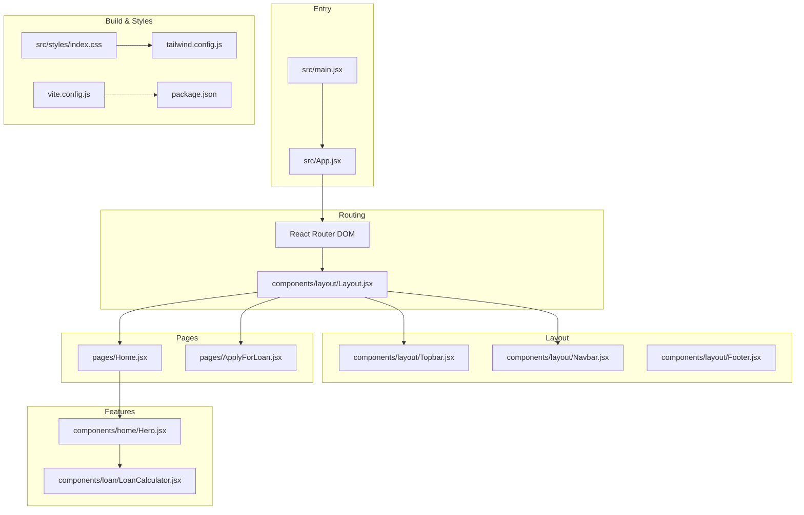
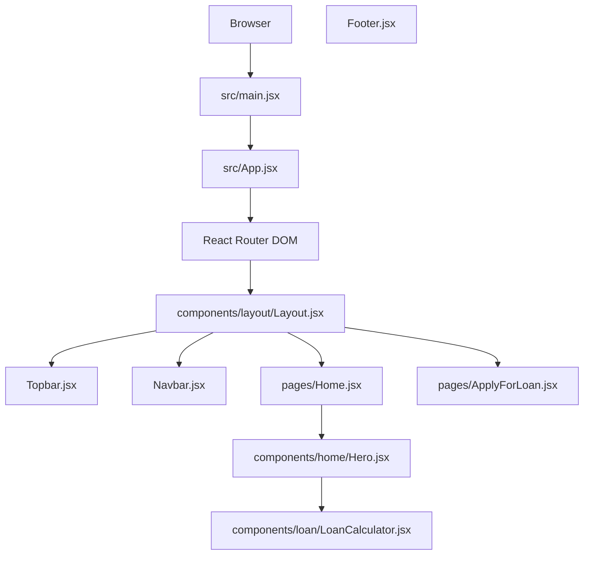
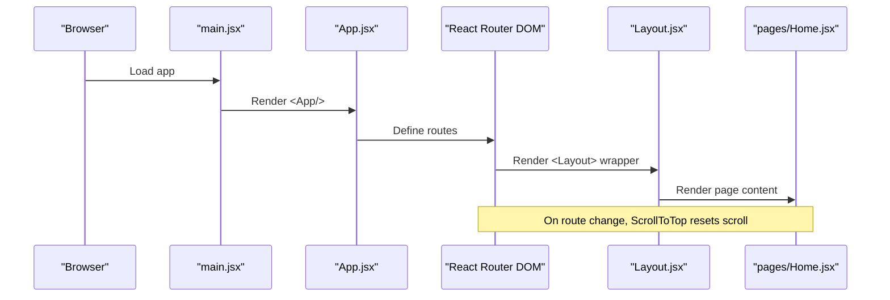
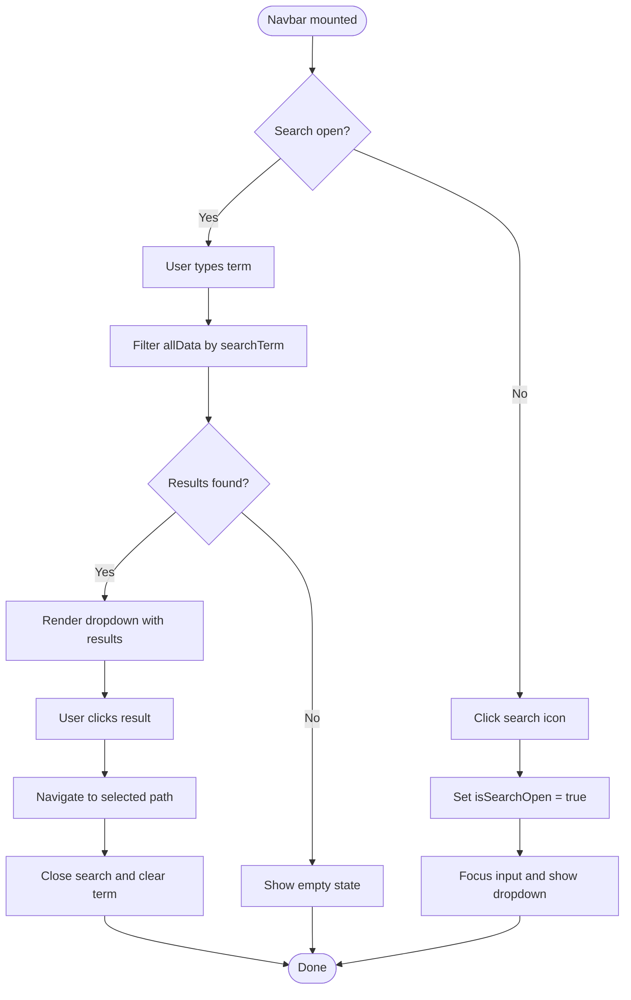
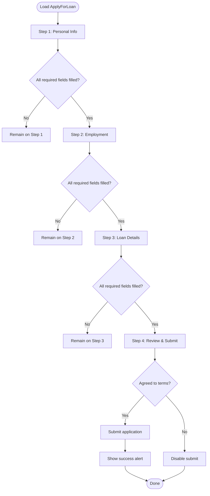
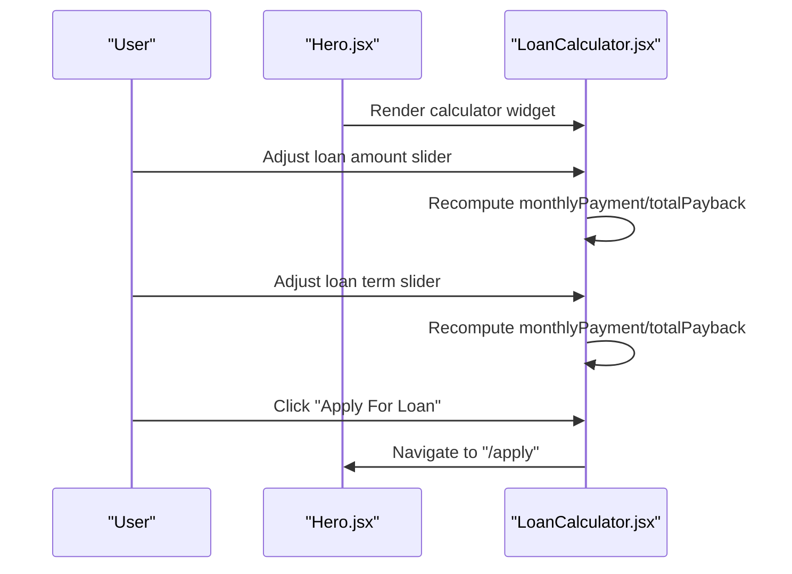
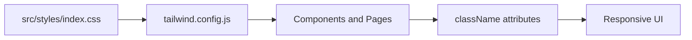
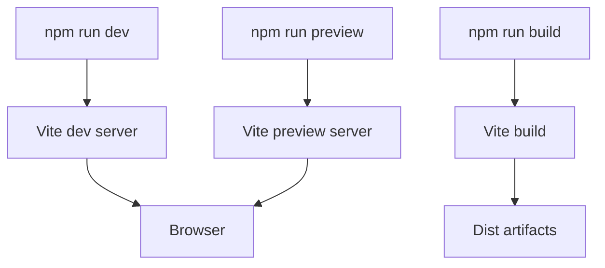
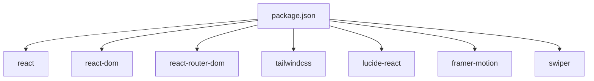

# Architecture Overview

<cite>
**Referenced Files in This Document**
- [App.jsx](file://src/App.jsx)
- [main.jsx](file://src/main.jsx)
- [Layout.jsx](file://src/components/layout/Layout.jsx)
- [Navbar.jsx](file://src/components/layout/Navbar.jsx)
- [Topbar.jsx](file://src/components/layout/Topbar.jsx)
- [Footer.jsx](file://src/components/layout/Footer.jsx)
- [Hero.jsx](file://src/components/home/Hero.jsx)
- [LoanCalculator.jsx](file://src/components/loan/LoanCalculator.jsx)
- [Home.jsx](file://src/pages/Home.jsx)
- [ApplyForLoan.jsx](file://src/pages/ApplyForLoan.jsx)
- [ScrollToTop.jsx](file://src/ScrollToTop.jsx)
- [index.css](file://src/styles/index.css)
- [package.json](file://package.json)
- [vite.config.js](file://vite.config.js)
- [tailwind.config.js](file://tailwind.config.js)
</cite>

## Table of Contents
1. [Introduction](#introduction)
2. [Project Structure](#project-structure)
3. [Core Components](#core-components)
4. [Architecture Overview](#architecture-overview)
5. [Detailed Component Analysis](#detailed-component-analysis)
6. [Dependency Analysis](#dependency-analysis)
7. [Performance Considerations](#performance-considerations)
8. [Troubleshooting Guide](#troubleshooting-guide)
9. [Conclusion](#conclusion)
10. [Appendices](#appendices)

## Introduction
This document describes the architecture of the Easilon Financial Solutions application. It focuses on the component-based architecture, routing with React Router DOM, layout composition, state management with React hooks, responsive design with Tailwind CSS, and the Vite build pipeline. The goal is to explain how pages and components interact, where system boundaries lie, and how design choices support scalability and maintainability.

## Project Structure
The application follows a feature-based and layer-based organization:
- Entry point initializes the React root and renders the App shell.
- App configures routing and wraps most pages with a shared Layout.
- Layout composes Topbar, Navbar, main content area, and Footer.
- Feature-specific components live under components/<feature>.
- Page components live under pages and are rendered by routes.
- Styles are managed via Tailwind CSS with a custom configuration.

**Diagram sources**
- [main.jsx](file://src/main.jsx#L1-L11)
- [App.jsx](file://src/App.jsx#L1-L43)
- [Layout.jsx](file://src/components/layout/Layout.jsx#L1-L20)
- [Topbar.jsx](file://src/components/layout/Topbar.jsx#L1-L55)
- [Navbar.jsx](file://src/components/layout/Navbar.jsx#L1-L156)
- [Footer.jsx](file://src/components/layout/Footer.jsx#L1-L117)
- [Home.jsx](file://src/pages/Home.jsx#L1-L297)
- [ApplyForLoan.jsx](file://src/pages/ApplyForLoan.jsx#L1-L479)
- [Hero.jsx](file://src/components/home/Hero.jsx#L1-L125)
- [LoanCalculator.jsx](file://src/components/loan/LoanCalculator.jsx#L1-L117)
- [vite.config.js](file://vite.config.js#L1-L8)
- [package.json](file://package.json#L1-L36)
- [tailwind.config.js](file://tailwind.config.js#L1-L24)
- [index.css](file://src/styles/index.css#L1-L12)

**Section sources**
- [main.jsx](file://src/main.jsx#L1-L11)
- [App.jsx](file://src/App.jsx#L1-L43)
- [Layout.jsx](file://src/components/layout/Layout.jsx#L1-L20)
- [index.css](file://src/styles/index.css#L1-L12)
- [vite.config.js](file://vite.config.js#L1-L8)
- [package.json](file://package.json#L1-L36)
- [tailwind.config.js](file://tailwind.config.js#L1-L24)

## Core Components
- App: Declares routes and wraps page components with Layout except authentication pages. Uses ScrollToTop to reset scroll position on route changes.
- Layout: Provides a consistent page scaffold with Topbar, Navbar, main content area, and Footer.
- Navbar: Implements desktop/mobile navigation, a search bar with dynamic results, cart action, and apply-for-loan CTA.
- Topbar: Displays contact info and quick links; integrates social icons.
- Footer: Presents company info, explore links, loan services, and contact details.
- Home: Aggregates Hero and multiple marketing sections; composes reusable components.
- Hero: Carousel-like hero with animated slides and a LoanCalculator widget.
- LoanCalculator: Interactive widget computing monthly payment and total payback based on user inputs.
- ApplyForLoan: Multi-step form collecting personal, employment, loan, and review details.

Key design patterns:
- Composition over inheritance: Layout composes smaller components.
- Hooks-based state: Local state for UI interactivity and calculations.
- Route-based rendering: Pages are rendered as route elements.

**Section sources**
- [App.jsx](file://src/App.jsx#L1-L43)
- [Layout.jsx](file://src/components/layout/Layout.jsx#L1-L20)
- [Topbar.jsx](file://src/components/layout/Topbar.jsx#L1-L55)
- [Navbar.jsx](file://src/components/layout/Navbar.jsx#L1-L156)
- [Footer.jsx](file://src/components/layout/Footer.jsx#L1-L117)
- [Home.jsx](file://src/pages/Home.jsx#L1-L297)
- [Hero.jsx](file://src/components/home/Hero.jsx#L1-L125)
- [LoanCalculator.jsx](file://src/components/loan/LoanCalculator.jsx#L1-L117)
- [ApplyForLoan.jsx](file://src/pages/ApplyForLoan.jsx#L1-L479)

## Architecture Overview
The system is a client-side React application structured around:
- Routing: Centralized in App.jsx with React Router DOM.
- Layout: Shared container in Layout.jsx wrapping most pages.
- Components: Reusable building blocks under components/.
- Pages: Route handlers under pages/.
- Styling: Tailwind CSS with a custom theme and global styles.
- Build: Vite with React plugin.

**Diagram sources**
- [main.jsx](file://src/main.jsx#L1-L11)
- [App.jsx](file://src/App.jsx#L1-L43)
- [Layout.jsx](file://src/components/layout/Layout.jsx#L1-L20)
- [Topbar.jsx](file://src/components/layout/Topbar.jsx#L1-L55)
- [Navbar.jsx](file://src/components/layout/Navbar.jsx#L1-L156)
- [Footer.jsx](file://src/components/layout/Footer.jsx#L1-L117)
- [Home.jsx](file://src/pages/Home.jsx#L1-L297)
- [ApplyForLoan.jsx](file://src/pages/ApplyForLoan.jsx#L1-L479)
- [Hero.jsx](file://src/components/home/Hero.jsx#L1-L125)
- [LoanCalculator.jsx](file://src/components/loan/LoanCalculator.jsx#L1-L117)

## Detailed Component Analysis

### Routing and Layout System
- App.jsx defines routes for all pages and wraps them with Layout except authentication routes. It also mounts ScrollToTop to reset scroll position on navigation.
- Layout.jsx composes Topbar, Navbar, main content area, and Footer, ensuring a consistent look-and-feel across pages.

**Diagram sources**
- [main.jsx](file://src/main.jsx#L1-L11)
- [App.jsx](file://src/App.jsx#L1-L43)
- [Layout.jsx](file://src/components/layout/Layout.jsx#L1-L20)
- [Home.jsx](file://src/pages/Home.jsx#L1-L297)
- [ScrollToTop.jsx](file://src/ScrollToTop.jsx#L1-L14)

**Section sources**
- [App.jsx](file://src/App.jsx#L1-L43)
- [Layout.jsx](file://src/components/layout/Layout.jsx#L1-L20)
- [ScrollToTop.jsx](file://src/ScrollToTop.jsx#L1-L14)

### Navigation and Search
- Navbar manages mobile/desktop menus, a search input with filtered results, cart navigation, and apply-for-loan CTA.
- Search filters a static dataset and navigates on selection.

**Diagram sources**
- [Navbar.jsx](file://src/components/layout/Navbar.jsx#L1-L156)

**Section sources**
- [Navbar.jsx](file://src/components/layout/Navbar.jsx#L1-L156)

### Loan Application Form (Multi-step)
- ApplyForLoan.jsx implements a wizard with four steps: Personal Info, Employment, Loan Details, and Review.
- Uses React hooks to manage step progression and form state.
- Validates required fields and enforces terms agreement for submission.

**Diagram sources**
- [ApplyForLoan.jsx](file://src/pages/ApplyForLoan.jsx#L1-L479)

**Section sources**
- [ApplyForLoan.jsx](file://src/pages/ApplyForLoan.jsx#L1-L479)

### Hero and Loan Calculator Widget
- Hero.jsx manages a rotating hero carousel and embeds LoanCalculator.
- LoanCalculator.jsx computes monthly payment and total payback based on loan amount and term, with formatted currency display.

**Diagram sources**
- [Hero.jsx](file://src/components/home/Hero.jsx#L1-L125)
- [LoanCalculator.jsx](file://src/components/loan/LoanCalculator.jsx#L1-L117)

**Section sources**
- [Hero.jsx](file://src/components/home/Hero.jsx#L1-L125)
- [LoanCalculator.jsx](file://src/components/loan/LoanCalculator.jsx#L1-L117)

### State Management Approach
- Local component state with useState and useEffect drives UI interactivity:
  - Hero: carousel slide index.
  - LoanCalculator: loanAmount, loanMonths, computed results.
  - ApplyForLoan: multi-step state and form data.
- No centralized state library is used; hooks manage state per component.

**Section sources**
- [Hero.jsx](file://src/components/home/Hero.jsx#L1-L125)
- [LoanCalculator.jsx](file://src/components/loan/LoanCalculator.jsx#L1-L117)
- [ApplyForLoan.jsx](file://src/pages/ApplyForLoan.jsx#L1-L479)

### Responsive Design and Styling
- Tailwind CSS is configured with a custom theme and global base/components/utilities imports.
- The design leverages responsive utilities (e.g., lg:, md:) to adapt layouts across breakpoints.
- Custom colors and fonts are defined in tailwind.config.js and applied via className attributes.

**Diagram sources**
- [index.css](file://src/styles/index.css#L1-L12)
- [tailwind.config.js](file://tailwind.config.js#L1-L24)

**Section sources**
- [index.css](file://src/styles/index.css#L1-L12)
- [tailwind.config.js](file://tailwind.config.js#L1-L24)

### Build Process with Vite
- Vite is configured with the React plugin and serves the app in development.
- Scripts in package.json define dev/build/preview/lint commands.

**Diagram sources**
- [vite.config.js](file://vite.config.js#L1-L8)
- [package.json](file://package.json#L1-L36)

**Section sources**
- [vite.config.js](file://vite.config.js#L1-L8)
- [package.json](file://package.json#L1-L36)

## Dependency Analysis
External dependencies and integrations:
- React and ReactDOM: Core framework and DOM renderer.
- React Router DOM: Client-side routing.
- Tailwind CSS and related PostCSS tooling: Utility-first styling.
- lucide-react: Iconography.
- framer-motion: Motion library.
- swiper: Carousel/slider library.

**Diagram sources**
- [package.json](file://package.json#L1-L36)

**Section sources**
- [package.json](file://package.json#L1-L36)

## Performance Considerations
- Component composition keeps pages modular and improves render locality.
- Hooks-based local state avoids unnecessary prop drilling for UI state.
- Tailwind utilities enable efficient styling without heavy CSS frameworks.
- Consider lazy-loading route components for larger applications to reduce initial bundle size.
- Memoization strategies (e.g., useMemo/useCallback) can optimize expensive computations in forms or calculators.
- Keep the carousel interval reasonable to avoid excessive re-renders.

## Troubleshooting Guide
Common areas to inspect:
- Routing issues: Verify route paths and Layout wrappers in App.jsx.
- Scroll behavior: Confirm ScrollToTop is mounted and pathname changes trigger scroll reset.
- Navigation: Ensure Link and useNavigate are used consistently in Navbar and Hero.
- Styling: Confirm Tailwind directives are present in index.css and theme matches className usage.
- Build errors: Check Vite configuration and plugin setup in vite.config.js.

**Section sources**
- [App.jsx](file://src/App.jsx#L1-L43)
- [ScrollToTop.jsx](file://src/ScrollToTop.jsx#L1-L14)
- [Navbar.jsx](file://src/components/layout/Navbar.jsx#L1-L156)
- [Hero.jsx](file://src/components/home/Hero.jsx#L1-L125)
- [index.css](file://src/styles/index.css#L1-L12)
- [vite.config.js](file://vite.config.js#L1-L8)

## Conclusion
Easilon Financial Solutions employs a clean, component-based architecture with React Router DOM for routing and a shared Layout for consistent presentation. State is managed locally with React hooks, while Tailwind CSS provides responsive styling. The Vite build pipeline supports fast development and optimized production builds. These choices yield a maintainable, scalable foundation suitable for iterative feature additions.

## Appendices
- System boundaries:
  - App.jsx and Layout.jsx define the application shell and page scaffolding.
  - Individual pages encapsulate domain logic and UI composition.
  - Components under components/ are reusable building blocks.
- Integration patterns:
  - Route-based composition with Layout wrapper.
  - Icon-driven navigation and interactive widgets.
  - Tailwind-based styling with a custom color palette and typography.