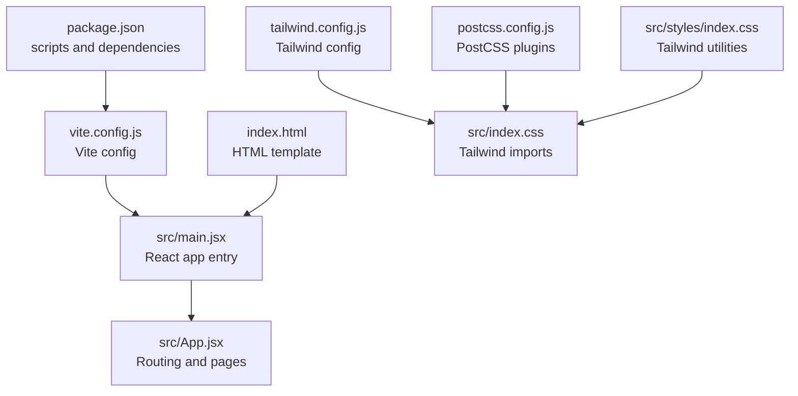
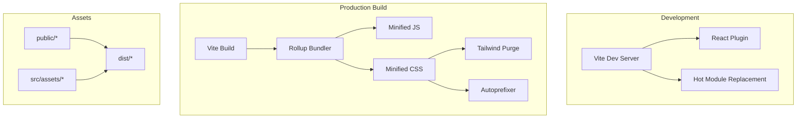
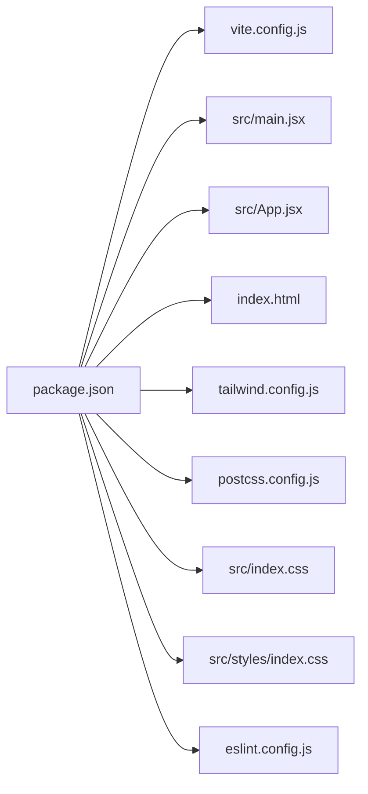

# Build and Deployment

<cite>
**Referenced Files in This Document**
- [vite.config.js](file://vite.config.js)
- [package.json](file://package.json)
- [index.html](file://index.html)
- [tailwind.config.js](file://tailwind.config.js)
- [postcss.config.js](file://postcss.config.js)
- [src/main.jsx](file://src/main.jsx)
- [src/App.jsx](file://src/App.jsx)
- [src/index.css](file://src/index.css)
- [src/styles/index.css](file://src/styles/index.css)
- [eslint.config.js](file://eslint.config.js)
</cite>

## Table of Contents
1. [Introduction](#introduction)
2. [Project Structure](#project-structure)
3. [Core Components](#core-components)
4. [Architecture Overview](#architecture-overview)
5. [Detailed Component Analysis](#detailed-component-analysis)
6. [Dependency Analysis](#dependency-analysis)
7. [Performance Considerations](#performance-considerations)
8. [Troubleshooting Guide](#troubleshooting-guide)
9. [Conclusion](#conclusion)
10. [Appendices](#appendices)

## Introduction
This document explains the build and deployment process for the project, focusing on the Vite build configuration, production optimizations, asset handling, and deployment preparation. It covers the build pipeline (bundling, minification, and optimization), environment variable configuration, deployment targets, CI/CD integration possibilities, performance optimization techniques, bundle analysis, lazy loading strategies, static asset optimization, CDN integration options, development versus production differences, hot module replacement, troubleshooting, platform-specific deployment guides, environment configuration management, monitoring, customization, and extension of the build process.

## Project Structure
The project is a React application configured with Vite and PostCSS/Tailwind CSS. Key build-related files include the Vite configuration, package scripts, HTML entry, Tailwind and PostCSS configurations, and the main application entry points. Assets are organized under public and src/assets, with Tailwind scanning both the HTML template and all JSX/TSX files.

**Diagram sources**
- [package.json](file://package.json#L6-L11)
- [vite.config.js](file://vite.config.js#L5-L7)
- [src/main.jsx](file://src/main.jsx#L1-L11)
- [src/App.jsx](file://src/App.jsx#L1-L51)
- [index.html](file://index.html#L1-L15)
- [tailwind.config.js](file://tailwind.config.js#L1-L24)
- [src/index.css](file://src/index.css#L1-L40)
- [postcss.config.js](file://postcss.config.js#L1-L6)
- [src/styles/index.css](file://src/styles/index.css#L1-L12)

**Section sources**
- [package.json](file://package.json#L1-L36)
- [vite.config.js](file://vite.config.js#L1-L8)
- [index.html](file://index.html#L1-L15)
- [tailwind.config.js](file://tailwind.config.js#L1-L24)
- [postcss.config.js](file://postcss.config.js#L1-L6)
- [src/main.jsx](file://src/main.jsx#L1-L11)
- [src/App.jsx](file://src/App.jsx#L1-L51)
- [src/index.css](file://src/index.css#L1-L40)
- [src/styles/index.css](file://src/styles/index.css#L1-L12)

## Core Components
- Vite configuration defines the React plugin and serves as the central build-time configuration.
- Package scripts provide dev server, production build, linting, and local preview commands.
- HTML template initializes the DOM and loads the application entry script.
- Tailwind CSS and PostCSS configure utility-first styling and automatic vendor prefixing.
- Application entry and routing compose the runtime behavior and page composition.

Key build and runtime responsibilities:
- Vite handles development server, HMR, and production bundling/minification.
- Tailwind scans templates and components to purge unused CSS in production.
- PostCSS applies Tailwind directives and autoprefixing.

**Section sources**
- [vite.config.js](file://vite.config.js#L5-L7)
- [package.json](file://package.json#L6-L11)
- [index.html](file://index.html#L10-L12)
- [tailwind.config.js](file://tailwind.config.js#L3-L3)
- [postcss.config.js](file://postcss.config.js#L1-L6)
- [src/main.jsx](file://src/main.jsx#L1-L11)
- [src/App.jsx](file://src/App.jsx#L21-L48)

## Architecture Overview
The build pipeline integrates Vite, React, Tailwind CSS, and PostCSS. During development, Vite serves the app with HMR. In production, Vite bundles and minifies JavaScript and CSS, while Tailwind purges unused styles. Static assets are copied from the public directory and resolved via Vite’s asset handling.

**Diagram sources**
- [vite.config.js](file://vite.config.js#L5-L7)
- [tailwind.config.js](file://tailwind.config.js#L3-L3)
- [postcss.config.js](file://postcss.config.js#L1-L6)
- [package.json](file://package.json#L6-L11)

## Detailed Component Analysis

### Vite Configuration
- Purpose: Enables the React plugin and exposes the default Vite configuration surface.
- Implications: Extending this file allows adding plugins, aliases, build options, and environment variable handling.

Optimization hooks to consider:
- Define build.rollupOptions for advanced Rollup configuration.
- Add define for global constants injected at build time.
- Configure optimizeDeps for pre-bundling strategies.

**Section sources**
- [vite.config.js](file://vite.config.js#L5-L7)

### Package Scripts and Dependencies
- Scripts:
  - dev: starts the Vite development server.
  - build: produces a production build.
  - preview: serves the production build locally.
  - lint: runs ESLint on the project.
- Dependencies include React, React Router, Tailwind CSS v4, PostCSS, and related tooling.

Environment variables:
- Not currently defined in scripts; consider adding NODE_ENV and custom variables via dotenv or Vite define.

CI/CD integration:
- Use the build and preview scripts in automated pipelines.
- Cache node_modules and optimize install steps.

**Section sources**
- [package.json](file://package.json#L6-L11)
- [package.json](file://package.json#L12-L34)

### HTML Template
- Initializes the DOM container and loads the application entry script.
- Includes a favicon link and external fonts.

Implications:
- Keep the root div id consistent with the React root mount target.
- External resources (fonts) are loaded at runtime; ensure network availability or self-host assets.

**Section sources**
- [index.html](file://index.html#L10-L12)
- [index.html](file://index.html#L8-L8)

### Tailwind CSS Configuration
- Scans index.html and all JSX/TSX files under src for class usage.
- Defines custom color palette and font families.
- No plugins are enabled, keeping the build minimal.

Optimization:
- Tailwind purges unused utilities in production builds.
- Consider adding the JIT engine if not already active in the used version.

**Section sources**
- [tailwind.config.js](file://tailwind.config.js#L3-L3)
- [tailwind.config.js](file://tailwind.config.js#L5-L21)

### PostCSS Configuration
- Applies Tailwind CSS directives and autoprefixer.
- Ensures cross-browser compatibility for CSS properties.

Integration:
- Works with Tailwind’s CSS directives to generate optimized styles.

**Section sources**
- [postcss.config.js](file://postcss.config.js#L1-L6)

### Application Entry and Routing
- React root mounts the App component.
- App composes routing and page components, enabling navigation across the site.

Implications:
- Route-based code splitting can be introduced later for lazy loading.
- Protected routes and nested layouts are supported.

**Section sources**
- [src/main.jsx](file://src/main.jsx#L1-L11)
- [src/App.jsx](file://src/App.jsx#L21-L48)

### Stylesheets
- Global CSS imports Tailwind directives and custom fonts.
- Separate Tailwind utilities are included in src/styles/index.css.

Implications:
- Ensure consistent font loading and avoid FOUC by preloading critical fonts.
- Keep Tailwind imports minimal to reduce CSS size.

**Section sources**
- [src/index.css](file://src/index.css#L1-L12)
- [src/index.css](file://src/index.css#L14-L21)
- [src/styles/index.css](file://src/styles/index.css#L1-L12)

### ESLint Configuration
- Uses flat config with recommended rules for React Hooks and React Refresh.
- Ignores the dist directory from linting.

Implications:
- Enforces code quality and prevents stale artifacts from being linted.

**Section sources**
- [eslint.config.js](file://eslint.config.js#L8-L29)

## Dependency Analysis
The build system depends on Vite, React, Tailwind CSS, and PostCSS. The application depends on React, React Router, and UI libraries. The package scripts orchestrate the build lifecycle.

**Diagram sources**
- [package.json](file://package.json#L6-L11)
- [vite.config.js](file://vite.config.js#L5-L7)
- [src/main.jsx](file://src/main.jsx#L1-L11)
- [src/App.jsx](file://src/App.jsx#L1-L51)
- [index.html](file://index.html#L1-L15)
- [tailwind.config.js](file://tailwind.config.js#L1-L24)
- [postcss.config.js](file://postcss.config.js#L1-L6)
- [src/index.css](file://src/index.css#L1-L40)
- [src/styles/index.css](file://src/styles/index.css#L1-L12)
- [eslint.config.js](file://eslint.config.js#L1-L30)

**Section sources**
- [package.json](file://package.json#L1-L36)
- [vite.config.js](file://vite.config.js#L1-L8)
- [src/main.jsx](file://src/main.jsx#L1-L11)
- [src/App.jsx](file://src/App.jsx#L1-L51)
- [index.html](file://index.html#L1-L15)
- [tailwind.config.js](file://tailwind.config.js#L1-L24)
- [postcss.config.js](file://postcss.config.js#L1-L6)
- [src/index.css](file://src/index.css#L1-L40)
- [src/styles/index.css](file://src/styles/index.css#L1-L12)
- [eslint.config.js](file://eslint.config.js#L1-L30)

## Performance Considerations
- Production build optimization:
  - Vite minifies JavaScript and CSS by default in production.
  - Tailwind purges unused CSS classes automatically.
  - Autoprefixer ensures modern CSS compiles to compatible vendor prefixes.
- Bundle analysis:
  - Use Vite’s built-in reporter or third-party tools to inspect bundle composition.
- Lazy loading:
  - Split route components to load pages on demand.
  - Dynamically import heavy components to defer loading until needed.
- Asset optimization:
  - Prefer vector graphics (SVG) and compressed images.
  - Serve images via modern formats (AVIF/WebP) when supported.
  - Enable compression (gzip/Brotli) on the server.
- CDN integration:
  - Host static assets on a CDN to reduce origin load.
  - Use subresource integrity (SRI) for external assets.
- Environment variables:
  - Expose only necessary variables at build time.
  - Use Vite define to inject constants safely.

[No sources needed since this section provides general guidance]

## Troubleshooting Guide
Common issues and resolutions:
- Missing Tailwind utilities in production:
  - Verify content globs in Tailwind config include all templates and components.
- Fonts not loading:
  - Ensure external font URLs are reachable or self-host fonts.
- Build fails due to lint errors:
  - Run the lint script and fix reported issues.
- Preview differs from local dev:
  - Confirm the preview command serves the dist directory produced by the build script.
- HMR not working:
  - Check browser console for plugin errors and ensure the dev script runs without errors.

**Section sources**
- [tailwind.config.js](file://tailwind.config.js#L3-L3)
- [index.html](file://index.html#L8-L8)
- [package.json](file://package.json#L6-L11)
- [eslint.config.js](file://eslint.config.js#L8-L29)

## Conclusion
The project leverages Vite for a fast development experience and efficient production builds, with Tailwind CSS and PostCSS providing utility-first styling and cross-browser compatibility. By extending the Vite configuration, adopting lazy loading, optimizing assets, and integrating CDNs, teams can achieve robust deployments across diverse environments. The provided scripts and configurations offer a strong foundation for CI/CD automation, environment management, and performance monitoring.

[No sources needed since this section summarizes without analyzing specific files]

## Appendices

### Development vs Production Differences
- Development:
  - Vite dev server with HMR enables rapid iteration.
  - No minification or tree-shaking; source maps are enabled by default.
- Production:
  - Vite minifies JS/CSS and performs dead-code elimination.
  - Tailwind purges unused CSS; PostCSS autoprefixes output.

**Section sources**
- [package.json](file://package.json#L6-L11)
- [tailwind.config.js](file://tailwind.config.js#L3-L3)
- [postcss.config.js](file://postcss.config.js#L1-L6)

### Environment Variable Configuration
- Current scripts do not set environment variables.
- Recommended additions:
  - Set NODE_ENV to production during build.
  - Use Vite define to inject constants at build time.
  - Externalize secrets and avoid committing sensitive values.

**Section sources**
- [package.json](file://package.json#L6-L11)
- [vite.config.js](file://vite.config.js#L5-L7)

### Deployment Targets and CI/CD Integration
- Targets:
  - Static hosting (Netlify, Vercel, GitHub Pages).
  - CDN-backed distribution.
- CI/CD:
  - Install dependencies, run lint, build, and preview checks.
  - Upload artifacts or deploy via provider-specific CLI.

**Section sources**
- [package.json](file://package.json#L6-L11)

### Platform-Specific Deployment Guides
- Netlify/Vercel:
  - Build command: the build script.
  - Output directory: the dist folder generated by Vite.
  - Redirects/headers can be configured per platform.
- GitHub Pages:
  - Publish the dist folder from the build output.
  - Configure base path if deploying to a subpath.

**Section sources**
- [package.json](file://package.json#L6-L11)

### Monitoring Deployment Success
- Validate the preview command locally after building.
- Check browser console and network tab for errors.
- Monitor bundle sizes and Lighthouse scores post-deployment.

**Section sources**
- [package.json](file://package.json#L10-L10)

### Customization and Extension Guidelines
- Extend Vite configuration:
  - Add plugins, aliases, and build.rollupOptions.
  - Introduce define for global constants.
- Optimize assets:
  - Compress images and enable modern formats.
  - Use asset hashing and cache headers.
- Lazy loading:
  - Dynamically import route components and heavy modules.
- Security:
  - Enforce CSP and SRI for external assets.
  - Sanitize environment variables and avoid leaking secrets.

**Section sources**
- [vite.config.js](file://vite.config.js#L5-L7)
- [package.json](file://package.json#L6-L11)