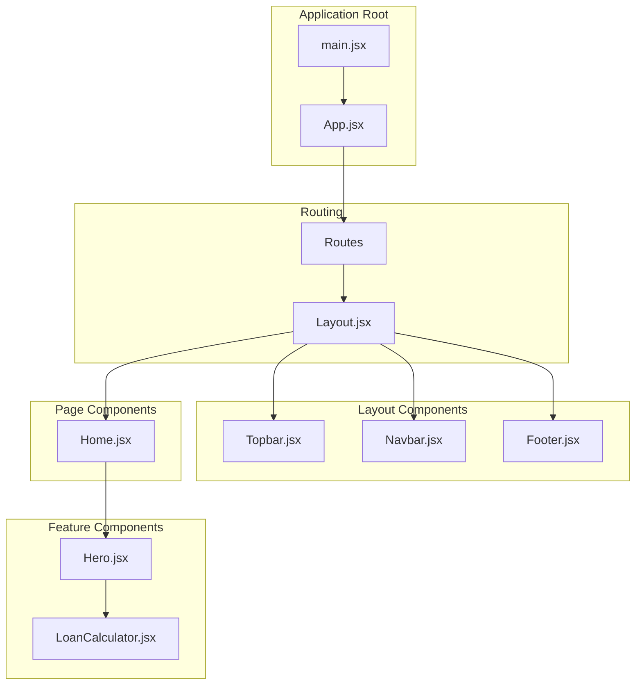
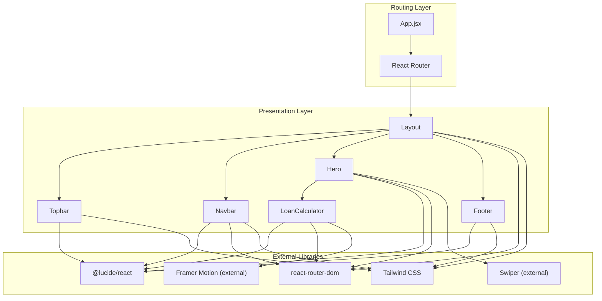
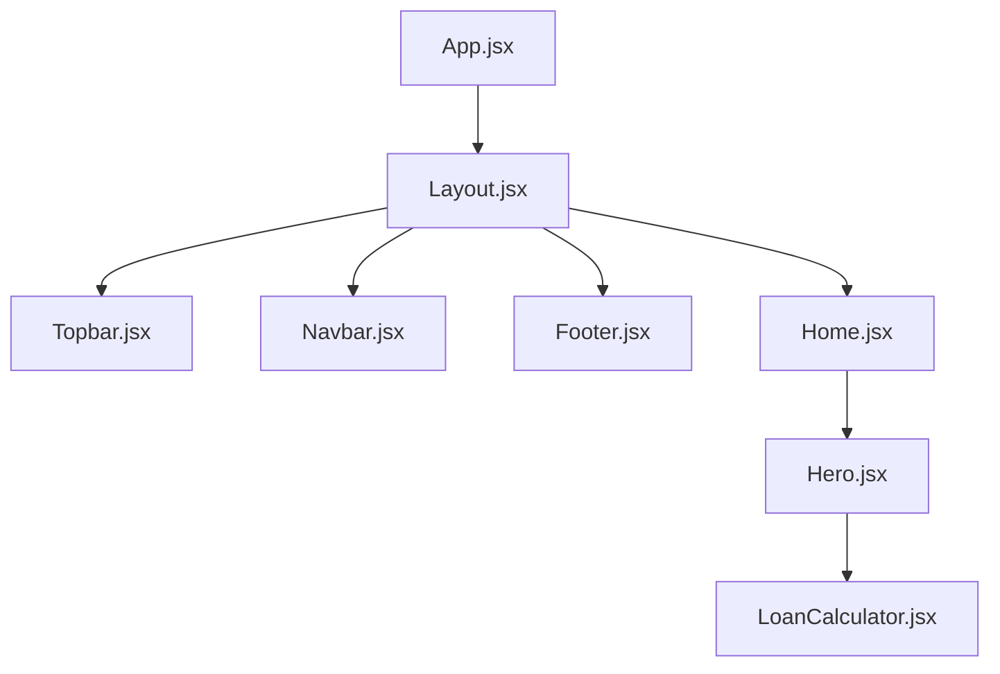
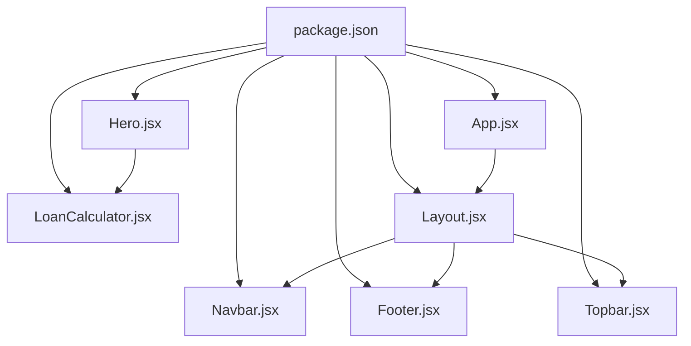

# Component System

<cite>
**Referenced Files in This Document**
- [Layout.jsx](file://src/components/layout/Layout.jsx)
- [Navbar.jsx](file://src/components/layout/Navbar.jsx)
- [Footer.jsx](file://src/components/layout/Footer.jsx)
- [Topbar.jsx](file://src/components/layout/Topbar.jsx)
- [Hero.jsx](file://src/components/home/Hero.jsx)
- [LoanCalculator.jsx](file://src/components/loan/LoanCalculator.jsx)
- [Home.jsx](file://src/pages/Home.jsx)
- [App.jsx](file://src/App.jsx)
- [main.jsx](file://src/main.jsx)
- [ScrollToTop.jsx](file://src/ScrollToTop.jsx)
- [package.json](file://package.json)
</cite>

## Table of Contents
1. [Introduction](#introduction)
2. [Project Structure](#project-structure)
3. [Core Components](#core-components)
4. [Architecture Overview](#architecture-overview)
5. [Detailed Component Analysis](#detailed-component-analysis)
6. [Dependency Analysis](#dependency-analysis)
7. [Performance Considerations](#performance-considerations)
8. [Troubleshooting Guide](#troubleshooting-guide)
9. [Conclusion](#conclusion)
10. [Appendices](#appendices)

## Introduction
This document describes the component system architecture for a React-based financial services website. It focuses on reusable UI components organized by domain: layout scaffolding (Layout, Navbar, Footer, Topbar), home page content (Hero carousel), and interactive widgets (LoanCalculator). The documentation explains component composition patterns, prop interfaces, state management, lifecycle hooks, event handling, and integration with external libraries such as Lucide icons, Tailwind CSS, and React Router. It also provides guidelines for component development, naming conventions, folder organization, and best practices for extending the component library.

## Project Structure
The component system follows a feature-based organization:
- Layout components live under src/components/layout and provide global scaffolding.
- Page-level components live under src/pages and compose layout with page-specific content.
- Interactive components live under src/components/<category> and encapsulate reusable functionality.

**Diagram sources**
- [main.jsx](file://src/main.jsx#L1-L11)
- [App.jsx](file://src/App.jsx#L1-L43)
- [Layout.jsx](file://src/components/layout/Layout.jsx#L1-L20)
- [Topbar.jsx](file://src/components/layout/Topbar.jsx#L1-L55)
- [Navbar.jsx](file://src/components/layout/Navbar.jsx#L1-L156)
- [Footer.jsx](file://src/components/layout/Footer.jsx#L1-L117)
- [Home.jsx](file://src/pages/Home.jsx#L1-L297)
- [Hero.jsx](file://src/components/home/Hero.jsx#L1-L125)
- [LoanCalculator.jsx](file://src/components/loan/LoanCalculator.jsx#L1-L117)

**Section sources**
- [main.jsx](file://src/main.jsx#L1-L11)
- [App.jsx](file://src/App.jsx#L1-L43)
- [Layout.jsx](file://src/components/layout/Layout.jsx#L1-L20)
- [Home.jsx](file://src/pages/Home.jsx#L1-L297)

## Core Components
This section documents the primary reusable components and their roles.

- Layout: Provides the global scaffold with Topbar, Navbar, main content area, and Footer.
- Navbar: Implements responsive navigation with mobile menu, search, cart, and apply actions.
- Footer: Presents corporate information, newsletter signup, links, and social media.
- Topbar: Displays contact info and quick links at the top of the page.
- Hero: Carousel of hero content with dynamic slides and embedded LoanCalculator widget.
- LoanCalculator: Interactive slider-based calculator for loan amount and term with formatted currency display.

Key characteristics:
- Composition: Layout composes Topbar, Navbar, and Footer around page content. Hero composes LoanCalculator.
- Props: Layout accepts a children prop for page content. Other components are self-contained.
- State: Components manage local state for UI interactions (mobile menu, search, slides, calculator inputs).
- Routing: Components integrate with React Router for navigation and programmatic navigation.

**Section sources**
- [Layout.jsx](file://src/components/layout/Layout.jsx#L1-L20)
- [Navbar.jsx](file://src/components/layout/Navbar.jsx#L1-L156)
- [Footer.jsx](file://src/components/layout/Footer.jsx#L1-L117)
- [Topbar.jsx](file://src/components/layout/Topbar.jsx#L1-L55)
- [Hero.jsx](file://src/components/home/Hero.jsx#L1-L125)
- [LoanCalculator.jsx](file://src/components/loan/LoanCalculator.jsx#L1-L117)

## Architecture Overview
The application uses a layered architecture:
- Presentation layer: Components render UI and handle user interactions.
- Routing layer: App.jsx defines routes and wraps page components with Layout.
- Global state: Minimal local state within components; no centralized store.
- External integrations: Lucide icons, Tailwind CSS, React Router, and third-party libraries.

**Diagram sources**
- [App.jsx](file://src/App.jsx#L1-L43)
- [Layout.jsx](file://src/components/layout/Layout.jsx#L1-L20)
- [Navbar.jsx](file://src/components/layout/Navbar.jsx#L1-L156)
- [Footer.jsx](file://src/components/layout/Footer.jsx#L1-L117)
- [Topbar.jsx](file://src/components/layout/Topbar.jsx#L1-L55)
- [Hero.jsx](file://src/components/home/Hero.jsx#L1-L125)
- [LoanCalculator.jsx](file://src/components/loan/LoanCalculator.jsx#L1-L117)
- [package.json](file://package.json#L12-L20)

## Detailed Component Analysis

### Layout Component
Purpose:
- Wraps page content with global header and footer.
- Provides a consistent container with sticky navbar and scrollable main area.

Composition:
- Composes Topbar, Navbar, and Footer.
- Accepts children as the page content.

Props:
- children: ReactNode representing the page content.

State and Lifecycle:
- Stateless functional component; relies on children prop.

Communication:
- No internal state to propagate; communicates via props.

Reusability:
- Used by all routed pages via App.jsx.

**Section sources**
- [Layout.jsx](file://src/components/layout/Layout.jsx#L1-L20)
- [App.jsx](file://src/App.jsx#L24-L37)

### Navbar Component
Purpose:
- Provides responsive navigation with desktop and mobile views.
- Integrates search, cart, and apply actions.

Props:
- None.

State and Lifecycle:
- Manages mobile menu visibility, search panel state, and search term.
- Uses location and navigation hooks for active link highlighting and programmatic navigation.

Event Handling:
- Toggle mobile menu.
- Toggle search panel and update search term.
- Navigate to cart and apply pages.
- Filter and select search results.

Search Feature:
- Filters predefined navigation items by search term.
- Renders dropdown results with icons and links.

Responsive Behavior:
- Desktop: Horizontal nav with logo, links, actions.
- Mobile: Collapsible menu with links and apply button.

**Section sources**
- [Navbar.jsx](file://src/components/layout/Navbar.jsx#L1-L156)

### Footer Component
Purpose:
- Displays corporate branding, newsletter signup, links, and social media.

Props:
- None.

State and Lifecycle:
- Computes current year dynamically.
- Renders static content with links and icons.

Newsletter:
- Input field with submit button styled as an arrow.

Links:
- Corporate links and loan service categories.

Contact Information:
- Address, email, and phone with icons.

Social Media:
- Circular buttons with platform icons.

**Section sources**
- [Footer.jsx](file://src/components/layout/Footer.jsx#L1-L117)

### Topbar Component
Purpose:
- Shows contact information and quick links at the top of the page.

Props:
- None.

State and Lifecycle:
- Stateless component rendering static content.

Navigation:
- Links to login, career, media, and FAQ pages.

Social Icons:
- Circular buttons with platform icons.

**Section sources**
- [Topbar.jsx](file://src/components/layout/Topbar.jsx#L1-L55)

### Hero Component
Purpose:
- Displays a hero carousel with animated background and call-to-action buttons.
- Embeds the LoanCalculator widget on the right side.

Props:
- None.

State and Lifecycle:
- Manages current slide index with interval-based auto-advance.
- Cleans up interval on unmount.

Carousel:
- Three slides with subtitle and title.
- Manual indicators to jump to slides.

Content Layout:
- Two-column layout on large screens: text content on the left, calculator on the right.
- Responsive grid ensures proper alignment.

Navigation:
- Links to services and sign-up pages.
- Calculator navigates to apply page.

**Section sources**
- [Hero.jsx](file://src/components/home/Hero.jsx#L1-L125)

### LoanCalculator Component
Purpose:
- Interactive calculator for loan amount and term with formatted currency display.

Props:
- None.

State and Lifecycle:
- Manages loan amount, loan months, monthly payment, and total payback.
- Recomputes totals when inputs change.

Inputs:
- Range sliders for loan amount and loan duration.
- Dynamic gradient background reflecting current values.

Formatting:
- Currency formatting for Indian Rupees with Intl.NumberFormat.

Navigation:
- Apply button navigates to the apply page.

**Section sources**
- [LoanCalculator.jsx](file://src/components/loan/LoanCalculator.jsx#L1-L117)

### Home Page Component
Purpose:
- Aggregates multiple sections for the landing page.

Props:
- None.

Structure:
- Renders Hero component.
- Includes welcome, stats, services, process, benefits, testimonials, partner logos, and final CTA sections.

Assets:
- Imports images for hero visuals and testimonials.

Navigation:
- Uses Link components for internal navigation.

**Section sources**
- [Home.jsx](file://src/pages/Home.jsx#L1-L297)

## Architecture Overview

### Component Hierarchy

**Diagram sources**
- [App.jsx](file://src/App.jsx#L1-L43)
- [Layout.jsx](file://src/components/layout/Layout.jsx#L1-L20)
- [Topbar.jsx](file://src/components/layout/Topbar.jsx#L1-L55)
- [Navbar.jsx](file://src/components/layout/Navbar.jsx#L1-L156)
- [Footer.jsx](file://src/components/layout/Footer.jsx#L1-L117)
- [Home.jsx](file://src/pages/Home.jsx#L1-L297)
- [Hero.jsx](file://src/components/home/Hero.jsx#L1-L125)
- [LoanCalculator.jsx](file://src/components/loan/LoanCalculator.jsx#L1-L117)

### Parent-Child Communication Patterns
- Props: Layout passes children to page components; Hero passes no props to LoanCalculator.
- State isolation: Each component manages its own state locally.
- Event-driven updates: Click handlers update state; effects compute derived values.
- Programmatic navigation: useNavigate hook triggers route transitions.

### External Library Integrations
- Lucide React: Icons used across Navbar, Footer, Hero, and Topbar.
- React Router: Navigation and programmatic navigation.
- Tailwind CSS: Utility-first styling across components.
- Swiper: Carousel library for Hero component.
- Framer Motion: Animation library for enhanced motion.

**Section sources**
- [package.json](file://package.json#L12-L20)
- [Hero.jsx](file://src/components/home/Hero.jsx#L1-L125)
- [LoanCalculator.jsx](file://src/components/loan/LoanCalculator.jsx#L1-L117)
- [Navbar.jsx](file://src/components/layout/Navbar.jsx#L1-L156)
- [Footer.jsx](file://src/components/layout/Footer.jsx#L1-L117)
- [Topbar.jsx](file://src/components/layout/Topbar.jsx#L1-L55)

## Detailed Component Analysis

### Component Composition Patterns
- Container pattern: Layout composes multiple layout parts and page content.
- Widget pattern: Hero embeds LoanCalculator as a reusable widget.
- List rendering: Navbar renders navigation items; Footer renders lists of links and services.
- Conditional rendering: Mobile menu, search panel, and slide indicators toggle visibility based on state.

### Prop Interfaces
- Layout: children (ReactNode)
- Navbar: none
- Footer: none
- Topbar: none
- Hero: none
- LoanCalculator: none

### State Management Within Components
- Local state: Navbar manages mobile menu, search panel, and search term; Hero manages slide index; LoanCalculator manages inputs and computed totals.
- Effects: Hero uses effect for auto-advance; LoanCalculator uses effect for recomputation.
- Hooks: useLocation, useNavigate for routing; useState, useEffect for state and side effects.

### Lifecycle and Event Handling
- Mount: Hero sets up interval; LoanCalculator computes initial totals.
- Unmount: Hero clears interval.
- Interaction: Click handlers update state; input handlers update numeric values.
- Navigation: Programmatic navigation triggered by buttons.

### Integration with External Libraries
- Lucide icons: Consistent iconography across components.
- Swiper: Carousel behavior for Hero component.
- Framer Motion: Motion primitives for animations.

**Section sources**
- [Hero.jsx](file://src/components/home/Hero.jsx#L25-L30)
- [LoanCalculator.jsx](file://src/components/loan/LoanCalculator.jsx#L15-L20)
- [Navbar.jsx](file://src/components/layout/Navbar.jsx#L6-L9)
- [package.json](file://package.json#L12-L20)

## Dependency Analysis

**Diagram sources**
- [package.json](file://package.json#L12-L20)
- [App.jsx](file://src/App.jsx#L1-L43)
- [Layout.jsx](file://src/components/layout/Layout.jsx#L1-L20)
- [Navbar.jsx](file://src/components/layout/Navbar.jsx#L1-L156)
- [Footer.jsx](file://src/components/layout/Footer.jsx#L1-L117)
- [Topbar.jsx](file://src/components/layout/Topbar.jsx#L1-L55)
- [Hero.jsx](file://src/components/home/Hero.jsx#L1-L125)
- [LoanCalculator.jsx](file://src/components/loan/LoanCalculator.jsx#L1-L117)

**Section sources**
- [package.json](file://package.json#L12-L20)
- [App.jsx](file://src/App.jsx#L1-L43)

## Performance Considerations
- Minimize re-renders: Keep components pure where possible; memoize expensive computations.
- Lazy loading: Consider lazy-loading heavy components like Hero carousel.
- CSS optimization: Use Tailwind utilities efficiently; avoid unnecessary classes.
- Event handlers: Bind handlers in render only when necessary; prefer stable references.
- Effects cleanup: Clear intervals and subscriptions in cleanup functions.

## Troubleshooting Guide
Common issues and resolutions:
- Navigation not working: Verify React Router is installed and configured; ensure routes match component paths.
- Icons missing: Confirm Lucide React installation and correct import paths.
- Styling inconsistencies: Check Tailwind configuration and ensure utility classes are applied correctly.
- Carousel not sliding: Verify Swiper integration and correct initialization.
- Animations not playing: Confirm Framer Motion installation and correct usage.

**Section sources**
- [package.json](file://package.json#L12-L20)
- [App.jsx](file://src/App.jsx#L1-L43)

## Conclusion
The component system demonstrates a clean separation of concerns with reusable layout components, feature-specific widgets, and page-level compositions. Components communicate primarily through props and local state, with minimal reliance on external state management. The integration of Lucide icons, Tailwind CSS, Swiper, and Framer Motion enhances the user experience while maintaining simplicity. Following the guidelines below will help extend the library consistently and reliably.

## Appendices

### Guidelines for Component Development
- Naming conventions:
  - Use PascalCase for component names.
  - Place related components in dedicated folders (e.g., layout, home, loan).
- Folder organization:
  - Feature-based grouping improves discoverability.
  - Keep shared utilities and constants in a separate directory if reused widely.
- Prop interfaces:
  - Define explicit prop types for clarity and safety.
  - Prefer default props for optional values.
- State management:
  - Encapsulate state within components; avoid lifting unnecessarily.
  - Use effects sparingly and always clean up.
- Styling:
  - Favor Tailwind utilities for rapid prototyping.
  - Maintain consistent color tokens and typography scales.
- Accessibility:
  - Ensure keyboard navigation and screen reader support.
  - Use semantic HTML and ARIA attributes where needed.
- Testing:
  - Write unit tests for interactive components.
  - Mock external dependencies (router, icons) during testing.

### Reusability Strategies
- Extract common patterns into smaller, focused components.
- Provide configuration props for minor variations.
- Avoid hardcoding values; pass them as props or constants.
- Document component APIs and usage examples.

### Component Usage Examples
- Wrap pages with Layout to inherit global structure.
- Compose Hero inside Home to showcase interactive calculator.
- Use Navbar and Footer across pages for consistent navigation and branding.

### Best Practices for Extending the Component Library
- Maintain a consistent design system with shared tokens.
- Add new components incrementally with clear responsibilities.
- Document component behavior, props, and usage scenarios.
- Keep dependencies minimal and intentional.