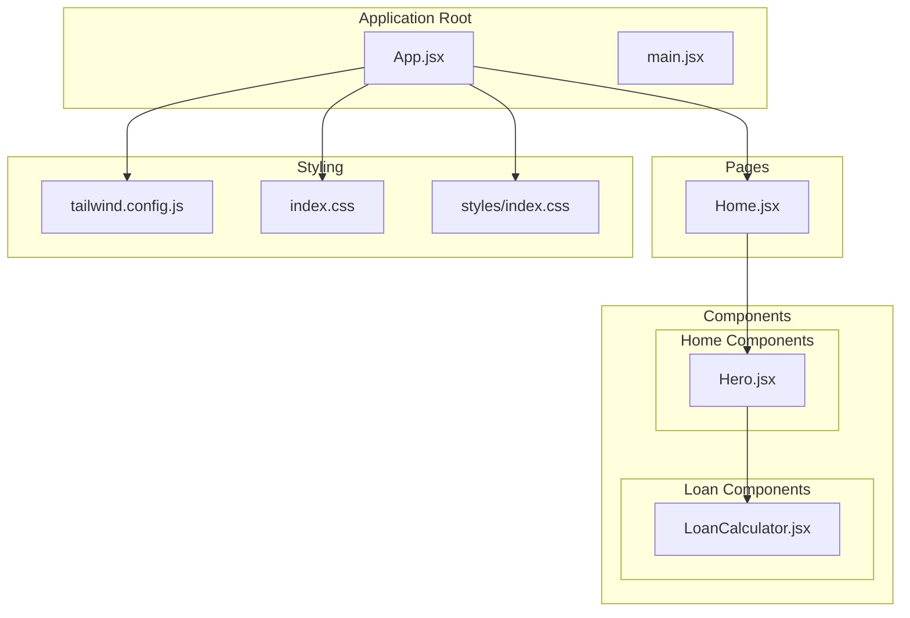
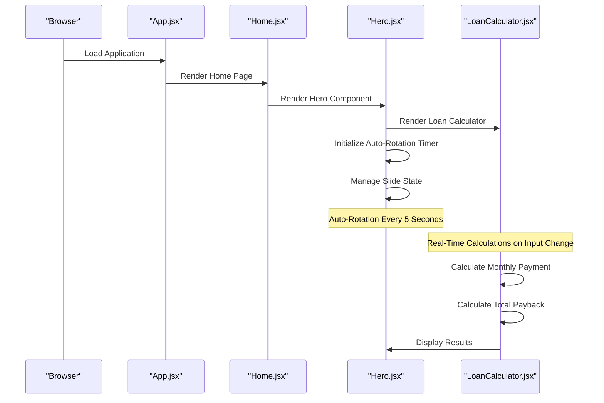
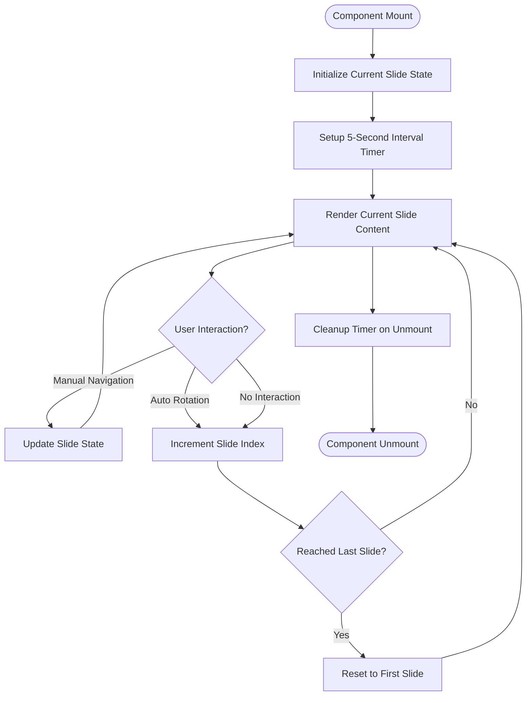
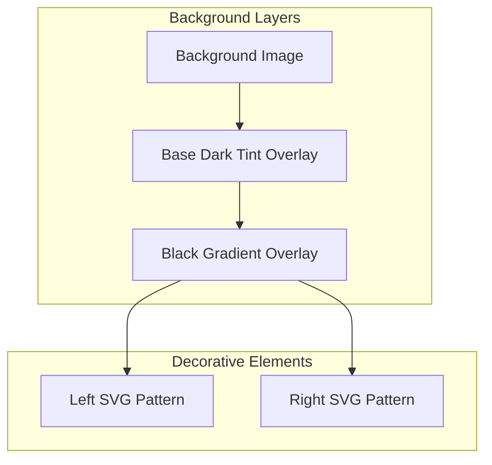
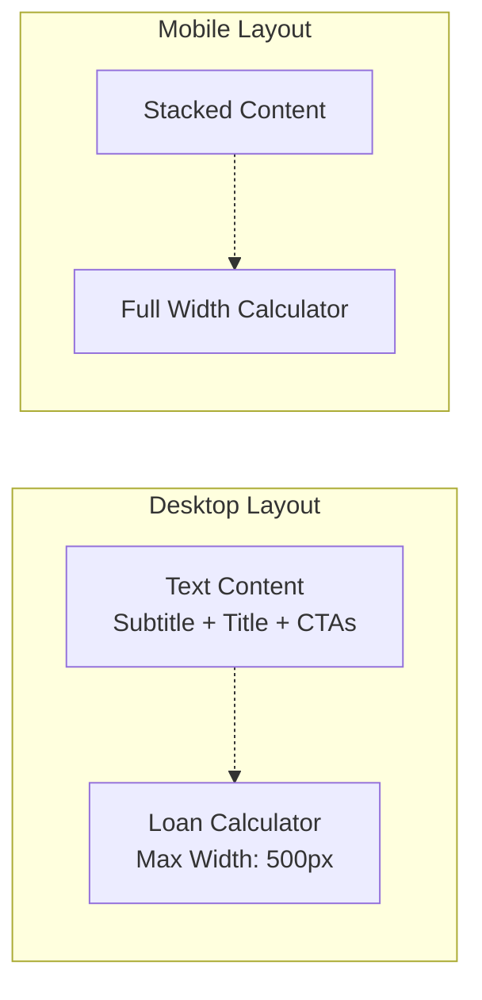
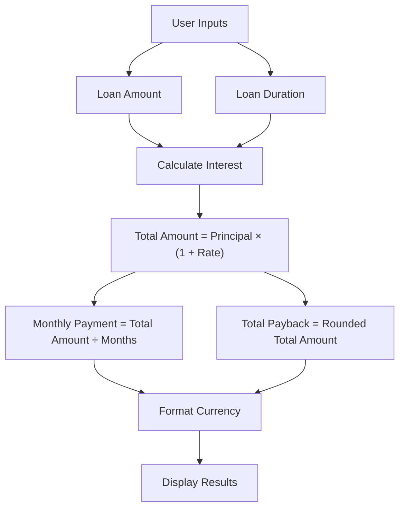
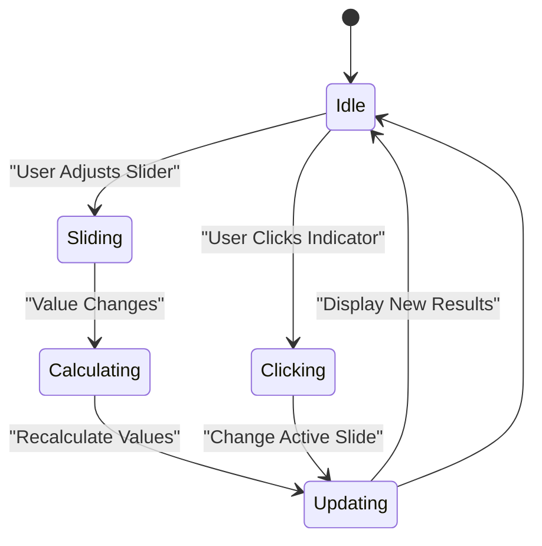
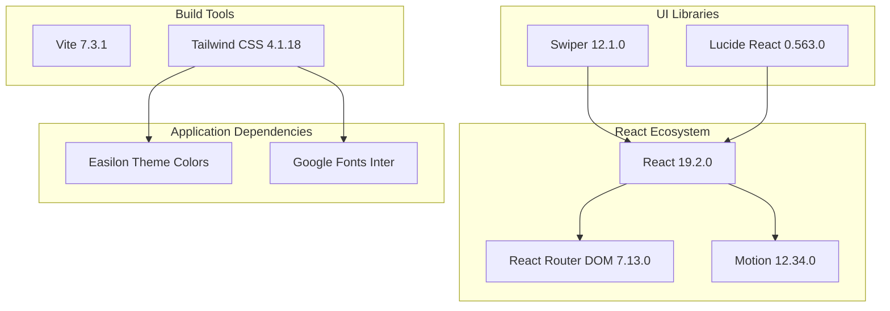

# Home Page Components

<cite>
**Referenced Files in This Document**
- [Hero.jsx](file://src/components/home/Hero.jsx)
- [LoanCalculator.jsx](file://src/components/loan/LoanCalculator.jsx)
- [Home.jsx](file://src/pages/Home.jsx)
- [App.jsx](file://src/App.jsx)
- [index.css](file://src/index.css)
- [index.css](file://src/styles/index.css)
- [tailwind.config.js](file://tailwind.config.js)
- [package.json](file://package.json)
- [main.jsx](file://src/main.jsx)
</cite>

## Table of Contents
1. [Introduction](#introduction)
2. [Project Structure](#project-structure)
3. [Core Components](#core-components)
4. [Architecture Overview](#architecture-overview)
5. [Detailed Component Analysis](#detailed-component-analysis)
6. [Dependency Analysis](#dependency-analysis)
7. [Performance Considerations](#performance-considerations)
8. [Troubleshooting Guide](#troubleshooting-guide)
9. [Conclusion](#conclusion)
10. [Appendices](#appendices)

## Introduction
This document provides comprehensive documentation for the home page component system with a focus on the Hero component. The Hero component implements an auto-rotating carousel with integrated loan calculator functionality. It demonstrates modern React patterns, responsive design, and interactive user experiences. The system showcases state management, real-time calculations, and seamless integration between the carousel and calculator components.

## Project Structure
The home page components are organized within a clear modular structure that separates concerns and promotes reusability:



**Diagram sources**
- [App.jsx](file://src/App.jsx#L1-L51)
- [Home.jsx](file://src/pages/Home.jsx#L1-L297)
- [Hero.jsx](file://src/components/home/Hero.jsx#L1-L125)
- [LoanCalculator.jsx](file://src/components/loan/LoanCalculator.jsx#L1-L117)

**Section sources**
- [App.jsx](file://src/App.jsx#L1-L51)
- [main.jsx](file://src/main.jsx#L1-L11)
- [tailwind.config.js](file://tailwind.config.js#L1-L24)

## Core Components
The home page system consists of two primary components that work together to deliver an engaging user experience:

### Hero Component
The Hero component serves as the main visual focal point of the homepage, featuring:
- Auto-rotating carousel with 5-second intervals
- Dynamic background imagery with layered overlays
- Integrated loan calculator for immediate financial planning
- Responsive grid layout with text and calculator sections
- Interactive slide indicators and navigation controls

### Loan Calculator Component
The Loan Calculator provides real-time financial calculations with:
- Interactive sliders for loan amount and duration
- Real-time monthly payment and total payback calculations
- Currency formatting with Indian Rupee support
- Navigation integration for loan applications

**Section sources**
- [Hero.jsx](file://src/components/home/Hero.jsx#L7-L125)
- [LoanCalculator.jsx](file://src/components/loan/LoanCalculator.jsx#L5-L117)

## Architecture Overview
The component architecture follows a parent-child relationship pattern with clear separation of concerns:



**Diagram sources**
- [App.jsx](file://src/App.jsx#L21-L48)
- [Home.jsx](file://src/pages/Home.jsx#L13-L16)
- [Hero.jsx](file://src/components/home/Hero.jsx#L7-L30)
- [LoanCalculator.jsx](file://src/components/loan/LoanCalculator.jsx#L15-L20)

The architecture demonstrates clean component composition where the Hero component manages its internal state while delegating financial calculations to the LoanCalculator component. Both components share styling through Tailwind CSS utilities and custom color themes.

## Detailed Component Analysis

### Hero Component Implementation
The Hero component implements a sophisticated auto-rotating carousel system with integrated calculator functionality:

#### Carousel Configuration
The carousel uses React state management with automatic rotation:



**Diagram sources**
- [Hero.jsx](file://src/components/home/Hero.jsx#L25-L30)
- [Hero.jsx](file://src/components/home/Hero.jsx#L100-L112)

#### Background Design System
The Hero component employs a layered background approach with multiple overlay effects:



**Diagram sources**
- [Hero.jsx](file://src/components/home/Hero.jsx#L35-L59)

#### Content Layout Structure
The component uses a responsive grid layout that adapts to different screen sizes:



**Diagram sources**
- [Hero.jsx](file://src/components/home/Hero.jsx#L62-L120)

**Section sources**
- [Hero.jsx](file://src/components/home/Hero.jsx#L7-L125)

### Loan Calculator Component Analysis
The Loan Calculator implements sophisticated real-time financial calculations:

#### Calculation Algorithm
The calculator uses a straightforward interest-based calculation model:



**Diagram sources**
- [LoanCalculator.jsx](file://src/components/loan/LoanCalculator.jsx#L15-L20)

#### Interactive Controls
The component features two interactive sliders with visual feedback:



**Diagram sources**
- [LoanCalculator.jsx](file://src/components/loan/LoanCalculator.jsx#L43-L59)
- [LoanCalculator.jsx](file://src/components/loan/LoanCalculator.jsx#L69-L85)

**Section sources**
- [LoanCalculator.jsx](file://src/components/loan/LoanCalculator.jsx#L5-L117)

### Component Integration Patterns
The Hero and LoanCalculator components demonstrate several integration patterns:

#### State Management Integration
The Hero component manages the carousel state while the LoanCalculator handles its own state independently. Both components communicate through props and shared styling rather than direct state sharing.

#### Navigation Integration
Both components utilize React Router for navigation:
- Hero component uses Link components for internal navigation
- LoanCalculator component uses useNavigate hook for programmatic navigation

#### Styling Consistency
Both components adhere to the established color palette and typography system defined in the Tailwind configuration.

**Section sources**
- [Hero.jsx](file://src/components/home/Hero.jsx#L82-L97)
- [LoanCalculator.jsx](file://src/components/loan/LoanCalculator.jsx#L106-L112)

## Dependency Analysis
The component system relies on several key dependencies that enable its functionality:



**Diagram sources**
- [package.json](file://package.json#L12-L20)
- [tailwind.config.js](file://tailwind.config.js#L6-L20)

### External Dependencies Impact
- **Swiper**: Provides carousel functionality despite not being actively used in the current implementation
- **Framer Motion**: Enables advanced animations and transitions
- **Lucide React**: Supplies consistent iconography across components
- **Tailwind CSS**: Provides utility-first styling with custom theme configuration

**Section sources**
- [package.json](file://package.json#L12-L35)
- [tailwind.config.js](file://tailwind.config.js#L1-L24)

## Performance Considerations
The component system implements several performance optimizations:

### Memory Management
- Proper cleanup of interval timers in the Hero component prevents memory leaks
- Component unmounting clears all active timers and event listeners

### Rendering Optimizations
- Minimal re-renders through efficient state updates
- Localized state management reduces unnecessary prop drilling
- CSS-based animations leverage GPU acceleration

### Bundle Size Considerations
- Strategic import of external libraries
- Tailwind CSS purging configuration for production builds
- Lazy loading potential for heavy components

### Accessibility Features
- Semantic HTML structure with proper heading hierarchy
- Keyboard navigation support for interactive elements
- Screen reader friendly labels and descriptions

## Troubleshooting Guide

### Common Issues and Solutions

#### Carousel Not Rotating
**Problem**: Auto-rotation timer not functioning
**Solution**: Verify timer cleanup in useEffect return statement and ensure slides array length is correct

#### Calculator Not Updating
**Problem**: Loan calculations not reflecting user input changes
**Solution**: Check useEffect dependencies array and ensure state updates trigger recalculation

#### Styling Issues
**Problem**: Color inconsistencies or missing theme variables
**Solution**: Verify Tailwind configuration and ensure custom color variables are properly defined

#### Navigation Problems
**Problem**: Links not navigating correctly
**Solution**: Confirm React Router setup and ensure proper route configuration

**Section sources**
- [Hero.jsx](file://src/components/home/Hero.jsx#L25-L30)
- [LoanCalculator.jsx](file://src/components/loan/LoanCalculator.jsx#L15-L20)
- [tailwind.config.js](file://tailwind.config.js#L6-L16)

## Conclusion
The home page component system demonstrates excellent architectural patterns with clear separation of concerns, robust state management, and seamless integration between components. The Hero component successfully combines auto-rotating carousel functionality with practical loan calculator integration, creating a cohesive user experience. The implementation showcases modern React development practices, responsive design principles, and thoughtful performance optimizations.

The system provides a solid foundation for future enhancements, including the potential integration of the Swiper library for more advanced carousel features and additional interactive elements for enhanced user engagement.

## Appendices

### Customization Options

#### Adding New Carousel Items
To add new carousel items, modify the slides array in the Hero component:
1. Add new slide objects with subtitle and title properties
2. Ensure proper state management for the new slide count
3. Update any slide indicator logic if needed

#### Integrating Additional Interactive Elements
Potential enhancements include:
- Adding manual navigation controls for the carousel
- Implementing touch/swipe gestures for mobile devices
- Adding pause/resume functionality on hover
- Including progress indicators for auto-rotation

#### Styling Customization
The component system supports extensive styling customization through:
- Tailwind CSS utility classes
- Custom color theme variables
- Font family modifications
- Animation and transition effects

### Implementation Examples

#### Example: Custom Carousel Item
```javascript
// Add to slides array
{
  subtitle: "New Feature",
  title: "Innovative Solution",
  description: "Comprehensive service offering"
}
```

#### Example: Enhanced Calculator Features
```javascript
// Add new calculation option
const [loanType, setLoanType] = useState('personal');
const [interestRate, setInterestRate] = useState(0.15);

useEffect(() => {
  let rate = 0.15;
  switch(loanType) {
    case 'business': rate = 0.12; break;
    case 'education': rate = 0.08; break;
    default: rate = 0.15;
  }
  const totalAmount = loanAmount * (1 + rate);
  const monthly = totalAmount / loanMonths;
  setMonthlyPayment(Math.round(monthly));
  setTotalPayback(Math.round(totalAmount));
}, [loanAmount, loanMonths, loanType]);
```

**Section sources**
- [Hero.jsx](file://src/components/home/Hero.jsx#L10-L23)
- [LoanCalculator.jsx](file://src/components/loan/LoanCalculator.jsx#L8-L13)