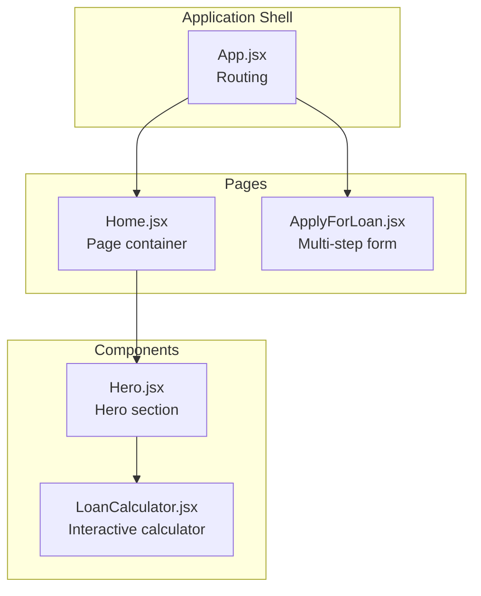
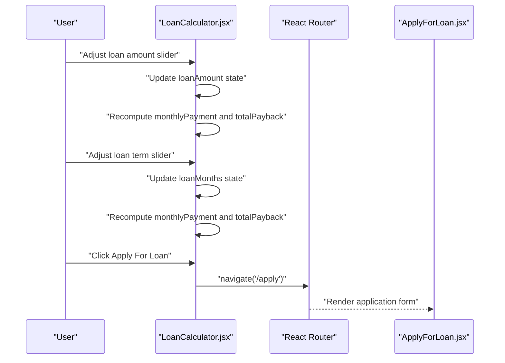
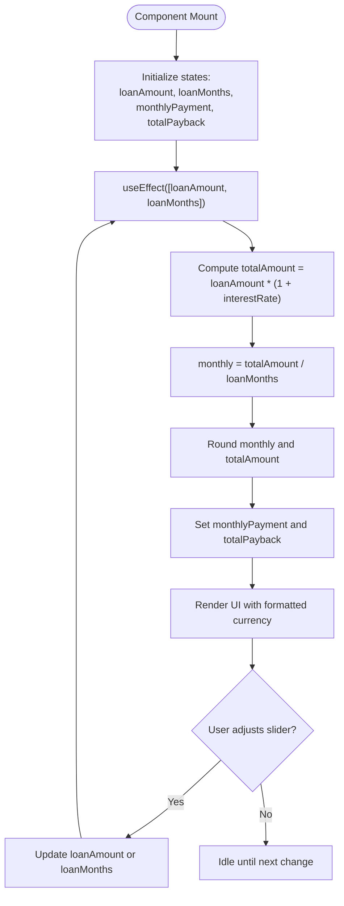
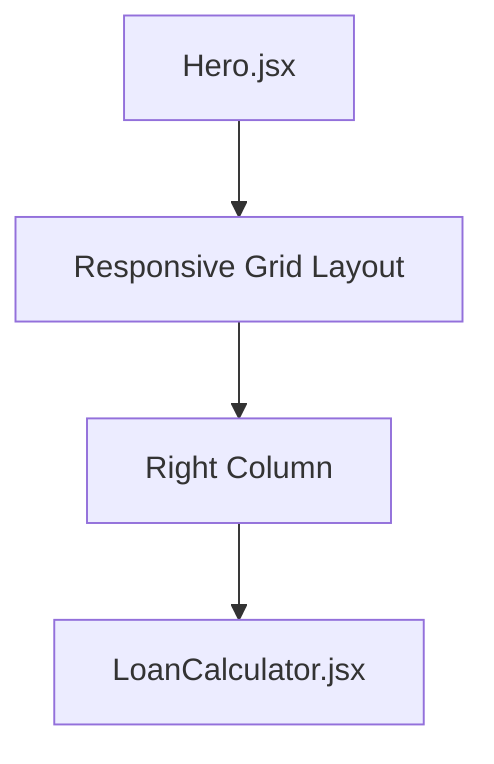
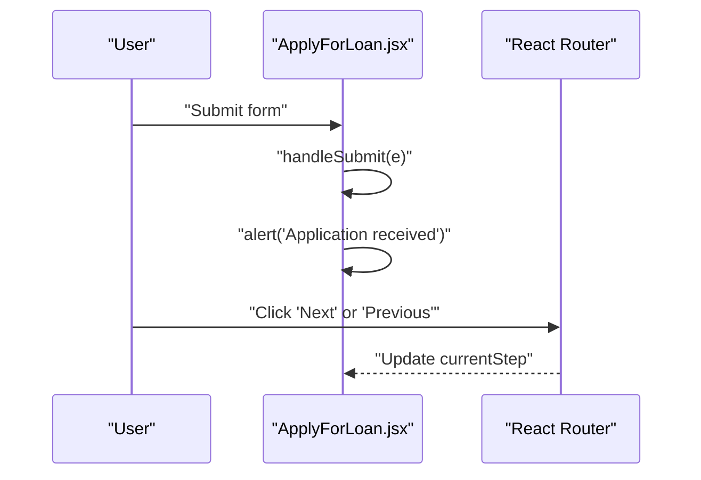
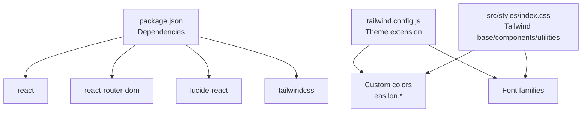

# Interactive Components

<cite>
**Referenced Files in This Document**
- [LoanCalculator.jsx](file://src/components/loan/LoanCalculator.jsx)
- [Hero.jsx](file://src/components/home/Hero.jsx)
- [ApplyForLoan.jsx](file://src/pages/ApplyForLoan.jsx)
- [App.jsx](file://src/App.jsx)
- [Home.jsx](file://src/pages/Home.jsx)
- [tailwind.config.js](file://tailwind.config.js)
- [index.css](file://src/styles/index.css)
- [package.json](file://package.json)
</cite>

## Table of Contents
1. [Introduction](#introduction)
2. [Project Structure](#project-structure)
3. [Core Components](#core-components)
4. [Architecture Overview](#architecture-overview)
5. [Detailed Component Analysis](#detailed-component-analysis)
6. [Dependency Analysis](#dependency-analysis)
7. [Performance Considerations](#performance-considerations)
8. [Troubleshooting Guide](#troubleshooting-guide)
9. [Conclusion](#conclusion)
10. [Appendices](#appendices)

## Introduction
This document focuses on the interactive LoanCalculator component and its integration patterns within the application. It explains the real-time calculation functionality driven by principal amount sliders, interest rate controls, and loan term adjustments. It documents state management for user inputs, dynamic result updates, form validation integration, responsive design patterns, and accessibility features. Implementation details include slider components, calculation precision, and user experience optimizations. It also provides examples for customization options, adding new calculation parameters, and integrating with external loan APIs. Finally, it covers standalone usage and integration patterns with other parts of the application.

## Project Structure
The interactive LoanCalculator resides under the components/loan directory and is embedded within the Hero component on the Home page. The Home page composes the Hero component, which positions the calculator in the hero section. The application routes define the landing page and the loan application page.

**Diagram sources**
- [App.jsx](file://src/App.jsx#L21-L48)
- [Home.jsx](file://src/pages/Home.jsx#L13-L16)
- [Hero.jsx](file://src/components/home/Hero.jsx#L1-L125)
- [LoanCalculator.jsx](file://src/components/loan/LoanCalculator.jsx#L1-L117)
- [ApplyForLoan.jsx](file://src/pages/ApplyForLoan.jsx#L1-L479)

**Section sources**
- [App.jsx](file://src/App.jsx#L21-L48)
- [Home.jsx](file://src/pages/Home.jsx#L13-L16)
- [Hero.jsx](file://src/components/home/Hero.jsx#L1-L125)
- [LoanCalculator.jsx](file://src/components/loan/LoanCalculator.jsx#L1-L117)
- [ApplyForLoan.jsx](file://src/pages/ApplyForLoan.jsx#L1-L479)

## Core Components
- LoanCalculator: A self-contained interactive component that computes and displays monthly payment and total payback amounts based on user-selected loan amount and term. It includes two sliders for loan amount and term, formatted currency display, and a navigation button to the application form.
- Hero: The hero section component that embeds the LoanCalculator in the right column of a responsive grid layout.
- ApplyForLoan: A multi-step form page that collects personal, employment, and loan details. It is protected and navigated to from the calculator’s apply button.

Key responsibilities:
- Real-time calculations triggered by state changes in loan amount and term.
- Currency formatting for consistent display.
- Navigation to the application form.
- Integration with the application routing and layout.

**Section sources**
- [LoanCalculator.jsx](file://src/components/loan/LoanCalculator.jsx#L5-L117)
- [Hero.jsx](file://src/components/home/Hero.jsx#L115-L118)
- [ApplyForLoan.jsx](file://src/pages/ApplyForLoan.jsx#L4-L56)
- [App.jsx](file://src/App.jsx#L34-L41)

## Architecture Overview
The LoanCalculator participates in a layered architecture:
- Presentation layer: LoanCalculator renders interactive UI elements and results.
- State layer: React hooks manage user inputs and derived calculations.
- Navigation layer: React Router routes connect the calculator to the application form.
- Styling layer: Tailwind CSS defines responsive design and theming.

**Diagram sources**
- [LoanCalculator.jsx](file://src/components/loan/LoanCalculator.jsx#L8-L20)
- [LoanCalculator.jsx](file://src/components/loan/LoanCalculator.jsx#L106-L112)
- [App.jsx](file://src/App.jsx#L34-L41)
- [ApplyForLoan.jsx](file://src/pages/ApplyForLoan.jsx#L53-L56)

## Detailed Component Analysis

### LoanCalculator Component
The LoanCalculator component encapsulates:
- State management for loanAmount, loanMonths, monthlyPayment, and totalPayback.
- A fixed interest rate constant used in calculations.
- A calculation effect that updates derived values whenever inputs change.
- Currency formatting for display.
- Two interactive sliders:
  - Loan amount slider with min, max, step, and gradient visualization.
  - Loan term slider with min, max, step, and gradient visualization.
- A results panel displaying monthly payment, term, and total payback.
- An apply button that navigates to the application form.

**Diagram sources**
- [LoanCalculator.jsx](file://src/components/loan/LoanCalculator.jsx#L8-L20)
- [LoanCalculator.jsx](file://src/components/loan/LoanCalculator.jsx#L22-L29)

Implementation highlights:
- Calculation algorithm: totalAmount = principal × (1 + interestRate); monthly = totalAmount / term; both rounded for display.
- Precision: Currency formatting uses integer digits to avoid decimals.
- Dynamic visuals: Slider backgrounds use linear gradients to reflect current selections.
- Navigation: The apply button triggers navigation to the application form.

Accessibility and UX considerations:
- Sliders expose numeric ranges and step increments suitable for touch and keyboard.
- Clear labels and formatted currency improve readability.
- Hover and focus states are styled via Tailwind utilities.

Integration points:
- Embedded in Hero component within a responsive grid layout.
- Navigates to ApplyForLoan page via React Router.

**Section sources**
- [LoanCalculator.jsx](file://src/components/loan/LoanCalculator.jsx#L5-L117)
- [Hero.jsx](file://src/components/home/Hero.jsx#L115-L118)
- [App.jsx](file://src/App.jsx#L34-L41)

### Hero Component Integration
The Hero component integrates the LoanCalculator into the hero section:
- Imports and renders the LoanCalculator.
- Places the calculator in the right column of a grid layout.
- Ensures responsiveness by constraining the calculator’s width and alignment.

**Diagram sources**
- [Hero.jsx](file://src/components/home/Hero.jsx#L115-L118)

**Section sources**
- [Hero.jsx](file://src/components/home/Hero.jsx#L115-L118)

### ApplyForLoan Page
The ApplyForLoan page is a multi-step form that collects personal, employment, and loan details. It includes:
- Step navigation with progress indicators.
- Controlled form inputs bound to a single state object.
- Validation and submission handling.
- Navigation protection via a protected route wrapper.

**Diagram sources**
- [ApplyForLoan.jsx](file://src/pages/ApplyForLoan.jsx#L53-L56)
- [ApplyForLoan.jsx](file://src/pages/ApplyForLoan.jsx#L435-L470)
- [App.jsx](file://src/App.jsx#L34-L41)

**Section sources**
- [ApplyForLoan.jsx](file://src/pages/ApplyForLoan.jsx#L4-L56)
- [ApplyForLoan.jsx](file://src/pages/ApplyForLoan.jsx#L321-L377)
- [ApplyForLoan.jsx](file://src/pages/ApplyForLoan.jsx#L379-L433)
- [App.jsx](file://src/App.jsx#L34-L41)

## Dependency Analysis
External dependencies and integrations:
- React and React Router: State management and routing.
- lucide-react: Icons for UI affordances.
- Tailwind CSS: Utility-first styling and responsive design.

**Diagram sources**
- [package.json](file://package.json#L12-L20)
- [tailwind.config.js](file://tailwind.config.js#L4-L21)
- [index.css](file://src/styles/index.css#L1-L12)

**Section sources**
- [package.json](file://package.json#L12-L20)
- [tailwind.config.js](file://tailwind.config.js#L4-L21)
- [index.css](file://src/styles/index.css#L1-L12)

## Performance Considerations
- Calculation cost: The effect recomputes total and monthly payments on each input change. Given the simplicity of the formula, the impact is negligible for typical ranges.
- Rounding: Using Math.round reduces floating-point noise and ensures consistent display.
- Rendering: The component re-renders only when state changes; ensure no unnecessary re-renders by keeping derived values inside the effect and avoiding extra props.
- Styling: Tailwind utilities are efficient; avoid runtime class concatenation to prevent excessive DOM churn.

[No sources needed since this section provides general guidance]

## Troubleshooting Guide
Common issues and resolutions:
- Inputs not updating: Verify that slider onChange handlers update the intended state and that the effect depends on those states.
- Incorrect currency display: Ensure the formatter uses the correct locale and currency settings.
- Navigation not working: Confirm the route for the application form is defined and that the button triggers navigation.
- Styling inconsistencies: Check Tailwind configuration and ensure color utilities match the theme.

**Section sources**
- [LoanCalculator.jsx](file://src/components/loan/LoanCalculator.jsx#L8-L20)
- [LoanCalculator.jsx](file://src/components/loan/LoanCalculator.jsx#L22-L29)
- [App.jsx](file://src/App.jsx#L34-L41)

## Conclusion
The LoanCalculator component delivers a smooth, real-time interactive experience with clear visual feedback and straightforward navigation to the application form. Its integration within the Hero component and the broader routing structure demonstrates a clean separation of concerns and scalable composition patterns. With minor enhancements—such as configurable interest rates, validation hooks, and API integration—the component can evolve into a robust financial estimation tool.

[No sources needed since this section summarizes without analyzing specific files]

## Appendices

### Customization Options
- Configurable interest rate: Replace the fixed interest rate with a controlled prop or state to support dynamic rates.
- Extensible parameters: Add new inputs (e.g., down payment, fees) and adjust the calculation accordingly.
- API integration: Fetch rates or prequalifications from an external service and update state asynchronously.
- Validation hooks: Integrate form validation to restrict ranges and enforce required fields before computation.

[No sources needed since this section provides general guidance]

### Adding New Calculation Parameters
- Extend state: Add new state variables for additional parameters.
- Update effect: Include new parameters in the dependency array and adjust the calculation logic.
- UI updates: Add new sliders or inputs with appropriate labels and formatting.
- Accessibility: Ensure labels, roles, and keyboard navigation remain consistent.

[No sources needed since this section provides general guidance]

### Integration Patterns
- Standalone usage: Import and render the component wherever interactive loan estimation is needed.
- Composition: Embed within other components (e.g., Hero) as demonstrated.
- Routing: Connect to forms or modals via navigation or programmatic triggers.
- Theming: Leverage Tailwind utilities and the custom color palette for consistent branding.

[No sources needed since this section provides general guidance]