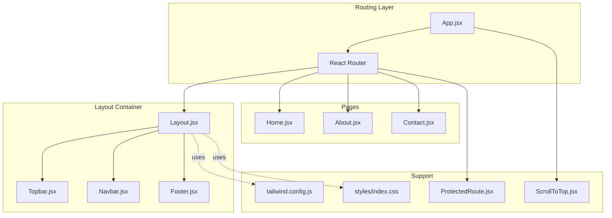
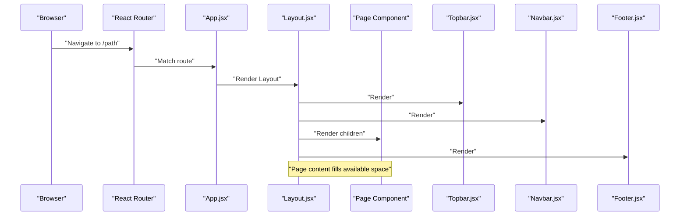
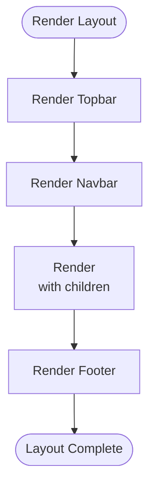
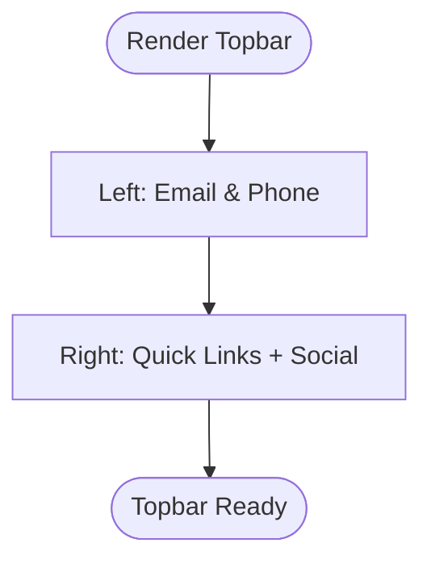
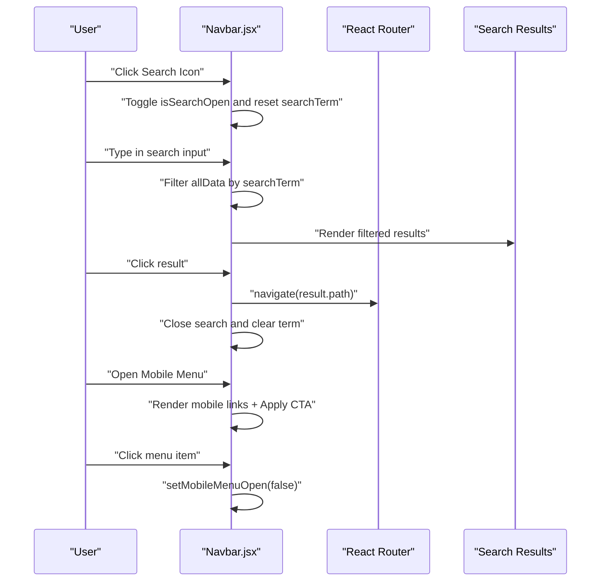
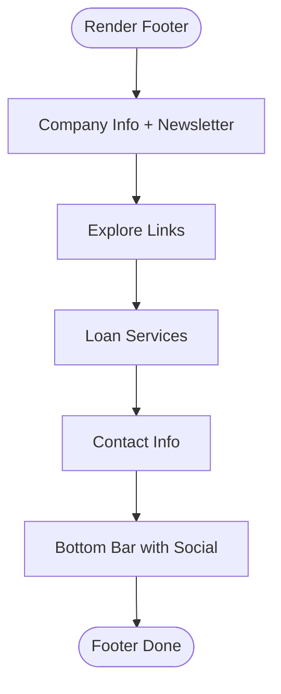
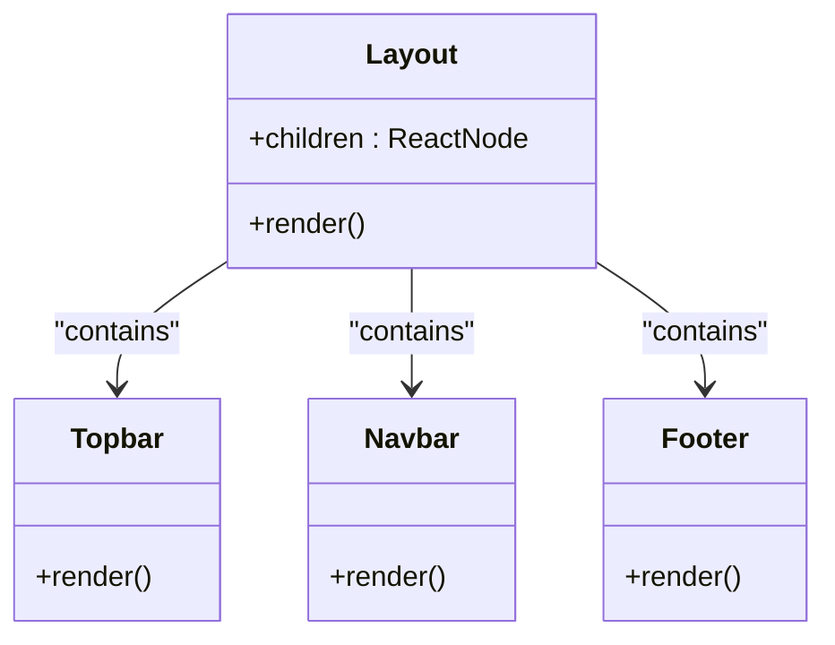
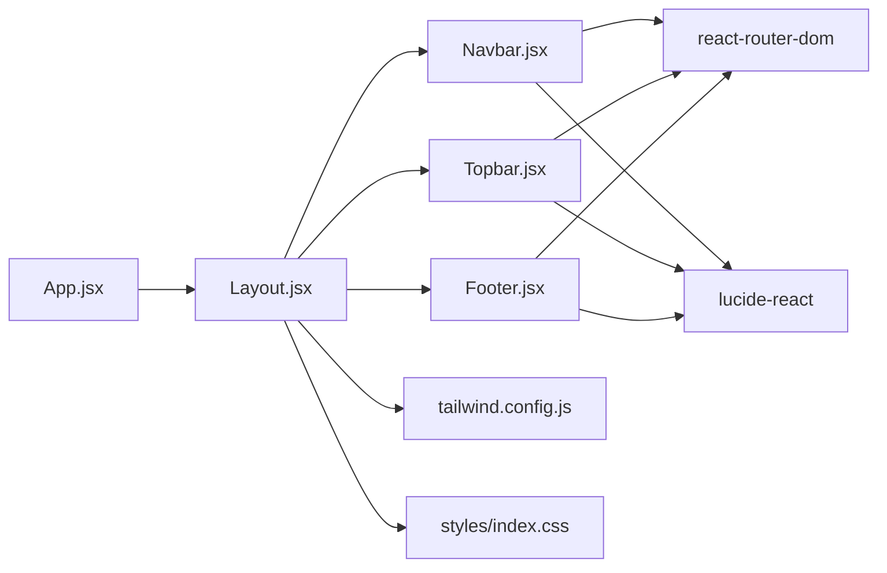

# Layout Components

<cite>
**Referenced Files in This Document**
- [Layout.jsx](file://src/components/layout/Layout.jsx)
- [Topbar.jsx](file://src/components/layout/Topbar.jsx)
- [Navbar.jsx](file://src/components/layout/Navbar.jsx)
- [Footer.jsx](file://src/components/layout/Footer.jsx)
- [App.jsx](file://src/App.jsx)
- [ScrollToTop.jsx](file://src/ScrollToTop.jsx)
- [ProtectedRoute.jsx](file://src/components/ProtectedRoute.jsx)
- [Home.jsx](file://src/pages/Home.jsx)
- [About.jsx](file://src/pages/About.jsx)
- [Contact.jsx](file://src/pages/Contact.jsx)
- [index.css](file://src/styles/index.css)
- [tailwind.config.js](file://tailwind.config.js)
- [main.jsx](file://src/main.jsx)
- [package.json](file://package.json)
</cite>

## Table of Contents
1. [Introduction](#introduction)
2. [Project Structure](#project-structure)
3. [Core Components](#core-components)
4. [Architecture Overview](#architecture-overview)
5. [Detailed Component Analysis](#detailed-component-analysis)
6. [Dependency Analysis](#dependency-analysis)
7. [Performance Considerations](#performance-considerations)
8. [Troubleshooting Guide](#troubleshooting-guide)
9. [Conclusion](#conclusion)
10. [Appendices](#appendices)

## Introduction
This document explains the layout component system used across the application. It focuses on the Layout wrapper component that acts as the main container for all pages, and the supporting components Topbar, Navbar, and Footer. It covers how these components collaborate to compose pages, manage responsive design, handle navigation state, integrate with React Router, and how to customize and extend the layout for new pages.

## Project Structure
The layout system resides under src/components/layout and is wired into the routing via App.jsx. The design system leverages Tailwind CSS with custom color tokens and fonts.

**Diagram sources**
- [App.jsx](file://src/App.jsx#L21-L48)
- [Layout.jsx](file://src/components/layout/Layout.jsx#L6-L17)
- [Topbar.jsx](file://src/components/layout/Topbar.jsx#L5-L52)
- [Navbar.jsx](file://src/components/layout/Navbar.jsx#L5-L153)
- [Footer.jsx](file://src/components/layout/Footer.jsx#L5-L114)
- [ScrollToTop.jsx](file://src/ScrollToTop.jsx#L4-L12)
- [ProtectedRoute.jsx](file://src/components/ProtectedRoute.jsx#L4-L14)
- [tailwind.config.js](file://tailwind.config.js#L1-L24)
- [index.css](file://src/styles/index.css#L1-L12)

**Section sources**
- [App.jsx](file://src/App.jsx#L21-L48)
- [Layout.jsx](file://src/components/layout/Layout.jsx#L6-L17)
- [tailwind.config.js](file://tailwind.config.js#L1-L24)
- [index.css](file://src/styles/index.css#L1-L12)

## Core Components
- Layout: Provides the global page scaffold with Topbar, Navbar, page content area, and Footer. It ensures a consistent header and footer across pages and uses flex layout to keep the footer at the bottom.
- Topbar: Displays contact information, quick links, and social icons. Responsive layout stacks on small screens and aligns items horizontally on larger screens.
- Navbar: Implements desktop and mobile navigation, live search with filtering, cart action, and apply-for-loan CTA. Uses React Router for navigation and maintains local state for mobile menu and search.
- Footer: Presents company info, explore links, loan services, contact info, newsletter input, and social icons. Responsive grid layout adapts to screen sizes.

**Section sources**
- [Layout.jsx](file://src/components/layout/Layout.jsx#L6-L17)
- [Topbar.jsx](file://src/components/layout/Topbar.jsx#L5-L52)
- [Navbar.jsx](file://src/components/layout/Navbar.jsx#L5-L153)
- [Footer.jsx](file://src/components/layout/Footer.jsx#L5-L114)

## Architecture Overview
The layout system is integrated at the routing level. App.jsx defines routes and wraps each page with the Layout component. ProtectedRoute secures sensitive routes. ScrollToTop resets scroll position on route changes.

**Diagram sources**
- [App.jsx](file://src/App.jsx#L25-L45)
- [Layout.jsx](file://src/components/layout/Layout.jsx#L6-L17)
- [Topbar.jsx](file://src/components/layout/Topbar.jsx#L5-L52)
- [Navbar.jsx](file://src/components/layout/Navbar.jsx#L5-L153)
- [Footer.jsx](file://src/components/layout/Footer.jsx#L5-L114)

## Detailed Component Analysis

### Layout Wrapper Component
- Role: Central container that composes Topbar, Navbar, page content, and Footer. Uses flex layout to push the footer to the bottom and allow content to grow.
- Props: Accepts children and renders them inside a main content area.
- Integration: Used by all pages via App.jsx routes.

**Diagram sources**
- [Layout.jsx](file://src/components/layout/Layout.jsx#L6-L17)

**Section sources**
- [Layout.jsx](file://src/components/layout/Layout.jsx#L6-L17)
- [App.jsx](file://src/App.jsx#L26-L33)

### Topbar Component
- Purpose: Displays contact links, quick internal links, and social media icons.
- Responsive behavior: Stacks vertically on small screens and aligns horizontally on medium and up.
- Styling: Uses custom color tokens and hover transitions.

**Diagram sources**
- [Topbar.jsx](file://src/components/layout/Topbar.jsx#L5-L52)

**Section sources**
- [Topbar.jsx](file://src/components/layout/Topbar.jsx#L5-L52)
- [tailwind.config.js](file://tailwind.config.js#L6-L16)

### Navbar Component
- Navigation: Renders desktop links and a mobile hamburger menu. Uses React Router Link for navigation and detects active link via location state.
- Live search: Maintains search term state and filters a static dataset to show suggestions. Clicking a suggestion navigates and clears the search.
- Mobile menu: Controlled by local state; toggles visibility and closes on item click.
- Actions: Shopping cart button navigates to cart; Apply For Loan CTA navigates to protected route.
- Responsive: Desktop horizontal bar with hidden mobile menu trigger.

**Diagram sources**
- [Navbar.jsx](file://src/components/layout/Navbar.jsx#L5-L153)

**Section sources**
- [Navbar.jsx](file://src/components/layout/Navbar.jsx#L5-L153)
- [App.jsx](file://src/App.jsx#L34-L41)

### Footer Component
- Sections: Company info, explore links, loan services, contact info, newsletter signup.
- Responsive grid: One column on small screens, four columns on large screens.
- Social and branding: Consistent use of brand colors and icons.

**Diagram sources**
- [Footer.jsx](file://src/components/layout/Footer.jsx#L5-L114)

**Section sources**
- [Footer.jsx](file://src/components/layout/Footer.jsx#L5-L114)

### Component Hierarchy and Prop Interfaces
- Layout
  - Props: children (ReactNode)
  - Responsibilities: container layout, child rendering
- Topbar
  - Props: none
  - Responsibilities: contact and social display
- Navbar
  - Props: none
  - Responsibilities: navigation, search, mobile menu, actions
- Footer
  - Props: none
  - Responsibilities: informational sections, newsletter, social

**Diagram sources**
- [Layout.jsx](file://src/components/layout/Layout.jsx#L6-L17)
- [Topbar.jsx](file://src/components/layout/Topbar.jsx#L5-L52)
- [Navbar.jsx](file://src/components/layout/Navbar.jsx#L5-L153)
- [Footer.jsx](file://src/components/layout/Footer.jsx#L5-L114)

## Dependency Analysis
- Routing and wrapping:
  - App.jsx defines routes and wraps pages with Layout. Some routes are protected by ProtectedRoute.
- Navigation state:
  - Navbar manages mobileMenuOpen, isSearchOpen, and searchTerm locally.
- Styling:
  - Tailwind config extends custom colors and fonts. Global styles define base font and body background.
- External libraries:
  - react-router-dom for routing and navigation.
  - lucide-react for icons.
  - framer-motion is present but not used in layout components.

**Diagram sources**
- [App.jsx](file://src/App.jsx#L21-L48)
- [Layout.jsx](file://src/components/layout/Layout.jsx#L6-L17)
- [Navbar.jsx](file://src/components/layout/Navbar.jsx#L1-L10)
- [Topbar.jsx](file://src/components/layout/Topbar.jsx#L2-L3)
- [Footer.jsx](file://src/components/layout/Footer.jsx#L2-L3)
- [tailwind.config.js](file://tailwind.config.js#L1-L24)
- [index.css](file://src/styles/index.css#L1-L12)
- [package.json](file://package.json#L12-L19)

**Section sources**
- [App.jsx](file://src/App.jsx#L21-L48)
- [Navbar.jsx](file://src/components/layout/Navbar.jsx#L1-L10)
- [Topbar.jsx](file://src/components/layout/Topbar.jsx#L2-L3)
- [Footer.jsx](file://src/components/layout/Footer.jsx#L2-L3)
- [tailwind.config.js](file://tailwind.config.js#L1-L24)
- [index.css](file://src/styles/index.css#L1-L12)
- [package.json](file://package.json#L12-L19)

## Performance Considerations
- Rendering cost: Navbar’s search filter operates on a small static dataset; performance impact is negligible.
- State scope: Local state in Navbar keeps UI interactions fast and avoids unnecessary re-renders in parent components.
- CSS framework: Tailwind utility classes are efficient; avoid generating dynamic classes in loops to prevent bloated CSS.
- Route transitions: Consider adding minimal animations if needed, leveraging existing motion library.

## Troubleshooting Guide
- Navigation does not highlight active link:
  - Verify the path comparison logic and ensure paths match exactly with Link targets.
- Search results not appearing:
  - Confirm the search input is focused and the dropdown condition checks both open state and filtered results length.
- Mobile menu not closing after selection:
  - Ensure the click handlers update the mobile menu state.
- Protected route redirect loop:
  - Confirm token presence in localStorage and that the protected route is properly wrapped.
- Footer alignment issues:
  - Check responsive grid classes and ensure container widths are applied consistently.

**Section sources**
- [Navbar.jsx](file://src/components/layout/Navbar.jsx#L25-L26)
- [Navbar.jsx](file://src/components/layout/Navbar.jsx#L78-L98)
- [Navbar.jsx](file://src/components/layout/Navbar.jsx#L125-L150)
- [ProtectedRoute.jsx](file://src/components/ProtectedRoute.jsx#L4-L14)
- [Footer.jsx](file://src/components/layout/Footer.jsx#L12-L91)

## Conclusion
The layout system provides a consistent, responsive foundation across pages. Layout orchestrates Topbar, Navbar, and Footer, while Navbar handles navigation and search. The integration with React Router and local state management keeps the UI interactive and performant. Extending the layout for new pages is straightforward: wrap page components with Layout and leverage the existing responsive patterns.

## Appendices

### Responsive Design Patterns
- Breakpoints and stacking:
  - Small screens: Vertical stacking for Topbar and mobile menu.
  - Medium and up: Horizontal alignment for Topbar and desktop Navbar.
  - Large screens: Multi-column Footer grid.
- Utility classes:
  - Flexbox for main layout and alignment.
  - Grid for Footer sections.
  - Responsive prefixes (sm, md, lg) to adapt layouts.

**Section sources**
- [Topbar.jsx](file://src/components/layout/Topbar.jsx#L8-L19)
- [Navbar.jsx](file://src/components/layout/Navbar.jsx#L38-L50)
- [Navbar.jsx](file://src/components/layout/Navbar.jsx#L125-L150)
- [Footer.jsx](file://src/components/layout/Footer.jsx#L12-L91)

### Navigation State Management
- Active link detection:
  - Uses location state to compare current path with target path.
- Mobile menu:
  - Controlled by a boolean state toggle.
- Search:
  - Tracks open/closed state, search term, and filtered results.

**Section sources**
- [Navbar.jsx](file://src/components/layout/Navbar.jsx#L25-L26)
- [Navbar.jsx](file://src/components/layout/Navbar.jsx#L6-L10)
- [Navbar.jsx](file://src/components/layout/Navbar.jsx#L21-L23)

### Integration with React Router
- Route definitions:
  - All pages are wrapped with Layout except standalone pages like Login.
  - Protected route for ApplyForLoan uses ProtectedRoute.
- Scroll behavior:
  - ScrollToTop resets scroll position on route change.

**Section sources**
- [App.jsx](file://src/App.jsx#L25-L45)
- [ScrollToTop.jsx](file://src/ScrollToTop.jsx#L4-L12)

### Examples: Customization and Extension
- Add a new page:
  - Create a new page component and register a route in App.jsx that wraps it with Layout.
  - Example path: [App.jsx](file://src/App.jsx#L26-L33)
- Customize Topbar:
  - Modify contact links or social icons in Topbar.jsx.
  - Example path: [Topbar.jsx](file://src/components/layout/Topbar.jsx#L22-L48)
- Extend Navbar:
  - Add new menu items to the static dataset and adjust desktop/mobile rendering.
  - Example path: [Navbar.jsx](file://src/components/layout/Navbar.jsx#L12-L20)
- Modify Footer:
  - Adjust grid columns or add new sections; ensure responsive classes remain intact.
  - Example path: [Footer.jsx](file://src/components/layout/Footer.jsx#L12-L91)
- Styling changes:
  - Update Tailwind color tokens or add new ones in tailwind.config.js.
  - Example path: [tailwind.config.js](file://tailwind.config.js#L6-L20)
- Global styles:
  - Adjust base font and body styles in index.css.
  - Example path: [index.css](file://src/styles/index.css#L7-L12)