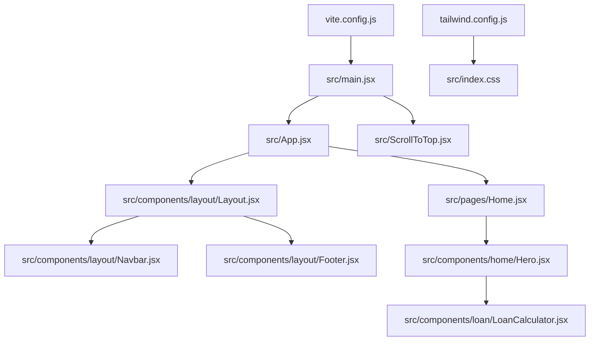
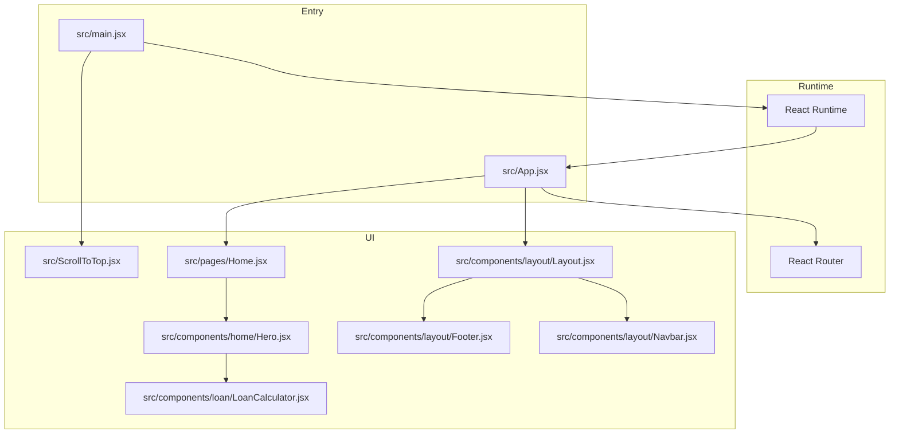
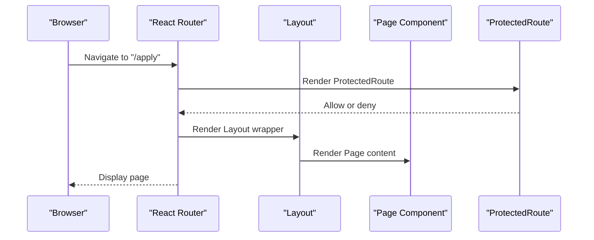
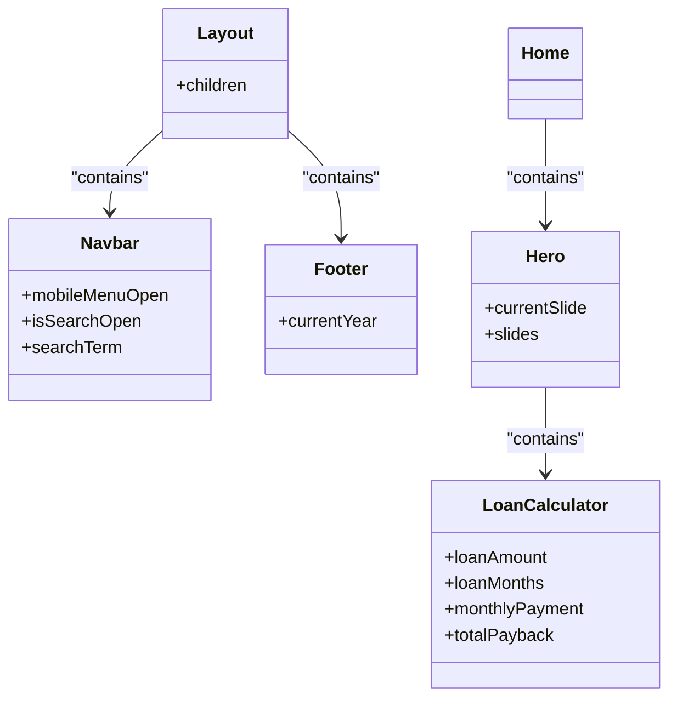
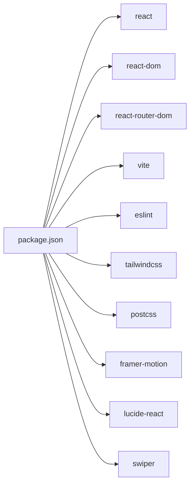

# Development Workflow

<cite>
**Referenced Files in This Document**
- [eslint.config.js](file://eslint.config.js)
- [package.json](file://package.json)
- [vite.config.js](file://vite.config.js)
- [tailwind.config.js](file://tailwind.config.js)
- [src/index.css](file://src/index.css)
- [.gitignore](file://.gitignore)
- [src/App.jsx](file://src/App.jsx)
- [src/main.jsx](file://src/main.jsx)
- [src/pages/Home.jsx](file://src/pages/Home.jsx)
- [src/components/layout/Layout.jsx](file://src/components/layout/Layout.jsx)
- [src/components/layout/Navbar.jsx](file://src/components/layout/Navbar.jsx)
- [src/components/layout/Footer.jsx](file://src/components/layout/Footer.jsx)
- [src/components/home/Hero.jsx](file://src/components/home/Hero.jsx)
- [src/components/loan/LoanCalculator.jsx](file://src/components/loan/LoanCalculator.jsx)
- [src/ScrollToTop.jsx](file://src/ScrollToTop.jsx)
</cite>

## Table of Contents
1. [Introduction](#introduction)
2. [Project Structure](#project-structure)
3. [Core Components](#core-components)
4. [Architecture Overview](#architecture-overview)
5. [Detailed Component Analysis](#detailed-component-analysis)
6. [Dependency Analysis](#dependency-analysis)
7. [Performance Considerations](#performance-considerations)
8. [Troubleshooting Guide](#troubleshooting-guide)
9. [Conclusion](#conclusion)
10. [Appendices](#appendices)

## Introduction
This document defines the development workflow and code quality standards for the project. It covers the ESLint configuration, code formatting rules, development best practices, Git workflow, branch management, pull request guidelines, testing strategy, code review processes, quality assurance measures, component development guidelines, naming conventions, documentation standards, development environment setup, debugging techniques, performance profiling tools, release process, version management, backward compatibility considerations, contribution guidelines, issue reporting, feature development workflows, troubleshooting, and maintaining code consistency across the team.

## Project Structure
The project is a Vite-powered React application using Tailwind CSS for styling. Key areas:
- Application bootstrap and routing are defined in the application entry and router setup.
- UI follows a layout pattern with a shared layout wrapper around pages.
- Components are organized by domain (layout, home, loan) and pages are organized under a dedicated folder.
- Styling leverages Tailwind CSS with a custom color palette and fonts.

**Diagram sources**
- [src/main.jsx](file://src/main.jsx#L1-L11)
- [src/App.jsx](file://src/App.jsx#L1-L51)
- [src/components/layout/Layout.jsx](file://src/components/layout/Layout.jsx#L1-L20)
- [src/components/layout/Navbar.jsx](file://src/components/layout/Navbar.jsx#L1-L156)
- [src/components/layout/Footer.jsx](file://src/components/layout/Footer.jsx#L1-L117)
- [src/pages/Home.jsx](file://src/pages/Home.jsx#L1-L297)
- [src/components/home/Hero.jsx](file://src/components/home/Hero.jsx#L1-L125)
- [src/components/loan/LoanCalculator.jsx](file://src/components/loan/LoanCalculator.jsx#L1-L117)
- [src/ScrollToTop.jsx](file://src/ScrollToTop.jsx#L1-L14)
- [vite.config.js](file://vite.config.js#L1-L8)
- [tailwind.config.js](file://tailwind.config.js#L1-L24)
- [src/index.css](file://src/index.css#L1-L40)

**Section sources**
- [src/main.jsx](file://src/main.jsx#L1-L11)
- [src/App.jsx](file://src/App.jsx#L1-L51)
- [src/components/layout/Layout.jsx](file://src/components/layout/Layout.jsx#L1-L20)
- [src/pages/Home.jsx](file://src/pages/Home.jsx#L1-L297)
- [vite.config.js](file://vite.config.js#L1-L8)
- [tailwind.config.js](file://tailwind.config.js#L1-L24)
- [src/index.css](file://src/index.css#L1-L40)

## Core Components
- Application entry renders the root React element and initializes the app shell.
- Routing is centralized in the application component with protected routes and nested layouts.
- Layout composes top bar, navigation, footer, and main content area.
- Home page aggregates reusable components such as hero banner and loan calculator.
- Styling integrates Tailwind with custom theme tokens and responsive design.

Key implementation references:
- Application bootstrap and rendering: [src/main.jsx](file://src/main.jsx#L1-L11)
- Routing and protected route usage: [src/App.jsx](file://src/App.jsx#L1-L51)
- Layout composition: [src/components/layout/Layout.jsx](file://src/components/layout/Layout.jsx#L1-L20)
- Home page composition: [src/pages/Home.jsx](file://src/pages/Home.jsx#L1-L297)
- Hero component and loan calculator: [src/components/home/Hero.jsx](file://src/components/home/Hero.jsx#L1-L125), [src/components/loan/LoanCalculator.jsx](file://src/components/loan/LoanCalculator.jsx#L1-L117)
- Tailwind theme and CSS base: [tailwind.config.js](file://tailwind.config.js#L1-L24), [src/index.css](file://src/index.css#L1-L40)

**Section sources**
- [src/main.jsx](file://src/main.jsx#L1-L11)
- [src/App.jsx](file://src/App.jsx#L1-L51)
- [src/components/layout/Layout.jsx](file://src/components/layout/Layout.jsx#L1-L20)
- [src/pages/Home.jsx](file://src/pages/Home.jsx#L1-L297)
- [src/components/home/Hero.jsx](file://src/components/home/Hero.jsx#L1-L125)
- [src/components/loan/LoanCalculator.jsx](file://src/components/loan/LoanCalculator.jsx#L1-L117)
- [tailwind.config.js](file://tailwind.config.js#L1-L24)
- [src/index.css](file://src/index.css#L1-L40)

## Architecture Overview
The application follows a component-driven architecture with:
- A single-page application (SPA) using React Router.
- A shared layout that wraps page-level components.
- Reusable UI components for navigation, hero banners, and calculators.
- Styling via Tailwind CSS with a custom theme.

**Diagram sources**
- [src/main.jsx](file://src/main.jsx#L1-L11)
- [src/App.jsx](file://src/App.jsx#L1-L51)
- [src/components/layout/Layout.jsx](file://src/components/layout/Layout.jsx#L1-L20)
- [src/components/layout/Navbar.jsx](file://src/components/layout/Navbar.jsx#L1-L156)
- [src/components/layout/Footer.jsx](file://src/components/layout/Footer.jsx#L1-L117)
- [src/pages/Home.jsx](file://src/pages/Home.jsx#L1-L297)
- [src/components/home/Hero.jsx](file://src/components/home/Hero.jsx#L1-L125)
- [src/components/loan/LoanCalculator.jsx](file://src/components/loan/LoanCalculator.jsx#L1-L117)
- [src/ScrollToTop.jsx](file://src/ScrollToTop.jsx#L1-L14)

## Detailed Component Analysis

### ESLint Configuration and Code Quality Standards
- Extends recommended JavaScript rules and React Hooks rules.
- Integrates React Refresh rules for Vite.
- Ignores the distribution output directory.
- Uses modern ECMAScript features with JSX enabled.
- Custom rule allows ignoring specific variable naming patterns for constants.

Implementation references:
- ESLint configuration: [eslint.config.js](file://eslint.config.js#L1-L30)
- Scripts for linting: [package.json](file://package.json#L6-L11)

Best practices derived from configuration:
- Enforce recommended JS rules and React Hooks best practices.
- Keep linting fast by ignoring built artifacts.
- Maintain modern language features while ensuring JSX support.

**Section sources**
- [eslint.config.js](file://eslint.config.js#L1-L30)
- [package.json](file://package.json#L6-L11)

### Vite Build and Development Setup
- React plugin is configured for fast refresh and JSX transformation.
- Scripts for dev, build, and preview are provided.
- No custom build targets are defined beyond defaults.

Implementation references:
- Vite configuration: [vite.config.js](file://vite.config.js#L1-L8)
- Scripts: [package.json](file://package.json#L6-L11)

**Section sources**
- [vite.config.js](file://vite.config.js#L1-L8)
- [package.json](file://package.json#L6-L11)

### Tailwind CSS Theming and Styling
- Content paths include HTML and all TS/JS/JSX/TSX files under src.
- Theme extends colors and fonts aligned with brand identity.
- Global CSS imports Tailwind and custom tokens; includes slider styling overrides.

Implementation references:
- Tailwind configuration: [tailwind.config.js](file://tailwind.config.js#L1-L24)
- Global CSS: [src/index.css](file://src/index.css#L1-L40)

**Section sources**
- [tailwind.config.js](file://tailwind.config.js#L1-L24)
- [src/index.css](file://src/index.css#L1-L40)

### Routing and Protected Routes
- Centralized routing with nested layout wrappers.
- Protected route usage demonstrates authentication gating for sensitive paths.
- Scroll-to-top behavior ensures clean navigation.

Implementation references:
- Routing and protected route: [src/App.jsx](file://src/App.jsx#L1-L51)
- Scroll-to-top: [src/ScrollToTop.jsx](file://src/ScrollToTop.jsx#L1-L14)

**Diagram sources**
- [src/App.jsx](file://src/App.jsx#L1-L51)
- [src/ScrollToTop.jsx](file://src/ScrollToTop.jsx#L1-L14)

**Section sources**
- [src/App.jsx](file://src/App.jsx#L1-L51)
- [src/ScrollToTop.jsx](file://src/ScrollToTop.jsx#L1-L14)

### Component Composition Patterns
- Layout composes header, navigation, footer, and main content area.
- Home page composes hero banner and calculator.
- Navigation supports desktop and mobile experiences with search and apply actions.

Implementation references:
- Layout: [src/components/layout/Layout.jsx](file://src/components/layout/Layout.jsx#L1-L20)
- Navbar: [src/components/layout/Navbar.jsx](file://src/components/layout/Navbar.jsx#L1-L156)
- Hero: [src/components/home/Hero.jsx](file://src/components/home/Hero.jsx#L1-L125)
- Loan calculator: [src/components/loan/LoanCalculator.jsx](file://src/components/loan/LoanCalculator.jsx#L1-L117)

**Diagram sources**
- [src/components/layout/Layout.jsx](file://src/components/layout/Layout.jsx#L1-L20)
- [src/components/layout/Navbar.jsx](file://src/components/layout/Navbar.jsx#L1-L156)
- [src/components/layout/Footer.jsx](file://src/components/layout/Footer.jsx#L1-L117)
- [src/pages/Home.jsx](file://src/pages/Home.jsx#L1-L297)
- [src/components/home/Hero.jsx](file://src/components/home/Hero.jsx#L1-L125)
- [src/components/loan/LoanCalculator.jsx](file://src/components/loan/LoanCalculator.jsx#L1-L117)

**Section sources**
- [src/components/layout/Layout.jsx](file://src/components/layout/Layout.jsx#L1-L20)
- [src/components/layout/Navbar.jsx](file://src/components/layout/Navbar.jsx#L1-L156)
- [src/components/layout/Footer.jsx](file://src/components/layout/Footer.jsx#L1-L117)
- [src/pages/Home.jsx](file://src/pages/Home.jsx#L1-L297)
- [src/components/home/Hero.jsx](file://src/components/home/Hero.jsx#L1-L125)
- [src/components/loan/LoanCalculator.jsx](file://src/components/loan/LoanCalculator.jsx#L1-L117)

### Testing Strategy and Quality Assurance
- No test framework or test runner is configured in the repository.
- Quality checks rely on ESLint and Vite build pipeline.
- Recommendation: Introduce unit tests for components and integration tests for routing and protected routes.

Guidelines:
- Add a testing framework (e.g., Vitest) and configure test scripts.
- Write unit tests for pure functions and component snapshots.
- Add integration tests for routing and protected route behavior.
- Include coverage thresholds and pre-commit hooks to enforce tests.

[No sources needed since this section provides general guidance]

### Code Review Processes
- Use pull requests to propose changes.
- Require at least one reviewer’s approval before merging.
- Ensure CI passes (lint, build) prior to merge.
- Keep PRs small and focused on a single concern.

[No sources needed since this section provides general guidance]

### Naming Conventions and Documentation Standards
- Component files use PascalCase (e.g., Layout.jsx, Hero.jsx).
- Pages are grouped under a pages directory with PascalCase filenames.
- Constants and CSS custom properties follow kebab-case or camelCase consistently.
- Inline comments explain complex logic (e.g., navigation import note).

Recommendations:
- Adopt consistent naming for CSS custom properties and Tailwind utilities.
- Add component prop documentation and usage examples.
- Standardize comment style for public APIs.

**Section sources**
- [src/components/layout/Layout.jsx](file://src/components/layout/Layout.jsx#L1-L20)
- [src/components/home/Hero.jsx](file://src/components/home/Hero.jsx#L1-L125)
- [src/components/loan/LoanCalculator.jsx](file://src/components/loan/LoanCalculator.jsx#L1-L117)
- [src/index.css](file://src/index.css#L1-L40)

### Development Environment Setup
- Install dependencies using the package manager.
- Run development server with hot reload.
- Build for production and preview locally.

References:
- Scripts: [package.json](file://package.json#L6-L11)
- Vite config: [vite.config.js](file://vite.config.js#L1-L8)

**Section sources**
- [package.json](file://package.json#L6-L11)
- [vite.config.js](file://vite.config.js#L1-L8)

### Debugging Techniques
- Use browser developer tools to inspect component tree and props.
- Leverage React DevTools for component hierarchy and state.
- Verify Tailwind classes by checking computed styles and content globs.

[No sources needed since this section provides general guidance]

### Performance Profiling Tools
- Use React DevTools Profiler to identify expensive renders.
- Audit bundle size with Vite’s built-in preview and external tools.
- Monitor runtime performance using browser performance panel.

[No sources needed since this section provides general guidance]

### Release Process, Version Management, and Backward Compatibility
- Version is managed in package metadata.
- No explicit changelog or semantic versioning strategy is present.
- Backward compatibility should be preserved for public APIs and component props.

Recommendations:
- Adopt semantic versioning and maintain a changelog.
- Tag releases and publish artifacts.
- Communicate breaking changes and migration steps.

**Section sources**
- [package.json](file://package.json#L2-L4)

### Contributing, Issues, and Feature Development
- Use branches per feature and open pull requests for review.
- Describe problem statements and acceptance criteria in issues.
- Keep commit messages clear and scoped.

[No sources needed since this section provides general guidance]

## Dependency Analysis
External dependencies and tooling:
- React and React DOM for UI.
- React Router for SPA routing.
- Tailwind CSS for styling with PostCSS pipeline.
- Vite for build tooling and development server.
- ESLint for code quality.

Implementation references:
- Dependencies: [package.json](file://package.json#L12-L20)
- Dev dependencies: [package.json](file://package.json#L21-L34)

**Diagram sources**
- [package.json](file://package.json#L12-L34)

**Section sources**
- [package.json](file://package.json#L12-L34)

## Performance Considerations
- Prefer lightweight components and avoid unnecessary re-renders.
- Lazy-load heavy assets and components where appropriate.
- Optimize Tailwind usage by purging unused styles.
- Monitor bundle size and split code for better load performance.

[No sources needed since this section provides general guidance]

## Troubleshooting Guide
Common issues and resolutions:
- Lint errors: Run the lint script and fix reported issues.
- Build failures: Inspect Vite logs and resolve missing dependencies.
- Styling inconsistencies: Verify Tailwind content globs and custom CSS imports.
- Routing problems: Confirm route paths and layout nesting.

References:
- Lint script: [package.json](file://package.json#L9-L9)
- Vite config: [vite.config.js](file://vite.config.js#L1-L8)
- Tailwind config: [tailwind.config.js](file://tailwind.config.js#L3-L3)
- Global CSS: [src/index.css](file://src/index.css#L1-L1)

**Section sources**
- [package.json](file://package.json#L9-L9)
- [vite.config.js](file://vite.config.js#L1-L8)
- [tailwind.config.js](file://tailwind.config.js#L3-L3)
- [src/index.css](file://src/index.css#L1-L1)

## Conclusion
This guide consolidates the current development workflow and outlines best practices for code quality, Git processes, testing, reviews, and maintenance. Adopting standardized conventions, continuous linting, and incremental improvements will ensure a robust and scalable development process.

[No sources needed since this section summarizes without analyzing specific files]

## Appendices

### Git Workflow and Branch Management
- Create feature branches from develop/main.
- Rebase or merge to keep history linear.
- Open pull requests with clear descriptions and screenshots for UI changes.

[No sources needed since this section provides general guidance]

### Pull Request Guidelines
- Include motivation, changes, and testing notes.
- Request reviewers based on component ownership.
- Ensure all checks pass before merging.

[No sources needed since this section provides general guidance]

### Component Development Checklist
- Use PascalCase for component files.
- Export default component and named exports for helpers.
- Add PropTypes or TypeScript types for public APIs.
- Write unit tests for component logic.
- Document props and behavior.

[No sources needed since this section provides general guidance]