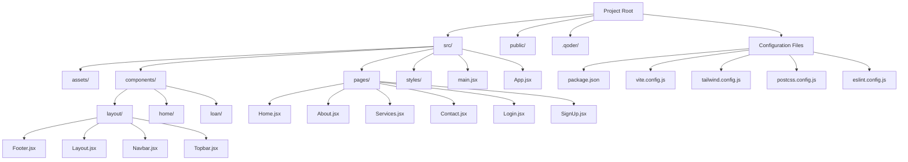

# Getting Started

<cite>
**Referenced Files in This Document**
- [package.json](file://package.json)
- [vite.config.js](file://vite.config.js)
- [tailwind.config.js](file://tailwind.config.js)
- [postcss.config.js](file://postcss.config.js)
- [eslint.config.js](file://eslint.config.js)
- [.gitignore](file://.gitignore)
- [index.html](file://index.html)
- [src/main.jsx](file://src/main.jsx)
- [src/App.jsx](file://src/App.jsx)
- [README.md](file://README.md)
</cite>

## Table of Contents
1. [Introduction](#introduction)
2. [Prerequisites](#prerequisites)
3. [Installation](#installation)
4. [Development Workflow](#development-workflow)
5. [Project Structure Overview](#project-structure-overview)
6. [Key Configuration Files](#key-configuration-files)
7. [Build and Deployment](#build-and-deployment)
8. [Troubleshooting](#troubleshooting)
9. [IDE Recommendations](#ide-recommendations)
10. [Browser Compatibility](#browser-compatibility)
11. [Conclusion](#conclusion)

## Introduction
Easilon Financial Solutions is a modern React-based web application designed to deliver financial services solutions with a clean, responsive interface. Built with Vite for fast development and Tailwind CSS for utility-first styling, this application provides a foundation for financial service websites with integrated loan calculation capabilities and professional layouts.

The application follows contemporary React patterns with component-based architecture, routing for navigation, and modern tooling for development and production builds.

## Prerequisites
Before you begin, ensure your development environment meets the following requirements:

### Node.js and Package Manager
- **Node.js**: Version 18.x or higher recommended
- **Package Manager**: npm 8.x+ or yarn 1.x+
- **Modern Browser**: Latest Chrome, Firefox, Safari, or Edge

### Development Tools
- **Code Editor**: VS Code recommended with React and Tailwind CSS extensions
- **Git**: Version control system for cloning and managing updates
- **Terminal/Command Line**: Command prompt or PowerShell for running commands

**Section sources**
- [package.json](file://package.json#L12-L34)
- [vite.config.js](file://vite.config.js#L1-L8)

## Installation
Follow these step-by-step instructions to set up the development environment:

### Step 1: Clone the Repository
```bash
git clone <repository-url>
cd easilon-final
```

### Step 2: Install Dependencies
Using npm (recommended):
```bash
npm install
```

Using yarn:
```bash
yarn install
```

### Step 3: Environment Setup
The application uses Vite for development with automatic environment detection. No additional environment variables are required for local development.

### Step 4: Verify Installation
Check that all dependencies installed correctly by running:
```bash
npm run lint
```

**Section sources**
- [package.json](file://package.json#L6-L11)
- [.gitignore](file://.gitignore#L1-L25)

## Development Workflow
The development workflow is streamlined with Vite's hot module replacement and React Fast Refresh:

### Starting the Development Server
```bash
npm run dev
```

This command launches:
- Local development server on port 5173
- Hot module replacement for instant UI updates
- React Fast Refresh for seamless component updates
- Automatic browser refresh on file changes

### Available Development Scripts
- `npm run dev`: Start development server with hot reload
- `npm run build`: Create production-ready build
- `npm run lint`: Run ESLint for code quality
- `npm run preview`: Preview production build locally

### Development Features
- **Hot Reload**: Automatic page refresh when files change
- **Fast Refresh**: Preserves component state during updates
- **ESLint Integration**: Real-time code quality feedback
- **Tailwind CSS**: Utility-first styling with custom color palette

**Section sources**
- [package.json](file://package.json#L6-L11)
- [vite.config.js](file://vite.config.js#L5-L7)

## Project Structure Overview
The application follows a conventional React project structure optimized for scalability and maintainability:



**Diagram sources**
- [package.json](file://package.json#L1-L36)
- [src/App.jsx](file://src/App.jsx#L1-L43)
- [src/main.jsx](file://src/main.jsx#L1-L11)

### Directory Breakdown
- **src/**: Main application source code
- **public/**: Static assets and images
- **.qoder/**: AI agent and skill configurations
- **Configuration files**: Build and tooling setup

**Section sources**
- [package.json](file://package.json#L1-L36)
- [src/App.jsx](file://src/App.jsx#L1-L43)

## Key Configuration Files
Understanding the configuration files is crucial for development and customization:

### package.json
Defines project metadata, dependencies, and scripts:
- **Dependencies**: React ecosystem libraries (React 19, react-router-dom, framer-motion)
- **Dev Dependencies**: Vite toolchain, Tailwind CSS, ESLint
- **Scripts**: Development, build, and lint commands

### Vite Configuration
Minimal configuration focused on React support:
- React plugin for JSX transformation
- Optimized development server settings
- ES module support

### Tailwind CSS Configuration
Customized design system:
- Content paths for purging unused styles
- Custom color palette (easilon brand colors)
- Font family configuration (Manrope font)
- Responsive design utilities

### PostCSS Configuration
Build pipeline integration:
- Tailwind CSS processor
- Autoprefixer for vendor prefixes
- CSS optimization

### ESLint Configuration
Code quality and consistency:
- React Hooks recommended rules
- React Refresh integration
- Modern JavaScript features
- Global variable definitions

**Section sources**
- [package.json](file://package.json#L1-L36)
- [vite.config.js](file://vite.config.js#L1-L8)
- [tailwind.config.js](file://tailwind.config.js#L1-L24)
- [postcss.config.js](file://postcss.config.js#L1-L6)
- [eslint.config.js](file://eslint.config.js#L1-L30)

## Build and Deployment
The application uses Vite for efficient production builds:

### Production Build Process
```bash
npm run build
```

This command generates:
- Optimized JavaScript bundles
- Minified CSS and assets
- Static HTML generation
- Asset hashing for cache busting

### Build Output
The build creates a `dist/` directory containing:
- Optimized JavaScript files
- Processed CSS files
- Compressed assets
- HTML entry points

### Preview Production Build
```bash
npm run preview
```

Test the production build locally before deployment.

### Deployment Preparation
1. **Verify Build**: Ensure `npm run build` completes without errors
2. **Test Preview**: Run `npm run preview` to validate production behavior
3. **Static Hosting**: Deploy `dist/` folder to any static hosting service
4. **Environment Variables**: Add any required environment variables for production

**Section sources**
- [package.json](file://package.json#L6-L11)
- [vite.config.js](file://vite.config.js#L5-L7)

## Troubleshooting
Common issues and their solutions:

### Node.js Version Issues
**Problem**: "Unsupported engine" warnings
**Solution**: Upgrade to Node.js 18.x or higher

### Port Conflicts
**Problem**: Port 5173 already in use
**Solution**: Modify Vite config or kill the conflicting process

### Dependency Installation Failures
**Problem**: npm/yarn install errors
**Solution**: Clear cache and retry:
```bash
npm cache clean --force
rm -rf node_modules package-lock.json
npm install
```

### Hot Reload Not Working
**Problem**: Changes not reflecting in browser
**Solution**: 
1. Check file save status
2. Verify Vite server is running
3. Restart development server if needed

### CSS Not Loading
**Problem**: Styles not applying correctly
**Solution**:
1. Verify Tailwind CSS is properly configured
2. Check for CSS conflicts
3. Ensure Tailwind directives are present

### Build Errors
**Problem**: Production build fails
**Solution**:
1. Run `npm run lint` to identify issues
2. Check for missing dependencies
3. Verify environment variables

**Section sources**
- [package.json](file://package.json#L12-L34)
- [vite.config.js](file://vite.config.js#L5-L7)
- [tailwind.config.js](file://tailwind.config.js#L3-L24)

## IDE Recommendations
For optimal development experience:

### Recommended Extensions
- **ESLint**: Code quality and error detection
- **Prettier**: Code formatting
- **Tailwind CSS IntelliSense**: CSS class completion
- **Auto Rename Tag**: HTML tag pair renaming
- **Bracket Pair Colorizer**: Code structure visualization

### VS Code Settings
Configure workspace settings for React development:
- Enable ESLint integration
- Set tab size to 2 spaces
- Enable auto formatting on save
- Configure TypeScript strict mode

### Alternative IDEs
- **WebStorm**: Full-featured React development
- **Sublime Text**: Lightweight option with React packages
- **Atom**: Community-driven with React packages

## Browser Compatibility
The application targets modern browsers with excellent compatibility:

### Supported Browsers
- **Chrome**: Latest 2 versions
- **Firefox**: Latest 2 versions
- **Safari**: Latest 2 versions
- **Edge**: Latest 2 versions

### Progressive Enhancement
- **JavaScript**: ES2020+ features
- **CSS**: Modern grid and flexbox
- **HTML**: HTML5 semantic elements
- **React**: 19.x features with polyfills where needed

### Polyfill Considerations
For older browsers, consider adding:
- Core-js polyfills
- Regenerator runtime
- URL polyfills for older environments

**Section sources**
- [eslint.config.js](file://eslint.config.js#L16-L23)
- [index.html](file://index.html#L8)

## Conclusion
Easilon Financial Solutions provides a solid foundation for building modern financial service applications. With its React-based architecture, Vite-powered development workflow, and Tailwind CSS styling system, developers can quickly create professional financial websites.

The setup process is straightforward with minimal configuration requirements. The application's modular structure makes it easy to extend with new features, pages, and components while maintaining code quality through ESLint integration.

For successful development:
1. Ensure Node.js 18.x+ is installed
2. Use npm for dependency management
3. Leverage Vite's hot reload for rapid iteration
4. Follow the established project structure
5. Test thoroughly across supported browsers

This documentation provides all necessary information to get the project running locally and ready for development. For additional customization, refer to the configuration files and component structure outlined above.