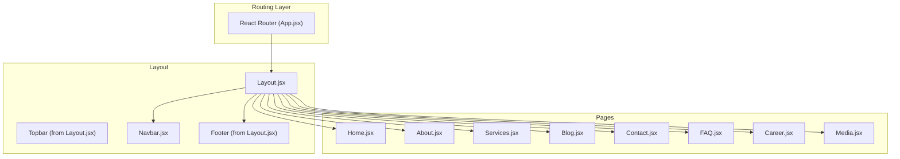
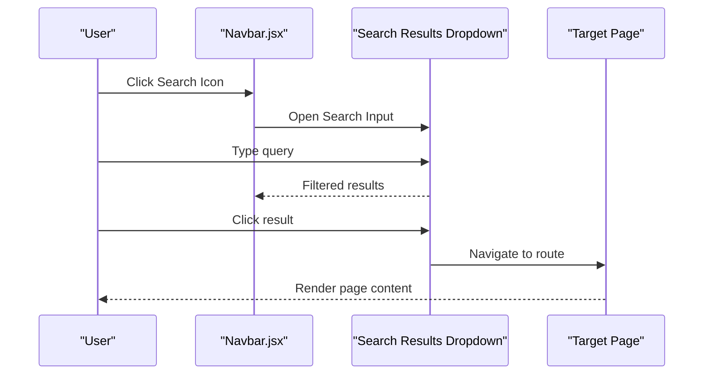
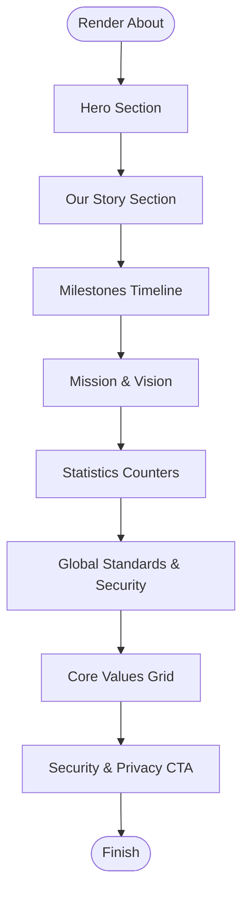
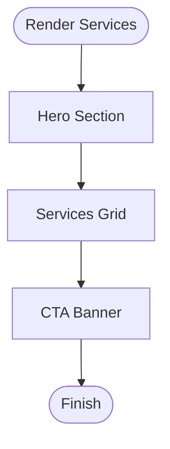
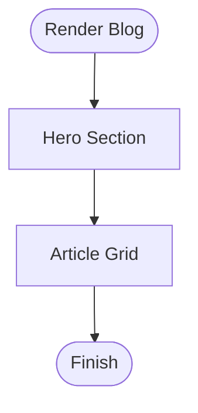
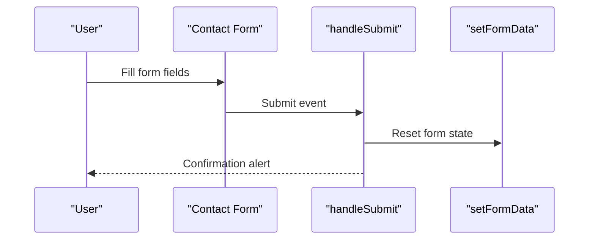
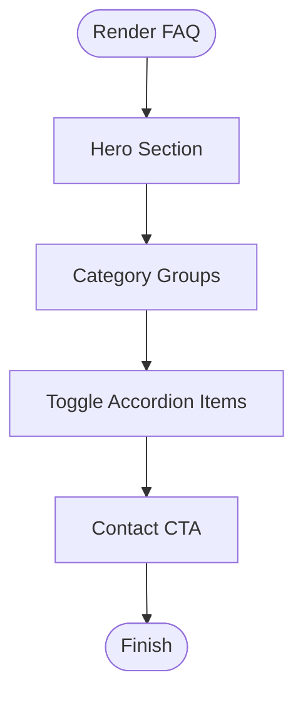
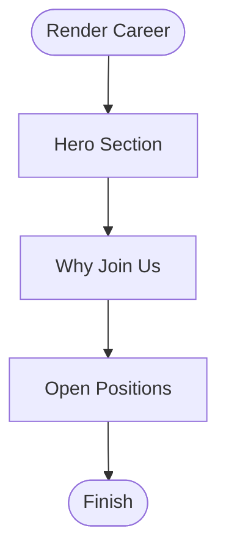
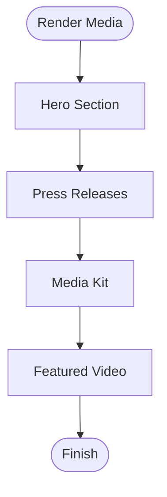
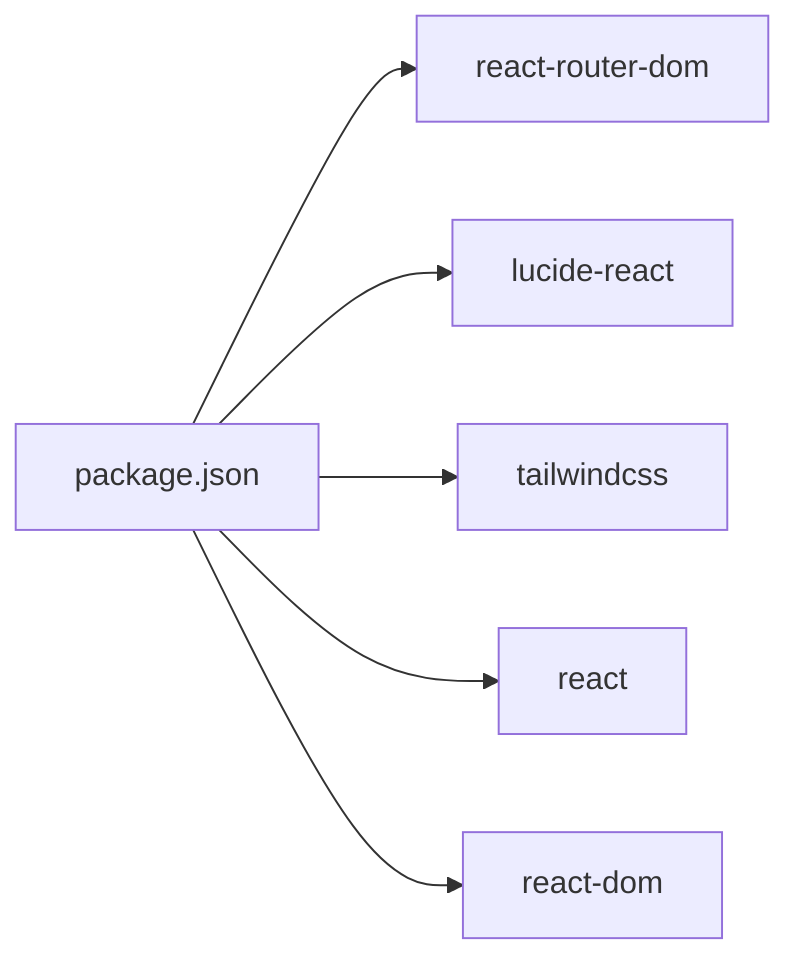

# Informational Pages

<cite>
**Referenced Files in This Document**
- [App.jsx](file://src/App.jsx)
- [Layout.jsx](file://src/components/layout/Layout.jsx)
- [Navbar.jsx](file://src/components/layout/Navbar.jsx)
- [About.jsx](file://src/pages/About.jsx)
- [Services.jsx](file://src/pages/Services.jsx)
- [Blog.jsx](file://src/pages/Blog.jsx)
- [Contact.jsx](file://src/pages/Contact.jsx)
- [FAQ.jsx](file://src/pages/FAQ.jsx)
- [Career.jsx](file://src/pages/Career.jsx)
- [Media.jsx](file://src/pages/Media.jsx)
- [Home.jsx](file://src/pages/Home.jsx)
- [tailwind.config.js](file://tailwind.config.js)
- [index.css](file://src/styles/index.css)
- [package.json](file://package.json)
</cite>

## Table of Contents
1. [Introduction](#introduction)
2. [Project Structure](#project-structure)
3. [Core Components](#core-components)
4. [Architecture Overview](#architecture-overview)
5. [Detailed Component Analysis](#detailed-component-analysis)
6. [Dependency Analysis](#dependency-analysis)
7. [Performance Considerations](#performance-considerations)
8. [Troubleshooting Guide](#troubleshooting-guide)
9. [Conclusion](#conclusion)
10. [Appendices](#appendices)

## Introduction
This document provides comprehensive documentation for all informational pages in the Easilon Financial Solutions application. It covers the About page (company history and team information), Services page (loan offerings and features), Blog page (content management and article display), Contact page (location details and inquiry forms), FAQ page (common questions and answers), Career page (job postings and applications), and Media page (press releases and announcements). It explains page-specific content structures, data management approaches, SEO optimization strategies, responsive design implementations, component reusability patterns, content formatting standards, image handling for media-rich pages, and integration with the navigation system. Practical examples are included for updating content dynamically, adding new pages, implementing search functionality, and optimizing for mobile devices.

## Project Structure
The application follows a feature-based structure with pages under src/pages and shared layout components under src/components/layout. Routing is configured via React Router in App.jsx, and the layout composes Topbar, Navbar, and Footer around page content. Styling leverages Tailwind CSS with a custom color palette and font configuration.

**Diagram sources**
- [App.jsx](file://src/App.jsx#L21-L48)
- [Layout.jsx](file://src/components/layout/Layout.jsx#L6-L17)
- [Navbar.jsx](file://src/components/layout/Navbar.jsx#L5-L156)
- [Home.jsx](file://src/pages/Home.jsx#L13-L297)
- [About.jsx](file://src/pages/About.jsx#L4-L263)
- [Services.jsx](file://src/pages/Services.jsx#L5-L141)
- [Blog.jsx](file://src/pages/Blog.jsx#L5-L154)
- [Contact.jsx](file://src/pages/Contact.jsx#L4-L188)
- [FAQ.jsx](file://src/pages/FAQ.jsx#L4-L182)
- [Career.jsx](file://src/pages/Career.jsx#L5-L182)
- [Media.jsx](file://src/pages/Media.jsx#L4-L177)

**Section sources**
- [App.jsx](file://src/App.jsx#L21-L48)
- [Layout.jsx](file://src/components/layout/Layout.jsx#L6-L17)
- [Navbar.jsx](file://src/components/layout/Navbar.jsx#L5-L156)

## Core Components
- Layout: Provides a consistent shell with Topbar, Navbar, and Footer around page content.
- Navbar: Implements desktop and mobile navigation, a live search bar, and action buttons.
- Page Components: Each informational page defines its own hero, content sections, and interactive elements.

Key reusable patterns:
- Consistent hero sections with gradient overlays and breadcrumb-like text paths.
- Card-based layouts for services, blog posts, FAQs, jobs, and media assets.
- Shared icons from lucide-react for visual consistency.
- Tailwind utility classes for responsive grids and typography.

**Section sources**
- [Layout.jsx](file://src/components/layout/Layout.jsx#L6-L17)
- [Navbar.jsx](file://src/components/layout/Navbar.jsx#L28-L156)
- [About.jsx](file://src/pages/About.jsx#L42-L263)
- [Services.jsx](file://src/pages/Services.jsx#L48-L141)
- [Blog.jsx](file://src/pages/Blog.jsx#L66-L154)
- [Contact.jsx](file://src/pages/Contact.jsx#L49-L188)
- [FAQ.jsx](file://src/pages/FAQ.jsx#L81-L182)
- [Career.jsx](file://src/pages/Career.jsx#L61-L182)
- [Media.jsx](file://src/pages/Media.jsx#L36-L177)

## Architecture Overview
The application uses a single-page architecture with client-side routing. The Layout component wraps each page, ensuring consistent navigation and footer placement. The Navbar integrates a search feature that filters internal routes and navigates users instantly.

**Diagram sources**
- [Navbar.jsx](file://src/components/layout/Navbar.jsx#L54-L99)
- [App.jsx](file://src/App.jsx#L25-L45)

**Section sources**
- [App.jsx](file://src/App.jsx#L25-L45)
- [Navbar.jsx](file://src/components/layout/Navbar.jsx#L21-L99)

## Detailed Component Analysis

### About Page
Purpose:
- Present company history, milestones, mission/vision, values, stats, and trust/security assurances.

Content structure:
- Hero with background image and breadcrumb.
- “Our Story” narrative with feature highlights.
- Timeline of milestones aligned with company longevity.
- Mission and Vision cards with decorative icons.
- Statistics counters with icons.
- Global standards, partnerships, and security features.
- Values grid with hover effects.
- Trust and security CTA.

Data management:
- Static arrays define stats, values, and milestones.
- Uses icons from lucide-react for visual cues.

SEO and accessibility:
- Semantic headings hierarchy.
- Alt attributes for images.
- Descriptive meta information can be added at the application level.

Responsive design:
- Grid layouts adapt from single column on small screens to multiple columns on larger screens.
- Typography scales appropriately across breakpoints.

Accessibility:
- Focusable elements and keyboard navigation supported by semantic HTML and Tailwind utilities.

**Diagram sources**
- [About.jsx](file://src/pages/About.jsx#L42-L263)

**Section sources**
- [About.jsx](file://src/pages/About.jsx#L4-L263)

### Services Page
Purpose:
- Showcase loan offerings with descriptions, features, and call-to-action links.

Content structure:
- Hero with gradient overlay.
- Services grid with icons, titles, descriptions, and feature lists.
- Call-to-action banner linking to the application page.

Data management:
- Static array of services with icon, title, description, and features.
- Uses Lucide icons mapped per service.

SEO and accessibility:
- Clear headings and concise descriptions.
- Links use semantic anchor elements.

Responsive design:
- Responsive grid adapts to device width.
- Hover states improve interactivity.

**Diagram sources**
- [Services.jsx](file://src/pages/Services.jsx#L48-L141)

**Section sources**
- [Services.jsx](file://src/pages/Services.jsx#L5-L141)

### Blog Page
Purpose:
- Display a collection of articles with images, categories, excerpts, and metadata.

Content structure:
- Hero with gradient overlay.
- Article grid with thumbnails, category badges, titles, excerpts, and metadata.

Data management:
- Static array of posts with image URLs, category, title, excerpt, author, date, and comment count.

SEO and accessibility:
- Proper heading hierarchy and alt text for images.
- Internal links for article navigation.

Responsive design:
- Three-column layout on large screens, two on medium, single on small.

**Diagram sources**
- [Blog.jsx](file://src/pages/Blog.jsx#L66-L154)

**Section sources**
- [Blog.jsx](file://src/pages/Blog.jsx#L5-L154)

### Contact Page
Purpose:
- Provide contact information cards, an inquiry form, and an embedded map.

Content structure:
- Hero with gradient overlay.
- Contact info cards with icons and details.
- Inquiry form with controlled inputs and submission handler.
- Embedded Google Maps iframe.

Data management:
- Static contact info array.
- Form state managed with React hooks.

SEO and accessibility:
- Semantic field grouping and labels.
- Accessible form controls with proper attributes.

Responsive design:
- Two-column layout on large screens, stacked on smaller screens.
- Map container maintains aspect ratio.

**Diagram sources**
- [Contact.jsx](file://src/pages/Contact.jsx#L13-L21)

**Section sources**
- [Contact.jsx](file://src/pages/Contact.jsx#L4-L188)

### FAQ Page
Purpose:
- Provide searchable, collapsible frequently asked questions grouped by categories.

Content structure:
- Hero with gradient overlay.
- Category-based accordion with toggle behavior.
- Contact CTA for unresolved queries.

Data management:
- Nested static array of categories and questions.
- Single state tracks the currently open FAQ index.

Interaction pattern:
- Toggle opens one item at a time; clicking again closes it.

**Diagram sources**
- [FAQ.jsx](file://src/pages/FAQ.jsx#L81-L182)

**Section sources**
- [FAQ.jsx](file://src/pages/FAQ.jsx#L4-L182)

### Career Page
Purpose:
- Promote company culture and display current job openings with details and application links.

Content structure:
- Hero with gradient overlay.
- Why join us section with benefits list and image.
- Open positions list with department, location, type, and salary.
- Apply now links.

Data management:
- Static arrays for benefits and job listings.

Responsive design:
- Two-column layout for hero content on large screens.
- Card-based job listings with flexible inner layout.

**Diagram sources**
- [Career.jsx](file://src/pages/Career.jsx#L61-L182)

**Section sources**
- [Career.jsx](file://src/pages/Career.jsx#L5-L182)

### Media Page
Purpose:
- Publish press releases, provide downloadable media assets, and showcase a featured video.

Content structure:
- Hero with gradient overlay.
- Press releases grid with category and date.
- Media kit grid with asset metadata and download affordances.
- Featured video section with thumbnail and play button.

Data management:
- Static arrays for press releases and media kit assets.

Responsive design:
- Three-column grid on large screens, two on medium, single on small.

**Diagram sources**
- [Media.jsx](file://src/pages/Media.jsx#L36-L177)

**Section sources**
- [Media.jsx](file://src/pages/Media.jsx#L4-L177)

## Dependency Analysis
External libraries and integrations:
- React and React Router DOM for routing and navigation.
- lucide-react for consistent iconography.
- Tailwind CSS for utility-first styling and responsive design.
- Google Maps iframe for location embedding.

**Diagram sources**
- [package.json](file://package.json#L12-L34)

**Section sources**
- [package.json](file://package.json#L12-L34)

## Performance Considerations
- Lazy loading: Consider lazy-loading heavy assets (images, videos) and deferring non-critical scripts.
- Image optimization: Serve appropriately sized images and leverage modern formats where possible.
- Bundle size: Keep icon usage scoped and avoid importing entire icon libraries.
- Rendering: Use memoization for static content arrays to prevent unnecessary re-renders.
- Accessibility: Ensure sufficient color contrast and semantic markup for screen readers.

## Troubleshooting Guide
Common issues and resolutions:
- Navigation not highlighting active link:
  - Verify isActive logic matches route paths and casing.
  - Confirm route paths in Navbar match those defined in App.jsx.
- Search not filtering results:
  - Ensure searchTerm state updates and filter logic compares lowercase values.
  - Check that allData includes target items and paths are correct.
- Form submission not resetting:
  - Confirm handleSubmit prevents default and resets state.
  - Validate controlled input names match state keys.
- Styling inconsistencies:
  - Verify Tailwind configuration extends colors and fonts as expected.
  - Ensure index.css imports Tailwind directives and custom fonts.

**Section sources**
- [Navbar.jsx](file://src/components/layout/Navbar.jsx#L25-L99)
- [Contact.jsx](file://src/pages/Contact.jsx#L13-L21)
- [tailwind.config.js](file://tailwind.config.js#L4-L21)
- [index.css](file://src/styles/index.css#L1-L12)

## Conclusion
The informational pages are structured consistently with reusable layout components, responsive design, and clear content hierarchies. They integrate seamlessly with the navigation system, support dynamic interactions where appropriate, and provide a solid foundation for content updates and enhancements. Extending the system involves adding new routes, creating page components following existing patterns, and integrating with the shared layout and navigation.

## Appendices

### SEO Optimization Strategies
- Meta tags and structured data: Add meta description, Open Graph, and Twitter Card tags at the application level.
- Semantic markup: Use headings in descending order and descriptive alt attributes for images.
- Internal linking: Leverage Navbar and page anchors to connect related content.
- URL structure: Maintain clean, readable paths aligned with page names.
- Accessibility: Ensure focus management, ARIA attributes where needed, and keyboard navigation.

### Content Formatting Standards
- Headings: H1 for page titles, H2 for major sections, H3 for subsections.
- Paragraphs: Use concise sentences with leading-relaxed for readability.
- Lists: Bulleted lists for features and benefits; numbered lists for steps.
- Links: Use descriptive anchor text and consistent hover states.

### Image Handling for Media-Rich Pages
- Optimize images: Compress and serve appropriate sizes; consider responsive image techniques.
- Lazy loading: Enable lazy loading for blog and media grids.
- Alt text: Provide meaningful alt attributes for accessibility and SEO.
- Aspect ratios: Maintain consistent aspect ratios for grids and carousels.

### Integration with Navigation System
- Route alignment: Ensure Navbar allData entries match App.jsx routes.
- Active states: Use isActive to reflect current page in navigation.
- Mobile menu: Keep mobile navigation in sync with desktop items.

### Examples

- Updating content dynamically:
  - Modify static arrays in page components (e.g., About stats, Services features).
  - Use React state for form inputs (e.g., Contact form) and controlled components.

- Adding a new informational page:
  - Create a new page component following the established structure.
  - Register the route in App.jsx with Layout wrapper.
  - Add navigation items in Navbar allData and ensure isActive logic works.

- Implementing search functionality:
  - Extend the existing search logic in Navbar to include more data sources (e.g., blog posts, services).
  - Debounce input for better performance and UX.

- Optimizing for mobile devices:
  - Use responsive grid classes and component stacking on smaller screens.
  - Ensure touch-friendly targets and readable font sizes.
  - Test navigation toggles and search dropdown behavior on mobile.

**Section sources**
- [App.jsx](file://src/App.jsx#L25-L45)
- [Navbar.jsx](file://src/components/layout/Navbar.jsx#L12-L23)
- [About.jsx](file://src/pages/About.jsx#L5-L37)
- [Services.jsx](file://src/pages/Services.jsx#L6-L43)
- [Contact.jsx](file://src/pages/Contact.jsx#L5-L21)
- [Blog.jsx](file://src/pages/Blog.jsx#L6-L61)
- [Media.jsx](file://src/pages/Media.jsx#L5-L31)