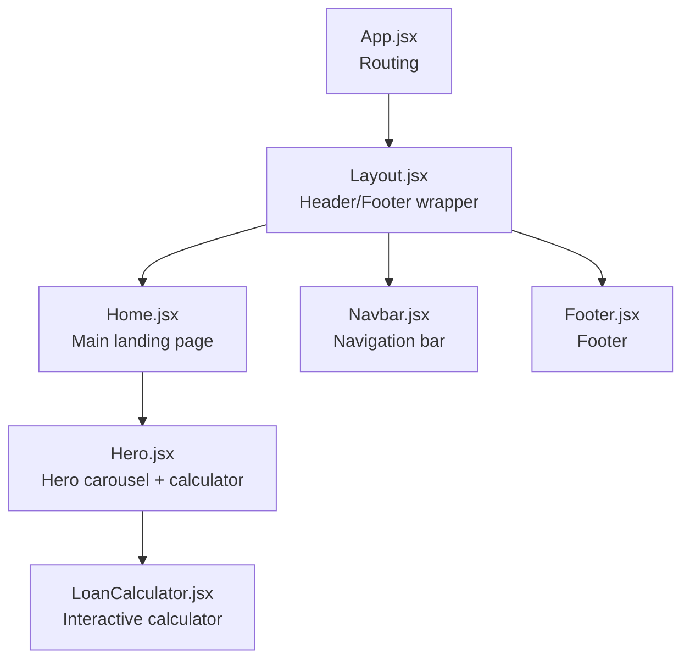
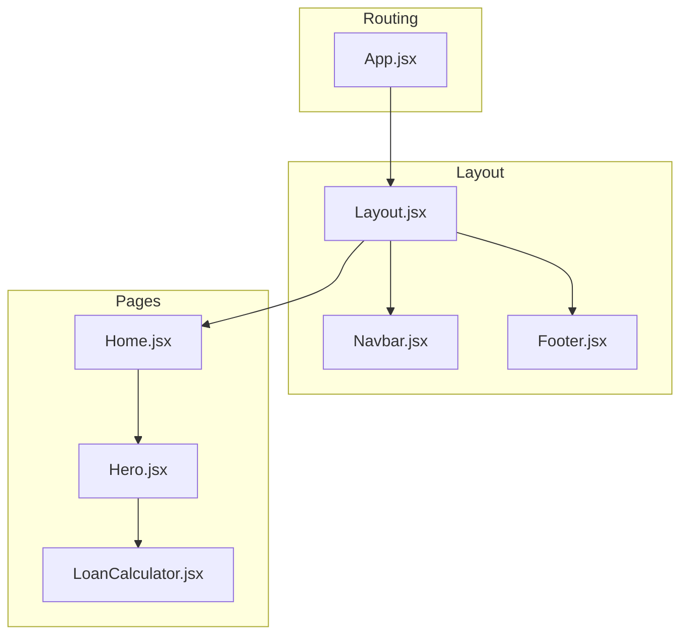
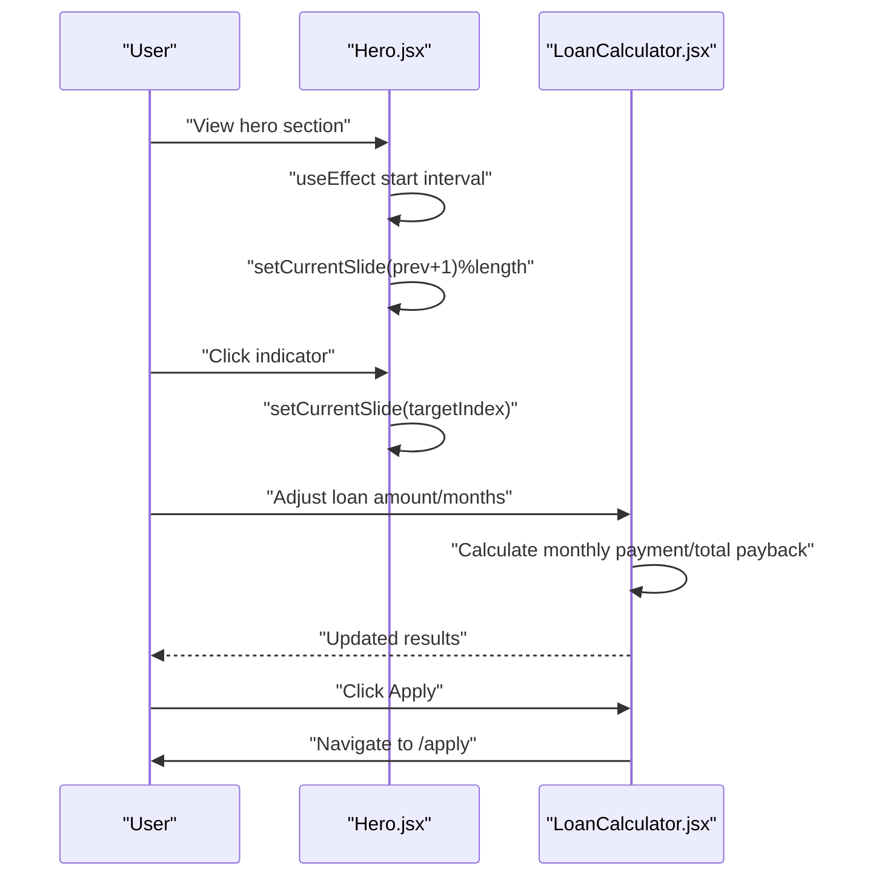
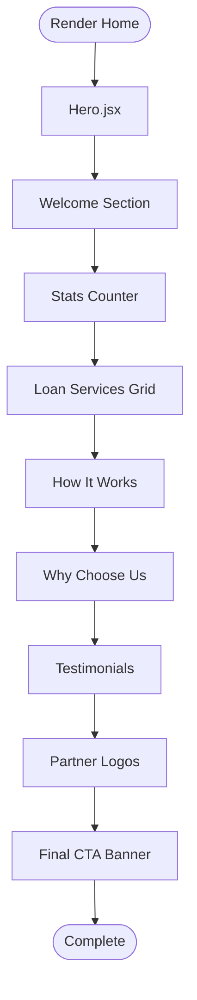
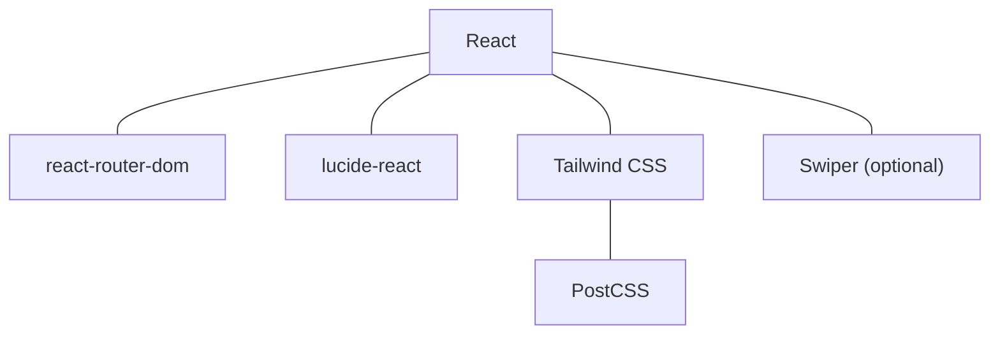

# Landing Page

<cite>
**Referenced Files in This Document**
- [Home.jsx](file://src/pages/Home.jsx)
- [Hero.jsx](file://src/components/home/Hero.jsx)
- [LoanCalculator.jsx](file://src/components/loan/LoanCalculator.jsx)
- [Layout.jsx](file://src/components/layout/Layout.jsx)
- [App.jsx](file://src/App.jsx)
- [Navbar.jsx](file://src/components/layout/Navbar.jsx)
- [Footer.jsx](file://src/components/layout/Footer.jsx)
- [index.css](file://src/styles/index.css)
- [tailwind.config.js](file://tailwind.config.js)
- [package.json](file://package.json)
</cite>

## Table of Contents
1. [Introduction](#introduction)
2. [Project Structure](#project-structure)
3. [Core Components](#core-components)
4. [Architecture Overview](#architecture-overview)
5. [Detailed Component Analysis](#detailed-component-analysis)
6. [Dependency Analysis](#dependency-analysis)
7. [Performance Considerations](#performance-considerations)
8. [Troubleshooting Guide](#troubleshooting-guide)
9. [Conclusion](#conclusion)
10. [Appendices](#appendices)

## Introduction
This document provides comprehensive documentation for the landing page components of Easilon Financial Solutions. It focuses on the Home page structure and the Hero component, detailing the hero carousel with auto-rotation, the welcome section with animated elements, the stats counter section, the loan services grid, the “How It Works” process, the “Why Choose Us” benefits, testimonials, partner logos, and the final call-to-action banner. It also covers the Hero component’s loan calculator integration, image asset management, responsive design patterns, interactive elements, component composition, prop passing, state management for carousel functionality, and styling using Tailwind CSS. Practical examples for content customization, adding new service offerings, and modifying the hero section layout are included.

## Project Structure
The landing page is built as a React application with Vite and styled using Tailwind CSS. The Home page composes multiple sections and integrates the Hero component, which further composes the LoanCalculator. Routing is handled via react-router-dom, and the layout wraps all pages with a shared header, navigation, and footer.

**Diagram sources**
- [App.jsx](file://src/App.jsx#L21-L48)
- [Layout.jsx](file://src/components/layout/Layout.jsx#L6-L17)
- [Home.jsx](file://src/pages/Home.jsx#L13-L296)
- [Hero.jsx](file://src/components/home/Hero.jsx#L7-L124)
- [LoanCalculator.jsx](file://src/components/loan/LoanCalculator.jsx#L5-L116)
- [Navbar.jsx](file://src/components/layout/Navbar.jsx#L5-L155)
- [Footer.jsx](file://src/components/layout/Footer.jsx#L5-L116)

**Section sources**
- [App.jsx](file://src/App.jsx#L21-L48)
- [Layout.jsx](file://src/components/layout/Layout.jsx#L6-L17)
- [Home.jsx](file://src/pages/Home.jsx#L13-L296)
- [Hero.jsx](file://src/components/home/Hero.jsx#L7-L124)
- [LoanCalculator.jsx](file://src/components/loan/LoanCalculator.jsx#L5-L116)
- [Navbar.jsx](file://src/components/layout/Navbar.jsx#L5-L155)
- [Footer.jsx](file://src/components/layout/Footer.jsx#L5-L116)

## Core Components
- Home.jsx: Orchestrates the entire landing page, rendering the Hero component and all subsequent sections. It imports local images and Lucide icons for visual elements and renders lists of services, testimonials, and stats.
- Hero.jsx: Implements an auto-rotating hero carousel with three slides, gradient overlays, decorative SVG elements, and a loan calculator widget on the right side. It manages the current slide index with React state and updates automatically every five seconds.
- LoanCalculator.jsx: Provides an interactive loan estimator with sliders for loan amount and term, real-time calculation of monthly payment and total payback, currency formatting, and a navigation action to the application page.
- Layout.jsx, Navbar.jsx, Footer.jsx: Provide the global layout and navigation, ensuring consistent branding and accessibility across the site.
- Styling: Tailwind CSS is configured with custom color tokens and fonts, enabling consistent theming across components.

**Section sources**
- [Home.jsx](file://src/pages/Home.jsx#L13-L296)
- [Hero.jsx](file://src/components/home/Hero.jsx#L7-L124)
- [LoanCalculator.jsx](file://src/components/loan/LoanCalculator.jsx#L5-L116)
- [Layout.jsx](file://src/components/layout/Layout.jsx#L6-L17)
- [Navbar.jsx](file://src/components/layout/Navbar.jsx#L5-L155)
- [Footer.jsx](file://src/components/layout/Footer.jsx#L5-L116)
- [index.css](file://src/styles/index.css#L1-L12)
- [tailwind.config.js](file://tailwind.config.js#L1-L24)

## Architecture Overview
The landing page follows a component-driven architecture:
- App.jsx defines routes and wraps each page with Layout.
- Layout.jsx injects Topbar, Navbar, and Footer around page content.
- Home.jsx composes multiple sections and the Hero component.
- Hero.jsx composes LoanCalculator.jsx and manages carousel state.
- Styling is centralized via Tailwind CSS with custom color tokens.

**Diagram sources**
- [App.jsx](file://src/App.jsx#L21-L48)
- [Layout.jsx](file://src/components/layout/Layout.jsx#L6-L17)
- [Navbar.jsx](file://src/components/layout/Navbar.jsx#L5-L155)
- [Footer.jsx](file://src/components/layout/Footer.jsx#L5-L116)
- [Home.jsx](file://src/pages/Home.jsx#L13-L296)
- [Hero.jsx](file://src/components/home/Hero.jsx#L7-L124)
- [LoanCalculator.jsx](file://src/components/loan/LoanCalculator.jsx#L5-L116)

## Detailed Component Analysis

### Hero Component
The Hero component creates a visually rich hero area with:
- Auto-rotating carousel: Uses React state and useEffect to cycle through three slides every five seconds.
- Background imagery: A darkened, gradient overlay enhances readability and visual impact.
- Decorative SVG elements: Adds organic curves to the sides for dynamic composition.
- Interactive elements: Slide indicators allow manual navigation; CTA buttons link to services and sign-up.
- Integrated calculator: Renders the LoanCalculator component on the right side for desktop layouts.

Key implementation patterns:
- State management: currentSlide tracks the active slide index.
- Auto-rotation: useEffect sets up a timer and clears it on unmount.
- Composition: Delegates calculations to LoanCalculator.jsx.

**Diagram sources**
- [Hero.jsx](file://src/components/home/Hero.jsx#L25-L30)
- [Hero.jsx](file://src/components/home/Hero.jsx#L100-L112)
- [LoanCalculator.jsx](file://src/components/loan/LoanCalculator.jsx#L15-L20)
- [LoanCalculator.jsx](file://src/components/loan/LoanCalculator.jsx#L106-L112)

**Section sources**
- [Hero.jsx](file://src/components/home/Hero.jsx#L7-L124)
- [LoanCalculator.jsx](file://src/components/loan/LoanCalculator.jsx#L5-L116)

### Home Page Sections
The Home page composes multiple sections, each with distinct content and styling:

1) Welcome Section
- Two floating images with borders and layered positioning.
- Animated elements: hover effects on feature bullets and buttons.
- Typography hierarchy emphasizes brand voice and clarity.

2) Stats Counter Section
- Four metric cards with icons and values.
- Consistent spacing and typography for readability.

3) Loan Services Grid
- Six loan offerings with icons, titles, and descriptions.
- Hover states and transitions for interactivity.

4) How It Works Section
- Three-step process with numbered steps and descriptions.
- Call-to-action button directs users to apply.

5) Why Choose Us Section
- Benefits with icons and descriptive labels.
- Skill rating bars with animated widths.

6) Testimonials Section
- Client feedback cards with star ratings and profile images.
- Navigation arrows for testimonials.

7) Partner Logos Section
- Brand names displayed with consistent typography and spacing.

8) Final Call-to-Action Banner
- Prominent CTA with skew background and directional emphasis.

**Diagram sources**
- [Home.jsx](file://src/pages/Home.jsx#L13-L296)

**Section sources**
- [Home.jsx](file://src/pages/Home.jsx#L18-L296)

### Responsive Design Patterns
- Flexbox and Grid: Used extensively for layout adaptability across breakpoints.
- Tailwind utilities: Responsive prefixes (sm:, md:, lg:, xl:) control layout shifts.
- Image handling: object-cover and aspect ratios maintain visual consistency.
- Typography scaling: Responsive text sizes improve readability on devices.

**Section sources**
- [Home.jsx](file://src/pages/Home.jsx#L19-L296)
- [Hero.jsx](file://src/components/home/Hero.jsx#L33-L121)
- [index.css](file://src/styles/index.css#L1-L12)
- [tailwind.config.js](file://tailwind.config.js#L4-L21)

### Styling Approaches Using Tailwind CSS
- Color tokens: easilon.primary, easilon.cyan, easilon.navy, easilon.gray define the brand palette.
- Font families: Manrope and Inter applied for headings and body text.
- Utilities: Spacing, shadows, borders, and gradients create depth and visual hierarchy.

**Section sources**
- [tailwind.config.js](file://tailwind.config.js#L6-L20)
- [index.css](file://src/styles/index.css#L5-L12)

### Component Composition and Prop Passing
- Composition: Home.jsx composes Hero.jsx; Hero.jsx composes LoanCalculator.jsx.
- Prop passing: None required for Hero and LoanCalculator in current implementation; state is internal.
- Navigation: Link components from react-router-dom enable internal navigation.

**Section sources**
- [Home.jsx](file://src/pages/Home.jsx#L3-L16)
- [Hero.jsx](file://src/components/home/Hero.jsx#L4-L5)
- [LoanCalculator.jsx](file://src/components/loan/LoanCalculator.jsx#L3)

### State Management for Carousel Functionality
- Local state: currentSlide holds the active carousel index.
- Auto-rotation: useEffect starts a timer updating the index periodically.
- Cleanup: Timer cleared on component unmount to prevent memory leaks.

**Section sources**
- [Hero.jsx](file://src/components/home/Hero.jsx#L8-L30)

### Image Asset Management
- Local assets: Images imported directly into Home.jsx and used in sections.
- Background image: Hero.jsx uses an external URL with overlays for performance and flexibility.
- Alt attributes: All images include descriptive alt text for accessibility.

**Section sources**
- [Home.jsx](file://src/pages/Home.jsx#L6-L11)
- [Hero.jsx](file://src/components/home/Hero.jsx#L36-L45)

### Examples of Content Customization
- Changing hero copy: Modify the slides array in Hero.jsx to update carousel text.
- Adding new services: Extend the services array in Home.jsx to include new offerings.
- Updating testimonials: Add or modify entries in the testimonials array in Home.jsx.
- Adjusting stats: Update the stats array in Home.jsx to reflect new metrics.
- Modifying hero layout: Adjust the grid and image containers in Hero.jsx to change composition.

**Section sources**
- [Hero.jsx](file://src/components/home/Hero.jsx#L10-L23)
- [Home.jsx](file://src/pages/Home.jsx#L105-L124)
- [Home.jsx](file://src/pages/Home.jsx#L229-L242)
- [Home.jsx](file://src/pages/Home.jsx#L76-L87)

## Dependency Analysis
External dependencies include React, react-router-dom for routing, lucide-react for icons, and swiper for potential carousel enhancements. Tailwind CSS and PostCSS handle styling.

**Diagram sources**
- [package.json](file://package.json#L12-L34)

**Section sources**
- [package.json](file://package.json#L12-L34)

## Performance Considerations
- Lazy loading: Consider lazy-loading heavy hero backgrounds or testimonials if content grows.
- Minimizing re-renders: Keep state scoped to components that need it (e.g., Hero carousel).
- CSS optimization: Use Tailwind utilities efficiently to avoid bloated styles.
- Image optimization: Prefer modern formats and appropriate sizes for hero images.

## Troubleshooting Guide
- Carousel not rotating: Verify useEffect timer setup and ensure slides length is greater than zero.
- Slides not clickable: Confirm indicator onClick handlers are bound to the correct indices.
- Loan calculator not updating: Ensure state updates for loanAmount and loanMonths trigger recalculation.
- Navigation issues: Check Link paths and route definitions in App.jsx.
- Styling inconsistencies: Confirm Tailwind configuration and color tokens are correctly extended.

**Section sources**
- [Hero.jsx](file://src/components/home/Hero.jsx#L25-L30)
- [Hero.jsx](file://src/components/home/Hero.jsx#L100-L112)
- [LoanCalculator.jsx](file://src/components/loan/LoanCalculator.jsx#L15-L20)
- [App.jsx](file://src/App.jsx#L25-L45)

## Conclusion
The landing page leverages a modular, component-driven architecture to deliver a visually engaging and functional user experience. The Hero component’s auto-rotating carousel and integrated loan calculator enhance engagement, while the Home page sections communicate value propositions effectively. Tailwind CSS and a consistent design system ensure cohesive styling. The structure supports easy content customization and future enhancements.

## Appendices
- Customization checklist:
  - Update hero slides and CTAs in Hero.jsx.
  - Add or remove services in Home.jsx.
  - Modify testimonials and stats arrays in Home.jsx.
  - Adjust color tokens and fonts in tailwind.config.js and index.css.
  - Verify navigation links in Navbar.jsx and Footer.jsx.