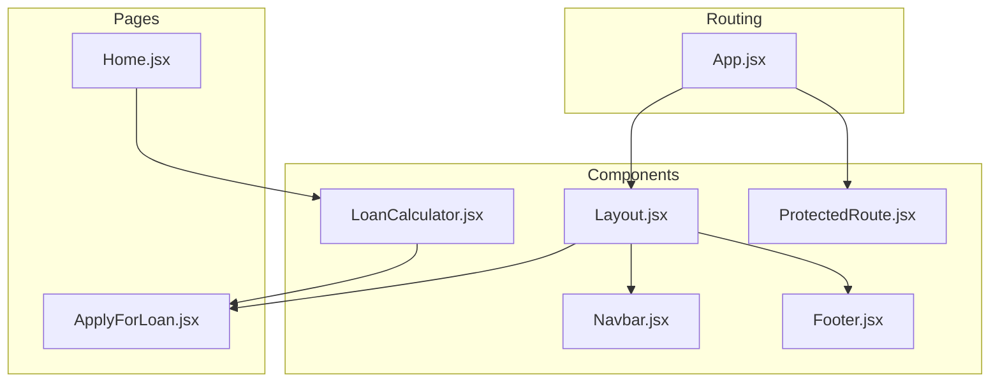
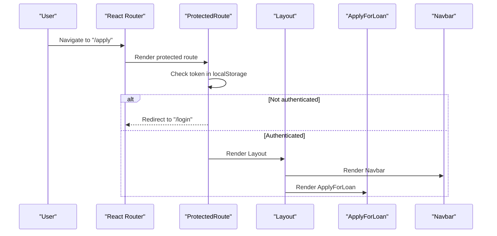
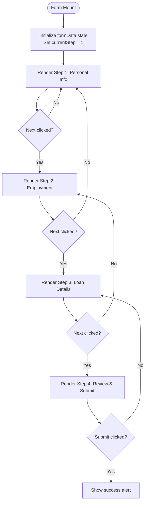
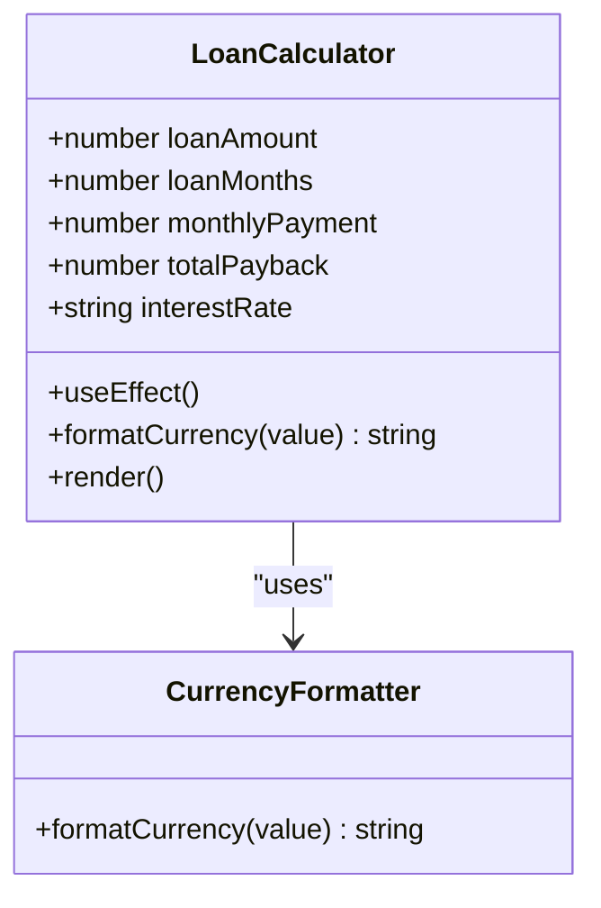
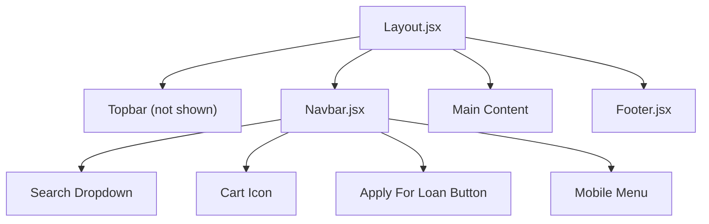
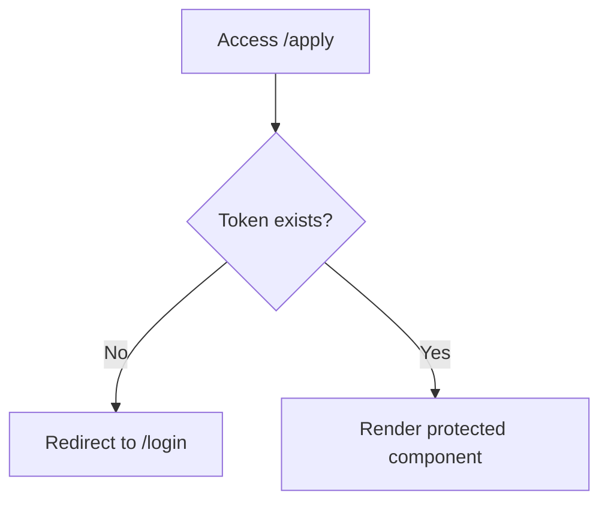
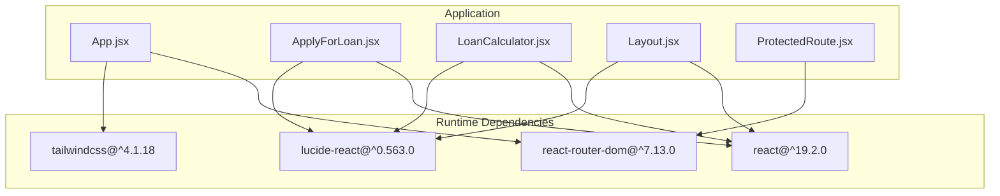

# Loan Application System

<cite>
**Referenced Files in This Document**
- [ApplyForLoan.jsx](file://src/pages/ApplyForLoan.jsx)
- [LoanCalculator.jsx](file://src/components/loan/LoanCalculator.jsx)
- [App.jsx](file://src/App.jsx)
- [Layout.jsx](file://src/components/layout/Layout.jsx)
- [Navbar.jsx](file://src/components/layout/Navbar.jsx)
- [Footer.jsx](file://src/components/layout/Footer.jsx)
- [ProtectedRoute.jsx](file://src/components/ProtectedRoute.jsx)
- [Home.jsx](file://src/pages/Home.jsx)
- [index.css](file://src/styles/index.css)
- [package.json](file://package.json)
</cite>

## Table of Contents
1. [Introduction](#introduction)
2. [Project Structure](#project-structure)
3. [Core Components](#core-components)
4. [Architecture Overview](#architecture-overview)
5. [Detailed Component Analysis](#detailed-component-analysis)
6. [Dependency Analysis](#dependency-analysis)
7. [Performance Considerations](#performance-considerations)
8. [Troubleshooting Guide](#troubleshooting-guide)
9. [Conclusion](#conclusion)
10. [Appendices](#appendices)

## Introduction
This document describes the multi-step loan application system built with React. It covers the four-step application process: personal information collection, employment details validation, loan specifics configuration, and final review submission. It explains form state management using React hooks, step-by-step navigation controls, form validation logic, data persistence between steps, component architecture, conditional rendering, error handling and display mechanisms, and integration with the layout system. It also provides examples for extending the application with additional loan types, customizing validation rules, implementing conditional questions, adding progress indicators, and outlines the submission workflow, data formatting for backend integration, and error recovery strategies.

## Project Structure
The application follows a feature-based structure with pages under src/pages and shared components under src/components. The loan application is implemented as a dedicated page with supporting calculator and layout components.

**Diagram sources**
- [App.jsx](file://src/App.jsx#L1-L51)
- [Layout.jsx](file://src/components/layout/Layout.jsx#L1-L20)
- [Navbar.jsx](file://src/components/layout/Navbar.jsx#L1-L156)
- [Footer.jsx](file://src/components/layout/Footer.jsx#L1-L117)
- [ApplyForLoan.jsx](file://src/pages/ApplyForLoan.jsx#L1-L479)
- [LoanCalculator.jsx](file://src/components/loan/LoanCalculator.jsx#L1-L117)
- [ProtectedRoute.jsx](file://src/components/ProtectedRoute.jsx#L1-L17)

**Section sources**
- [App.jsx](file://src/App.jsx#L1-L51)
- [Layout.jsx](file://src/components/layout/Layout.jsx#L1-L20)
- [Navbar.jsx](file://src/components/layout/Navbar.jsx#L1-L156)
- [Footer.jsx](file://src/components/layout/Footer.jsx#L1-L117)
- [ApplyForLoan.jsx](file://src/pages/ApplyForLoan.jsx#L1-L479)
- [LoanCalculator.jsx](file://src/components/loan/LoanCalculator.jsx#L1-L117)
- [ProtectedRoute.jsx](file://src/components/ProtectedRoute.jsx#L1-L17)

## Core Components
- Multi-step application page: Implements the four-step form with state management, navigation, and submission.
- Loan calculator: Provides interactive loan amount and term selection with real-time payment calculations.
- Layout system: Wraps pages with consistent header, navigation, and footer.
- Protected route: Enforces authentication for the application page.

Key capabilities:
- Centralized form state using React hooks for all steps.
- Conditional rendering based on current step.
- Navigation controls with step progression and previous/back navigation.
- Basic validation via HTML5 required attributes and checkbox requirement.
- Progress indicator with step icons and completion status.
- Integration with routing and layout system.

**Section sources**
- [ApplyForLoan.jsx](file://src/pages/ApplyForLoan.jsx#L1-L479)
- [LoanCalculator.jsx](file://src/components/loan/LoanCalculator.jsx#L1-L117)
- [Layout.jsx](file://src/components/layout/Layout.jsx#L1-L20)
- [ProtectedRoute.jsx](file://src/components/ProtectedRoute.jsx#L1-L17)

## Architecture Overview
The application uses React Router for navigation and a protected route guard to ensure only authenticated users can access the application page. The layout component wraps all pages to provide consistent branding and navigation.

**Diagram sources**
- [App.jsx](file://src/App.jsx#L34-L41)
- [ProtectedRoute.jsx](file://src/components/ProtectedRoute.jsx#L4-L14)
- [Layout.jsx](file://src/components/layout/Layout.jsx#L6-L16)
- [Navbar.jsx](file://src/components/layout/Navbar.jsx#L1-L156)
- [ApplyForLoan.jsx](file://src/pages/ApplyForLoan.jsx#L1-L479)

## Detailed Component Analysis

### Multi-step Loan Application Page
The application page manages a multi-step form with four distinct sections: personal information, employment details, loan specifics, and final review. It uses React hooks for state management and provides navigation controls between steps.

**Diagram sources**
- [ApplyForLoan.jsx](file://src/pages/ApplyForLoan.jsx#L5-L56)
- [ApplyForLoan.jsx](file://src/pages/ApplyForLoan.jsx#L139-L473)

Key implementation aspects:
- State initialization: Centralized form state object containing all fields for the four steps.
- Navigation handlers: Functions to move forward and backward between steps with boundary checks.
- Change handler: Unified handler for updating form fields, including checkbox toggles.
- Validation: Uses HTML5 required attributes for mandatory fields and a checkbox requirement for terms agreement.
- Conditional rendering: Renders the current step based on the currentStep state.
- Progress indicator: Displays step icons and completion status based on current step.
- Submission: Handles form submission with a success message.

Extensibility examples:
- Adding a new loan type: Extend the loan type dropdown options and add corresponding validation rules.
- Customizing validation: Add custom validation functions and integrate them with the change handler.
- Conditional questions: Add conditional rendering logic based on selected values (e.g., show additional fields when a specific employment status is chosen).
- Progress indicators: Enhance the progress bar to reflect step completion and errors.

**Section sources**
- [ApplyForLoan.jsx](file://src/pages/ApplyForLoan.jsx#L1-L479)

### Loan Calculator Component
The loan calculator provides an interactive way to estimate monthly payments and total payback amounts based on loan amount and term. It demonstrates state management and effect-driven calculations.

**Diagram sources**
- [LoanCalculator.jsx](file://src/components/loan/LoanCalculator.jsx#L1-L117)

Implementation highlights:
- State management: Tracks loan amount, term, and calculated results.
- Effect-driven updates: Recalculates monthly payment and total payback when inputs change.
- Currency formatting: Uses locale-aware formatting for Indian Rupees.
- Navigation: Navigates to the application page when the apply button is clicked.

**Section sources**
- [LoanCalculator.jsx](file://src/components/loan/LoanCalculator.jsx#L1-L117)

### Layout and Navigation System
The layout system provides consistent navigation and branding across pages. The navbar includes search functionality, cart, and a prominent call-to-action to apply for loans.

**Diagram sources**
- [Layout.jsx](file://src/components/layout/Layout.jsx#L1-L20)
- [Navbar.jsx](file://src/components/layout/Navbar.jsx#L1-L156)
- [Footer.jsx](file://src/components/layout/Footer.jsx#L1-L117)

Key features:
- Sticky navigation with active link highlighting.
- Search functionality with dropdown results.
- Responsive mobile menu.
- Consistent footer with links and social media.

**Section sources**
- [Layout.jsx](file://src/components/layout/Layout.jsx#L1-L20)
- [Navbar.jsx](file://src/components/layout/Navbar.jsx#L1-L156)
- [Footer.jsx](file://src/components/layout/Footer.jsx#L1-L117)

### Protected Route Guard
The protected route ensures that only authenticated users can access the application page by checking for a token in local storage.

**Diagram sources**
- [ProtectedRoute.jsx](file://src/components/ProtectedRoute.jsx#L4-L14)

**Section sources**
- [ProtectedRoute.jsx](file://src/components/ProtectedRoute.jsx#L1-L17)

## Dependency Analysis
The application relies on React, React Router, Tailwind CSS, and Lucide React for icons. The loan calculator uses a simple interest calculation model.

**Diagram sources**
- [package.json](file://package.json#L12-L20)
- [App.jsx](file://src/App.jsx#L1-L51)
- [ApplyForLoan.jsx](file://src/pages/ApplyForLoan.jsx#L1-L479)
- [LoanCalculator.jsx](file://src/components/loan/LoanCalculator.jsx#L1-L117)
- [Layout.jsx](file://src/components/layout/Layout.jsx#L1-L20)
- [ProtectedRoute.jsx](file://src/components/ProtectedRoute.jsx#L1-L17)

**Section sources**
- [package.json](file://package.json#L1-L36)
- [index.css](file://src/styles/index.css#L1-L12)

## Performance Considerations
- State updates: The form uses a single state object, which is efficient for small forms. For larger forms, consider splitting state into smaller chunks to reduce re-renders.
- Effects: The loan calculator recomputes values on every input change. For complex calculations, consider debouncing or memoization.
- Rendering: Conditional rendering based on step reduces unnecessary DOM nodes. Keep step components lightweight.
- Styling: Tailwind CSS generates utility classes dynamically; ensure purging is configured to remove unused styles in production builds.

## Troubleshooting Guide
Common issues and resolutions:
- Navigation disabled states: Ensure step boundaries are respected to prevent invalid navigation.
- Validation failures: Verify required fields are filled before proceeding to the next step.
- Terms agreement: The submit button is disabled until the terms checkbox is checked.
- Authentication: If redirected to login, ensure a valid token is stored in local storage.
- Styling: Confirm Tailwind CSS is properly configured and fonts are loaded.

**Section sources**
- [ApplyForLoan.jsx](file://src/pages/ApplyForLoan.jsx#L436-L470)
- [ProtectedRoute.jsx](file://src/components/ProtectedRoute.jsx#L4-L14)

## Conclusion
The multi-step loan application system provides a solid foundation for collecting customer information, validating employment details, configuring loan specifics, and enabling a final review and submission. It leverages React hooks for state management, React Router for navigation, and a protected route guard for authentication. The layout system ensures consistent branding and navigation. Extending the system involves adding new loan types, customizing validation rules, implementing conditional questions, enhancing progress indicators, and integrating with backend services for data submission and error recovery.

## Appendices

### Submission Workflow and Backend Integration
Current submission behavior:
- The form currently displays a success alert upon submission.
- No data is persisted or sent to a backend service.

Recommended backend integration steps:
- Define a data model for the application payload.
- Implement a submission function that formats the data and sends it to the backend.
- Add error handling for network failures and server errors.
- Implement loading states during submission.
- Provide user feedback for successful submissions and errors.

Data formatting suggestions:
- Normalize dates and numbers according to backend expectations.
- Include metadata such as timestamps and user identifiers.
- Validate and sanitize inputs before sending.

Error recovery strategies:
- Retry failed submissions with exponential backoff.
- Show user-friendly error messages and provide retry actions.
- Persist draft data locally to allow resuming after interruptions.

### Extending the Application
Examples of enhancements:
- Additional loan types: Add new options to the loan type dropdown and implement corresponding validation rules.
- Custom validation: Integrate custom validators for PAN numbers, phone numbers, and income thresholds.
- Conditional questions: Show additional fields based on employment status or loan type selections.
- Progress indicators: Add step completion markers and error indicators for invalid fields.
- Accessibility: Improve ARIA labels and keyboard navigation support.