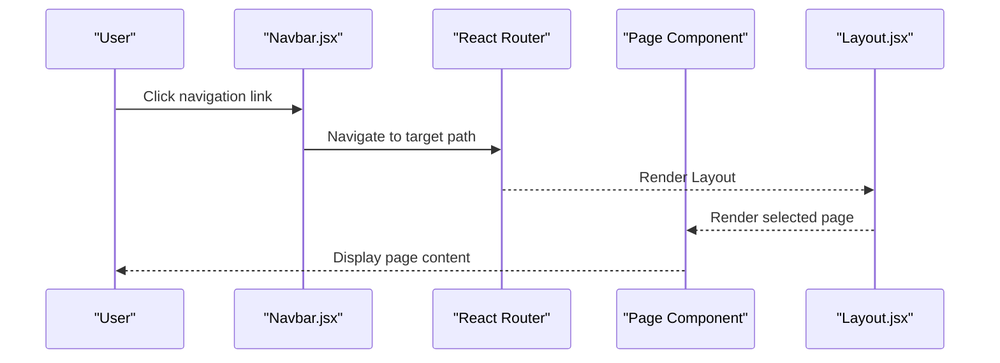
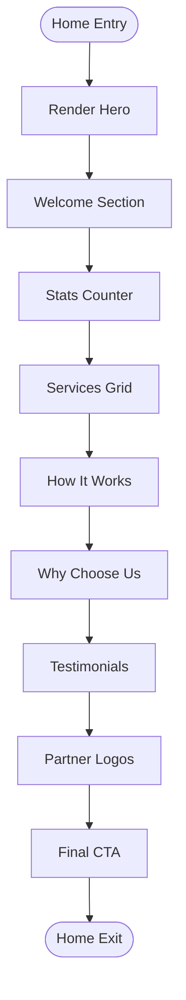
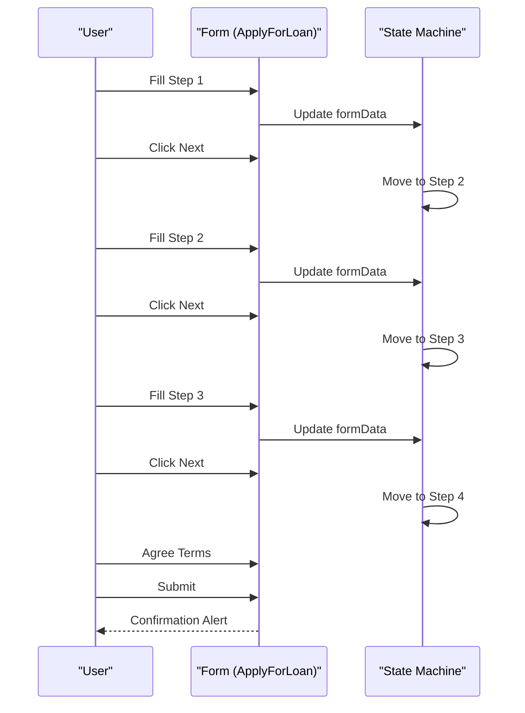
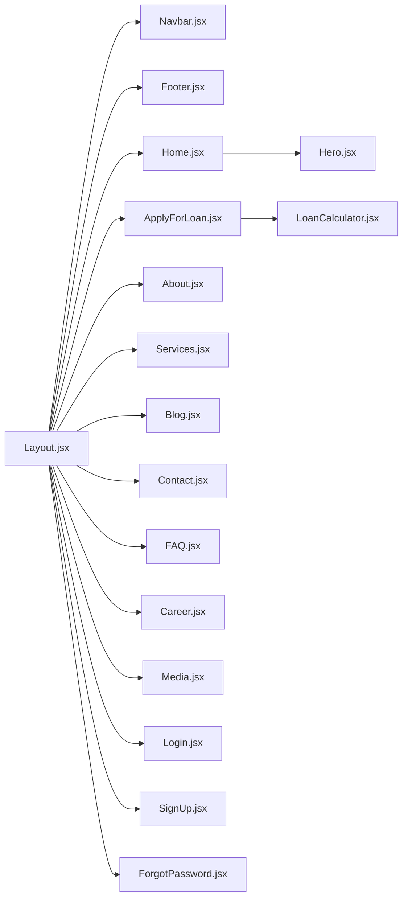

# Page Components

<cite>
**Referenced Files in This Document**
- [Home.jsx](file://src/pages/Home.jsx)
- [Hero.jsx](file://src/components/home/Hero.jsx)
- [ApplyForLoan.jsx](file://src/pages/ApplyForLoan.jsx)
- [About.jsx](file://src/pages/About.jsx)
- [Services.jsx](file://src/pages/Services.jsx)
- [Blog.jsx](file://src/pages/Blog.jsx)
- [Contact.jsx](file://src/pages/Contact.jsx)
- [FAQ.jsx](file://src/pages/FAQ.jsx)
- [Career.jsx](file://src/pages/Career.jsx)
- [Media.jsx](file://src/pages/Media.jsx)
- [Login.jsx](file://src/pages/Login.jsx)
- [SignUp.jsx](file://src/pages/SignUp.jsx)
- [ForgotPassword.jsx](file://src/pages/ForgotPassword.jsx)
- [Layout.jsx](file://src/components/layout/Layout.jsx)
- [Navbar.jsx](file://src/components/layout/Navbar.jsx)
- [Footer.jsx](file://src/components/layout/Footer.jsx)
- [LoanCalculator.jsx](file://src/components/loan/LoanCalculator.jsx)
</cite>

## Table of Contents
1. [Introduction](#introduction)
2. [Project Structure](#project-structure)
3. [Core Components](#core-components)
4. [Architecture Overview](#architecture-overview)
5. [Detailed Component Analysis](#detailed-component-analysis)
6. [Dependency Analysis](#dependency-analysis)
7. [Performance Considerations](#performance-considerations)
8. [Troubleshooting Guide](#troubleshooting-guide)
9. [Conclusion](#conclusion)
10. [Appendices](#appendices)

## Introduction
This document provides comprehensive documentation for all page components in the Easilon Financial Solutions application. It covers the landing page (Home) with its hero carousel and services showcase, the multi-step loan application process (ApplyForLoan) with form state management, the informational pages (About, Services, Blog, Contact, FAQ, Career, Media), and user account pages (Login, SignUp, ForgotPassword). For each page, we explain functionality, routing integration via the shared layout, form implementations, validation logic, user workflows, business logic, navigation patterns, SEO considerations, responsive design, page transitions, loading states, error handling strategies, and examples for customization and extension.

## Project Structure
The application follows a feature-based structure under src/pages and shared layout components under src/components/layout. Pages are rendered inside a Layout wrapper that includes Topbar, Navbar, and Footer. Several pages integrate reusable components such as Hero and LoanCalculator.

```mermaid
graph TB
subgraph "Pages"
Home["Home.jsx"]
Apply["ApplyForLoan.jsx"]
About["About.jsx"]
Services["Services.jsx"]
Blog["Blog.jsx"]
Contact["Contact.jsx"]
FAQ["FAQ.jsx"]
Career["Career.jsx"]
Media["Media.jsx"]
Login["Login.jsx"]
SignUp["SignUp.jsx"]
FP["ForgotPassword.jsx"]
end
subgraph "Layout"
Layout["Layout.jsx"]
Navbar["Navbar.jsx"]
Footer["Footer.jsx"]
end
subgraph "Shared Components"
Hero["Hero.jsx"]
LC["LoanCalculator.jsx"]
end
Layout --> Navbar
Layout --> Home
Layout --> About
Layout --> Services
Layout --> Blog
Layout --> Contact
Layout --> FAQ
Layout --> Career
Layout --> Media
Layout --> Login
Layout --> SignUp
Layout --> FP
Layout --> Footer
Home --> Hero
Apply --> LC
```

**Diagram sources**
- [Layout.jsx](file://src/components/layout/Layout.jsx#L6-L17)
- [Navbar.jsx](file://src/components/layout/Navbar.jsx#L5-L156)
- [Footer.jsx](file://src/components/layout/Footer.jsx#L5-L117)
- [Home.jsx](file://src/pages/Home.jsx#L1-L297)
- [Hero.jsx](file://src/components/home/Hero.jsx)
- [ApplyForLoan.jsx](file://src/pages/ApplyForLoan.jsx#L1-L479)
- [LoanCalculator.jsx](file://src/components/loan/LoanCalculator.jsx)

**Section sources**
- [Layout.jsx](file://src/components/layout/Layout.jsx#L6-L17)
- [Navbar.jsx](file://src/components/layout/Navbar.jsx#L5-L156)
- [Footer.jsx](file://src/components/layout/Footer.jsx#L5-L117)

## Core Components
- Layout: Wraps all pages with Topbar, Navbar, and Footer. Provides a consistent shell for navigation and branding.
- Navbar: Implements desktop and mobile navigation, a live search bar with filtered results, cart indicator, and a prominent Apply For Loan CTA.
- Footer: Provides site links, services, newsletter signup, and social profiles.
- Hero: Reusable hero section used on Home and several informational pages.
- LoanCalculator: Shared financial calculator component integrated into the loan application page.

These components establish routing integration, navigation patterns, and cross-page consistency.

**Section sources**
- [Layout.jsx](file://src/components/layout/Layout.jsx#L6-L17)
- [Navbar.jsx](file://src/components/layout/Navbar.jsx#L5-L156)
- [Footer.jsx](file://src/components/layout/Footer.jsx#L5-L117)
- [Hero.jsx](file://src/components/home/Hero.jsx)
- [LoanCalculator.jsx](file://src/components/loan/LoanCalculator.jsx)

## Architecture Overview
The pages are rendered within the Layout component. Navigation is handled by react-router-dom Link and useNavigate hooks. Forms use controlled components with useState to manage state and submission. Some pages simulate asynchronous operations (e.g., forgot password reset link sending) with timeouts and loading states.



**Diagram sources**
- [Navbar.jsx](file://src/components/layout/Navbar.jsx#L5-L156)
- [Layout.jsx](file://src/components/layout/Layout.jsx#L6-L17)
- [Home.jsx](file://src/pages/Home.jsx#L1-L297)
- [ApplyForLoan.jsx](file://src/pages/ApplyForLoan.jsx#L1-L479)

## Detailed Component Analysis

### Landing Page (Home)
- Purpose: Showcase brand, services, testimonials, stats, and call-to-action.
- Key Sections:
  - Hero: Integrated via Hero component.
  - Welcome: Brand storytelling with imagery and feature highlights.
  - Stats Counter: Animated counters for metrics.
  - Services Grid: Interactive cards linking to Services page.
  - How It Works: Three-step process with links to Apply.
  - Why Choose Us: Benefits and progress indicators.
  - Testimonials: Client quotes with star ratings.
  - Partner Logos: Trusted financial institution badges.
  - Final CTA: Contact-focused banner.
- Styling and Responsiveness: Extensive use of Tailwind utilities for responsive layouts across breakpoints.
- SEO Considerations: Semantic headings, descriptive alt attributes, structured content hierarchy.
- Navigation: Internal links to About, Services, Apply, and Contact.



**Diagram sources**
- [Home.jsx](file://src/pages/Home.jsx#L13-L297)
- [Hero.jsx](file://src/components/home/Hero.jsx)

**Section sources**
- [Home.jsx](file://src/pages/Home.jsx#L13-L297)

### Multi-Step Loan Application (ApplyForLoan)
- Purpose: Collect personal, employment, loan details, and review/approve before submission.
- State Management:
  - Local state tracks current step, form data, and step metadata.
  - Controlled form inputs update state on change.
- Workflow:
  - Step 1: Personal Info (names, DOB, PAN, address, city, state, pincode).
  - Step 2: Employment (status, employer, monthly income).
  - Step 3: Loan Details (type, amount, term).
  - Step 4: Review with summary boxes and Terms & Conditions checkbox.
- Validation:
  - HTML5 required attributes on inputs.
  - Conditional enablement of submit based on checkbox.
- Submission:
  - On submit, displays a confirmation message and prevents default action.
- Styling and UX:
  - Progress steps with icons and completion indicators.
  - Responsive grid forms and clear navigation buttons.
- Accessibility:
  - Proper labels, focus states, and keyboard-friendly controls.



**Diagram sources**
- [ApplyForLoan.jsx](file://src/pages/ApplyForLoan.jsx#L4-L56)
- [ApplyForLoan.jsx](file://src/pages/ApplyForLoan.jsx#L139-L479)

**Section sources**
- [ApplyForLoan.jsx](file://src/pages/ApplyForLoan.jsx#L4-L56)
- [ApplyForLoan.jsx](file://src/pages/ApplyForLoan.jsx#L139-L479)

### Informational Pages

#### About
- Purpose: Corporate story, timeline, mission/vision, values, and trust/security highlights.
- Features:
  - Hero with gradient overlay.
  - Story section with statistics.
  - Timeline milestones aligned with company history.
  - Mission/Vision cards with icons.
  - Stats counter with icons.
  - Global standards and security features.
  - Values grid with hover effects.
  - Trust and security CTA.
- SEO: Clear headings, descriptive paragraphs, and consistent structure.

**Section sources**
- [About.jsx](file://src/pages/About.jsx#L4-L263)

#### Services
- Purpose: Present loan offerings with features and CTAs.
- Features:
  - Hero with gradient overlay.
  - Services grid with icons, descriptions, and feature lists.
  - Call-to-action to contact for custom solutions.
- Navigation: Links to Apply and Contact.

**Section sources**
- [Services.jsx](file://src/pages/Services.jsx#L5-L141)

#### Blog
- Purpose: Publish latest articles with categories and metadata.
- Features:
  - Hero with gradient overlay.
  - Blog grid with images, categories, excerpts, and metadata.
  - Hover animations and readable typography.
- Navigation: Placeholder links to article detail pages.

**Section sources**
- [Blog.jsx](file://src/pages/Blog.jsx#L5-L154)

#### Contact
- Purpose: Provide contact information, working hours, and a contact form.
- Features:
  - Contact info cards with icons.
  - Contact form with controlled inputs and submission handler.
  - Embedded map iframe.
- UX: Form resets after submission; accessibility via labels and placeholders.

**Section sources**
- [Contact.jsx](file://src/pages/Contact.jsx#L4-L188)

#### FAQ
- Purpose: Answer common questions grouped by categories.
- Features:
  - Accordion-style toggles with chevrons.
  - Category grouping with icons.
  - Contact CTA for unresolved queries.
- UX: Single-open behavior for accordion sections.

**Section sources**
- [FAQ.jsx](file://src/pages/FAQ.jsx#L4-L182)

#### Career
- Purpose: Promote company culture and display open positions.
- Features:
  - Hero with gradient overlay.
  - Benefits list and team image.
  - Job listings with department, location, type, and salary.
  - Apply buttons linking to Contact.
- UX: Clean card layout with clear CTAs.

**Section sources**
- [Career.jsx](file://src/pages/Career.jsx#L5-L182)

#### Media
- Purpose: Share press releases, media kit assets, and featured video.
- Features:
  - Press releases grid with categories and dates.
  - Media kit download cards with sizes and formats.
  - Featured video player placeholder.
- UX: Consistent card design and hover states.

**Section sources**
- [Media.jsx](file://src/pages/Media.jsx#L4-L177)

### User Account Pages

#### Login
- Purpose: Authenticate users and provide social login options.
- Features:
  - Email/password fields with show/hide toggle.
  - Remember me checkbox.
  - Social login buttons (Google, Facebook) with simulated flows.
  - Forgot password and sign-up links.
  - Navigation on submit to Home.
- UX: Focus states, icons inside inputs, and smooth transitions.

**Section sources**
- [Login.jsx](file://src/pages/Login.jsx#L5-L186)

#### SignUp
- Purpose: Create new user accounts.
- Features:
  - Full name, email, password fields with show/hide toggle.
  - Redirects to Login after submission.
- UX: Minimalist form with clear navigation.

**Section sources**
- [SignUp.jsx](file://src/pages/SignUp.jsx#L5-L86)

#### ForgotPassword
- Purpose: Send password reset link with loading and success states.
- Features:
  - Email input with validation.
  - Loading state with spinner and disabled button.
  - Success screen with animated feedback and retry option.
  - Back-to-login link.
- UX: Clear feedback and re-triable actions.

**Section sources**
- [ForgotPassword.jsx](file://src/pages/ForgotPassword.jsx#L5-L107)

## Dependency Analysis
- Routing Integration:
  - All pages are rendered within Layout, ensuring consistent header/footer and navigation.
  - Navbar provides internal navigation and external CTA to Apply.
- Cross-Page Dependencies:
  - Home integrates Hero component.
  - ApplyForLoan integrates LoanCalculator component.
  - Several pages share similar hero and section patterns.
- State and Forms:
  - Controlled components with useState for all forms.
  - useNavigate for programmatic navigation on Login, SignUp, ForgotPassword, and ApplyForLoan.
- External Integrations:
  - Contact page embeds a Google Maps iframe.
  - Social login buttons simulate third-party flows.



**Diagram sources**
- [Layout.jsx](file://src/components/layout/Layout.jsx#L6-L17)
- [Navbar.jsx](file://src/components/layout/Navbar.jsx#L5-L156)
- [Footer.jsx](file://src/components/layout/Footer.jsx#L5-L117)
- [Home.jsx](file://src/pages/Home.jsx#L1-L297)
- [Hero.jsx](file://src/components/home/Hero.jsx)
- [ApplyForLoan.jsx](file://src/pages/ApplyForLoan.jsx#L1-L479)
- [LoanCalculator.jsx](file://src/components/loan/LoanCalculator.jsx)
- [About.jsx](file://src/pages/About.jsx#L1-L263)
- [Services.jsx](file://src/pages/Services.jsx#L1-L141)
- [Blog.jsx](file://src/pages/Blog.jsx#L1-L154)
- [Contact.jsx](file://src/pages/Contact.jsx#L1-L188)
- [FAQ.jsx](file://src/pages/FAQ.jsx#L1-L182)
- [Career.jsx](file://src/pages/Career.jsx#L1-L182)
- [Media.jsx](file://src/pages/Media.jsx#L1-L177)
- [Login.jsx](file://src/pages/Login.jsx#L1-L186)
- [SignUp.jsx](file://src/pages/SignUp.jsx#L1-L86)
- [ForgotPassword.jsx](file://src/pages/ForgotPassword.jsx#L1-L107)

**Section sources**
- [Layout.jsx](file://src/components/layout/Layout.jsx#L6-L17)
- [Navbar.jsx](file://src/components/layout/Navbar.jsx#L5-L156)
- [Footer.jsx](file://src/components/layout/Footer.jsx#L5-L117)

## Performance Considerations
- Rendering:
  - Pages use minimal state and avoid heavy computations; keep components pure where possible.
  - Hero and section components are lightweight and reused across pages.
- Forms:
  - Controlled components update state incrementally; consider debouncing for large forms if needed.
- Navigation:
  - useNavigate avoids full page reloads; ensure lazy loading for heavy routes if scaling.
- Images:
  - Prefer responsive image attributes and lazy loading for hero and testimonial images.
- Accessibility:
  - Ensure focus management in multi-step forms and accordions.

## Troubleshooting Guide
- Navigation Issues:
  - Verify Link paths match Navbar’s allData entries and routes.
  - Confirm useNavigate is used for programmatic navigation after form submissions.
- Form Submission:
  - Check required attributes and controlled state updates.
  - For ApplyForLoan, ensure Terms checkbox is mandatory before enabling submit.
- State Resets:
  - After successful Contact form submission, state is cleared; confirm desired UX.
- Social Login:
  - Simulated flows in Login; ensure actual OAuth integration is configured in production.
- Responsive Behavior:
  - Mobile menu and search dropdown rely on useState; verify Tailwind breakpoints and z-index stacking.

**Section sources**
- [Navbar.jsx](file://src/components/layout/Navbar.jsx#L5-L156)
- [Login.jsx](file://src/pages/Login.jsx#L15-L31)
- [ApplyForLoan.jsx](file://src/pages/ApplyForLoan.jsx#L53-L56)
- [Contact.jsx](file://src/pages/Contact.jsx#L13-L21)

## Conclusion
The Easilon Financial Solutions application delivers a cohesive, responsive, and user-focused experience across its pages. The shared Layout and Navbar provide consistent navigation, while individual pages implement clear workflows: Home showcases brand and services, ApplyForLoan streamlines the loan application process, and informational pages communicate value and trust. User account pages support authentication and recovery. With modular components and controlled state management, the application is extensible and maintainable.

## Appendices

### SEO and Accessibility Best Practices
- SEO:
  - Use semantic headings and concise meta descriptions.
  - Provide descriptive alt text for images.
  - Ensure internal linking with meaningful anchor text.
- Accessibility:
  - Associate labels with inputs; provide visible focus states.
  - Use ARIA roles where interactive elements require it.
  - Ensure sufficient color contrast and keyboard navigation.

### Responsive Design Notes
- Tailwind utilities are extensively used for responsive grids, spacing, and typography.
- Navbar adapts from desktop links to a collapsible mobile menu.
- Hero sections use relative units and percentage-based widths for scalability.

### Customization and Extension Patterns
- Adding a New Page:
  - Create a new page component under src/pages.
  - Wrap content with Layout to inherit navigation and footer.
  - Add a route entry in Navbar’s allData array if it requires top-level navigation.
- Extending the Loan Application:
  - Introduce new steps by adding to the steps array and rendering corresponding form sections.
  - Add new fields to formData and validation rules as needed.
- Enhancing the Hero:
  - Extract Hero into a prop-driven component for reuse across pages with different backgrounds and CTAs.
- Integrating Analytics:
  - Add event tracking on form submissions and navigation clicks.