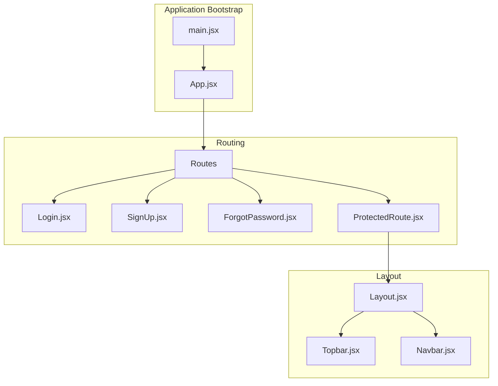
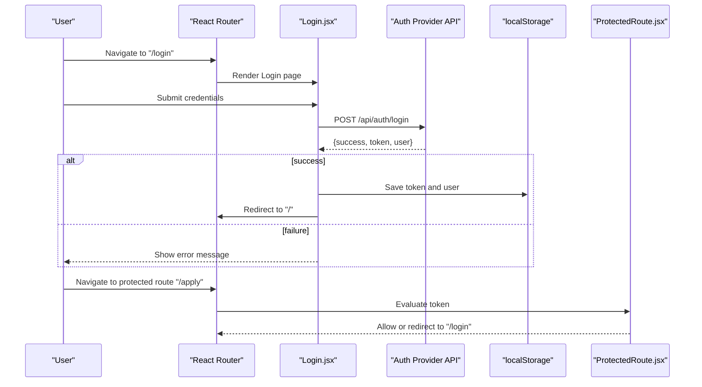
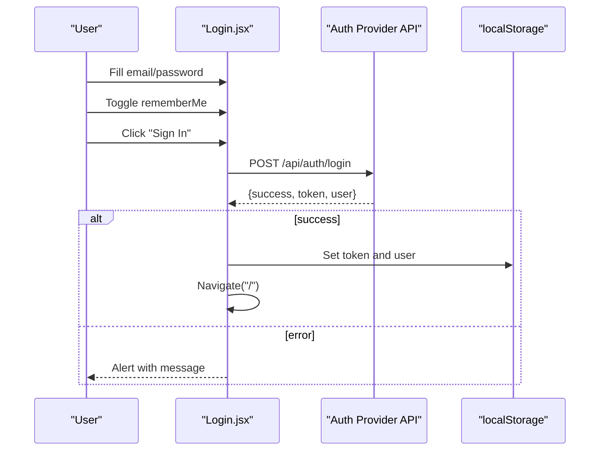
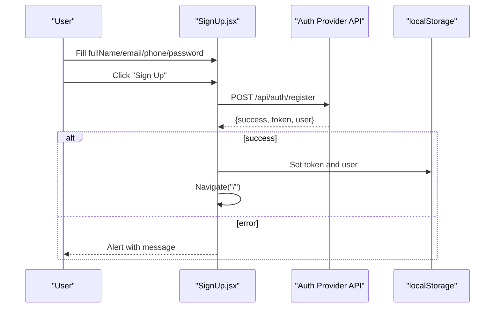
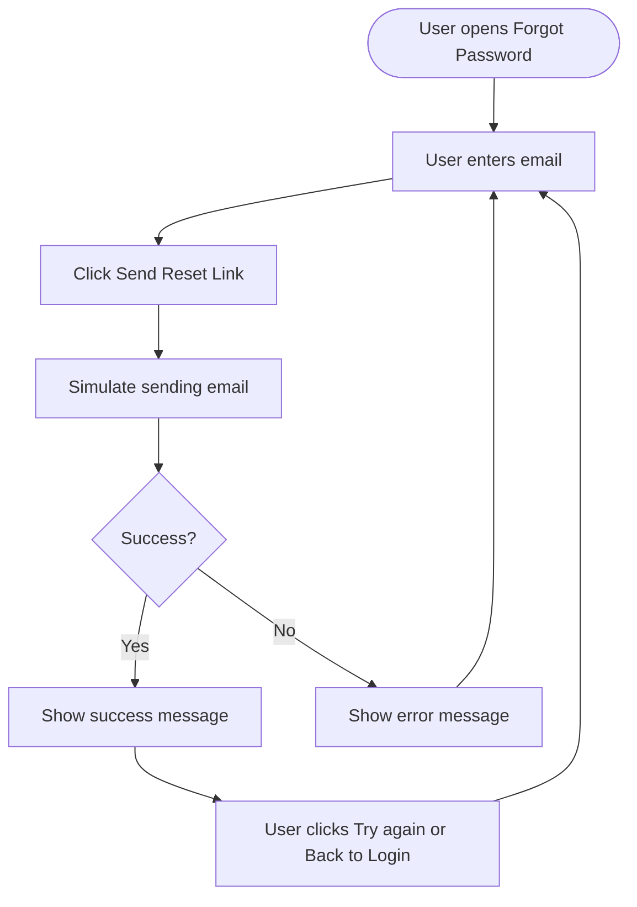
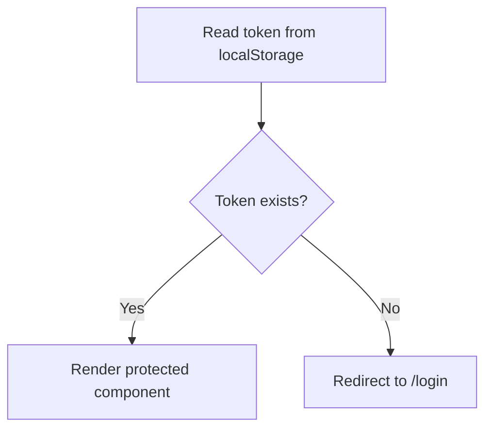
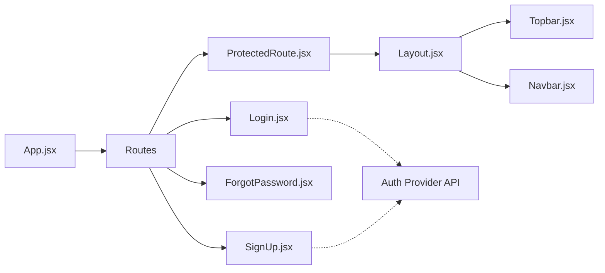
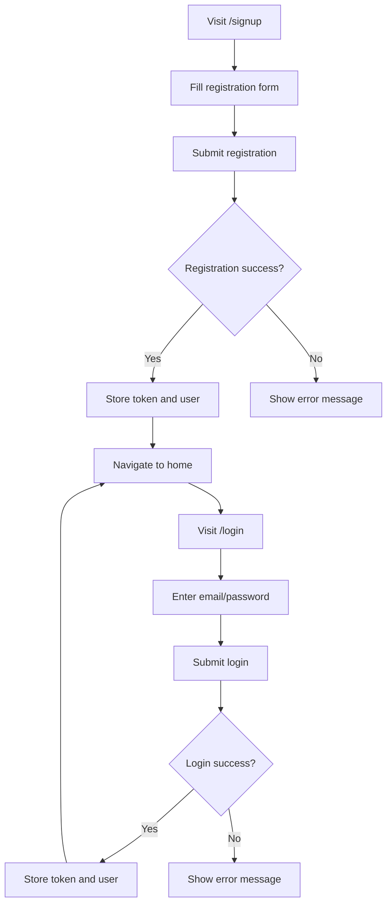
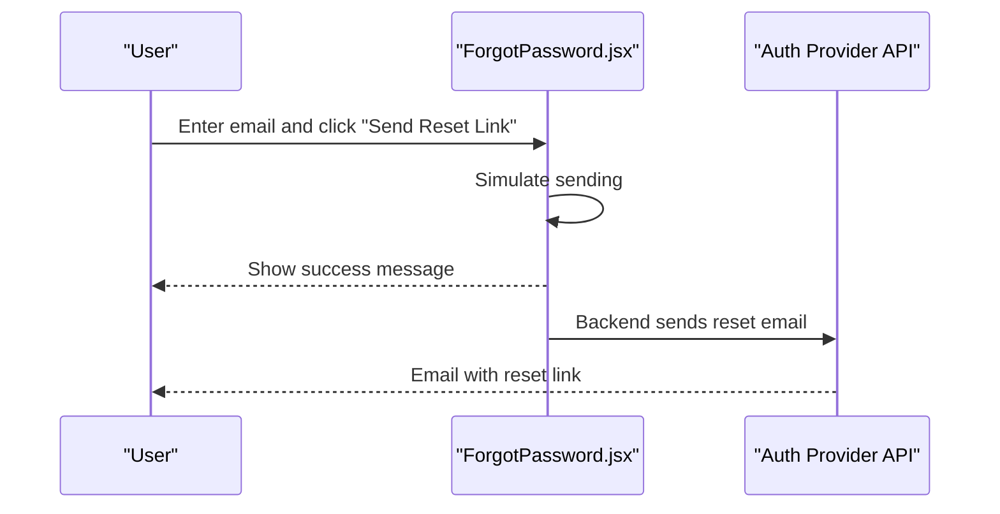

# User Account Pages

<cite>
**Referenced Files in This Document**
- [App.jsx](file://src/App.jsx)
- [main.jsx](file://src/main.jsx)
- [Login.jsx](file://src/pages/Login.jsx)
- [SignUp.jsx](file://src/pages/SignUp.jsx)
- [ForgotPassword.jsx](file://src/pages/ForgotPassword.jsx)
- [ProtectedRoute.jsx](file://src/components/ProtectedRoute.jsx)
- [Layout.jsx](file://src/components/layout/Layout.jsx)
- [Navbar.jsx](file://src/components/layout/Navbar.jsx)
- [Topbar.jsx](file://src/components/layout/Topbar.jsx)
</cite>

## Table of Contents
1. [Introduction](#introduction)
2. [Project Structure](#project-structure)
3. [Core Components](#core-components)
4. [Architecture Overview](#architecture-overview)
5. [Detailed Component Analysis](#detailed-component-analysis)
6. [Dependency Analysis](#dependency-analysis)
7. [Performance Considerations](#performance-considerations)
8. [Troubleshooting Guide](#troubleshooting-guide)
9. [Conclusion](#conclusion)
10. [Appendices](#appendices)

## Introduction
This document provides comprehensive documentation for the user account management pages: Login, SignUp, and ForgotPassword. It explains the form implementations, client-side state management, user experience flows, and integration with the authentication provider backend. It also covers session management via local storage, route protection, and recommended extensions for social login, two-factor authentication, and enhanced validation.

## Project Structure
The application uses React with React Router for routing. Authentication-related pages are defined under src/pages, and route protection is handled by a dedicated component. The layout wraps pages with a consistent header, navigation, and footer.

**Diagram sources**
- [main.jsx](file://src/main.jsx#L1-L11)
- [App.jsx](file://src/App.jsx#L21-L51)
- [Login.jsx](file://src/pages/Login.jsx#L5-L216)
- [SignUp.jsx](file://src/pages/SignUp.jsx#L5-L178)
- [ForgotPassword.jsx](file://src/pages/ForgotPassword.jsx#L5-L107)
- [ProtectedRoute.jsx](file://src/components/ProtectedRoute.jsx#L4-L14)
- [Layout.jsx](file://src/components/layout/Layout.jsx#L6-L17)
- [Topbar.jsx](file://src/components/layout/Topbar.jsx#L5-L55)
- [Navbar.jsx](file://src/components/layout/Navbar.jsx#L5-L156)

**Section sources**
- [App.jsx](file://src/App.jsx#L21-L51)
- [main.jsx](file://src/main.jsx#L1-L11)

## Core Components
- Login page: Handles email/password authentication, password visibility toggle, “Remember me” option, and social login placeholders.
- SignUp page: Collects full name, email, phone, and password; submits to the registration endpoint; stores tokens and user data on success.
- ForgotPassword page: Requests a password reset link via email with a simulated sending flow and success feedback.
- ProtectedRoute: Guards routes requiring authentication by checking for a stored token.
- Layout and navigation: Provide consistent branding and navigation across pages, including links to authentication pages.

**Section sources**
- [Login.jsx](file://src/pages/Login.jsx#L5-L216)
- [SignUp.jsx](file://src/pages/SignUp.jsx#L5-L178)
- [ForgotPassword.jsx](file://src/pages/ForgotPassword.jsx#L5-L107)
- [ProtectedRoute.jsx](file://src/components/ProtectedRoute.jsx#L4-L14)
- [Layout.jsx](file://src/components/layout/Layout.jsx#L6-L17)
- [Topbar.jsx](file://src/components/layout/Topbar.jsx#L24-L26)
- [Navbar.jsx](file://src/components/layout/Navbar.jsx#L110-L115)

## Architecture Overview
The authentication flow integrates frontend pages with a remote authentication provider. On successful login or registration, tokens and user data are persisted locally and used to protect routes. The navigation bar and topbar provide quick access to authentication pages.

**Diagram sources**
- [Login.jsx](file://src/pages/Login.jsx#L28-L60)
- [ProtectedRoute.jsx](file://src/components/ProtectedRoute.jsx#L4-L14)

## Detailed Component Analysis

### Login Page
- Form fields: email, password, rememberMe.
- Behavior:
  - Submits credentials to the authentication provider.
  - Stores token and user data in local storage upon success.
  - Navigates to the home page.
  - Provides “Forgot password?” and “Sign up” links.
  - Includes social login placeholders with platform-specific handlers.
- Validation and UX:
  - HTML5 required attributes on inputs.
  - Loading state disables the submit button.
  - Password visibility toggle.
- Security considerations:
  - Credentials are transmitted over HTTPS to the backend endpoint.
  - Token and user data are stored in localStorage; consider secure HTTP-only cookies for production.

**Diagram sources**
- [Login.jsx](file://src/pages/Login.jsx#L28-L60)

**Section sources**
- [Login.jsx](file://src/pages/Login.jsx#L5-L216)

### SignUp Page
- Form fields: fullName, email, phone, password.
- Behavior:
  - Submits registration payload to the provider.
  - Persists token and user data on success.
  - Navigates to the home page.
- Validation and UX:
  - HTML5 required attributes.
  - Loading state disables submission.
  - Password visibility toggle.
- Security considerations:
  - Sensitive data is sent to the backend endpoint.
  - Local storage usage for tokens; consider safer storage mechanisms in production.

**Diagram sources**
- [SignUp.jsx](file://src/pages/SignUp.jsx#L24-L60)

**Section sources**
- [SignUp.jsx](file://src/pages/SignUp.jsx#L5-L178)

### ForgotPassword Page
- Behavior:
  - Captures email input.
  - Simulates sending a reset link after a short delay.
  - Shows a success state with a dismissible message.
- UX:
  - Clear messaging and a “Back to Login” link.
  - Disabled state during sending.
- Security considerations:
  - Email verification is simulated; ensure real backend delivery and secure token generation in production.

**Diagram sources**
- [ForgotPassword.jsx](file://src/pages/ForgotPassword.jsx#L10-L23)

**Section sources**
- [ForgotPassword.jsx](file://src/pages/ForgotPassword.jsx#L5-L107)

### ProtectedRoute Component
- Purpose: Guards routes that require authentication.
- Logic:
  - Reads token from localStorage.
  - Redirects unauthenticated users to the login page.
  - Renders child components for authenticated users.

**Diagram sources**
- [ProtectedRoute.jsx](file://src/components/ProtectedRoute.jsx#L4-L14)

**Section sources**
- [ProtectedRoute.jsx](file://src/components/ProtectedRoute.jsx#L4-L14)

### Navigation and Layout Integration
- Topbar and Navbar provide quick access to authentication pages and site sections.
- The Layout component wraps pages to maintain consistent branding and navigation.

**Section sources**
- [Topbar.jsx](file://src/components/layout/Topbar.jsx#L24-L26)
- [Navbar.jsx](file://src/components/layout/Navbar.jsx#L110-L115)
- [Layout.jsx](file://src/components/layout/Layout.jsx#L6-L17)

## Dependency Analysis
- Routing depends on React Router and defines routes for Login, SignUp, ForgotPassword, and protected routes.
- ProtectedRoute depends on localStorage for token presence.
- Pages depend on the external authentication provider endpoints for login and registration.
- Layout components provide shared UI elements across pages.

**Diagram sources**
- [App.jsx](file://src/App.jsx#L21-L51)
- [Login.jsx](file://src/pages/Login.jsx#L33-L42)
- [SignUp.jsx](file://src/pages/SignUp.jsx#L29-L41)
- [ProtectedRoute.jsx](file://src/components/ProtectedRoute.jsx#L4-L14)
- [Layout.jsx](file://src/components/layout/Layout.jsx#L6-L17)
- [Topbar.jsx](file://src/components/layout/Topbar.jsx#L5-L55)
- [Navbar.jsx](file://src/components/layout/Navbar.jsx#L5-L156)

**Section sources**
- [App.jsx](file://src/App.jsx#L21-L51)
- [ProtectedRoute.jsx](file://src/components/ProtectedRoute.jsx#L4-L14)

## Performance Considerations
- Network requests: Debounce repeated submissions and avoid unnecessary re-renders by keeping form state minimal.
- UI responsiveness: Disable submit buttons during network calls to prevent duplicate submissions.
- Storage: Avoid storing large payloads in localStorage; keep tokens and essential user info only.
- Rendering: Use controlled components and memoization where appropriate to reduce re-renders.

## Troubleshooting Guide
- Login fails silently:
  - Verify backend endpoint availability and CORS configuration.
  - Check console logs for network errors.
  - Confirm that the server responds with a success flag and token.
- Registration errors:
  - Ensure required fields are present and formatted correctly.
  - Validate backend response structure and error messages.
- Protected route redirects:
  - Confirm token is saved in localStorage after login/registration.
  - Check that ProtectedRoute is applied around protected components.
- Social login placeholders:
  - Implement actual OAuth flows with providers (e.g., Google, Facebook) and handle callback URLs securely.

**Section sources**
- [Login.jsx](file://src/pages/Login.jsx#L28-L60)
- [SignUp.jsx](file://src/pages/SignUp.jsx#L24-L60)
- [ProtectedRoute.jsx](file://src/components/ProtectedRoute.jsx#L4-L14)

## Conclusion
The user account pages provide a clean, extensible foundation for authentication workflows. They integrate with a remote authentication provider, persist tokens for session management, and offer route protection. The existing structure supports straightforward enhancements such as social login, two-factor authentication, improved validation, and stronger security practices.

## Appendices

### User Experience Flow: From Registration to Login

**Diagram sources**
- [SignUp.jsx](file://src/pages/SignUp.jsx#L24-L60)
- [Login.jsx](file://src/pages/Login.jsx#L28-L60)

### Password Recovery Mechanism

**Diagram sources**
- [ForgotPassword.jsx](file://src/pages/ForgotPassword.jsx#L10-L23)

### Security Considerations and Best Practices
- Transport security:
  - Enforce HTTPS for all authentication endpoints.
- Credential handling:
  - Avoid logging sensitive data.
  - Sanitize and validate inputs on the client and server.
- Session management:
  - Prefer secure, httpOnly cookies over localStorage for tokens.
  - Implement token refresh and expiration handling.
- Two-factor authentication:
  - Add TOTP or SMS-based 2FA with backup codes.
- Social login:
  - Integrate OAuth providers with proper scopes and state handling.
- Form customization:
  - Add field-level validation, real-time checks, and accessibility attributes.
- Account management:
  - Provide profile updates, password change, and account deactivation flows.