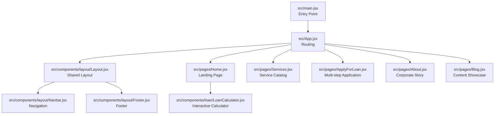
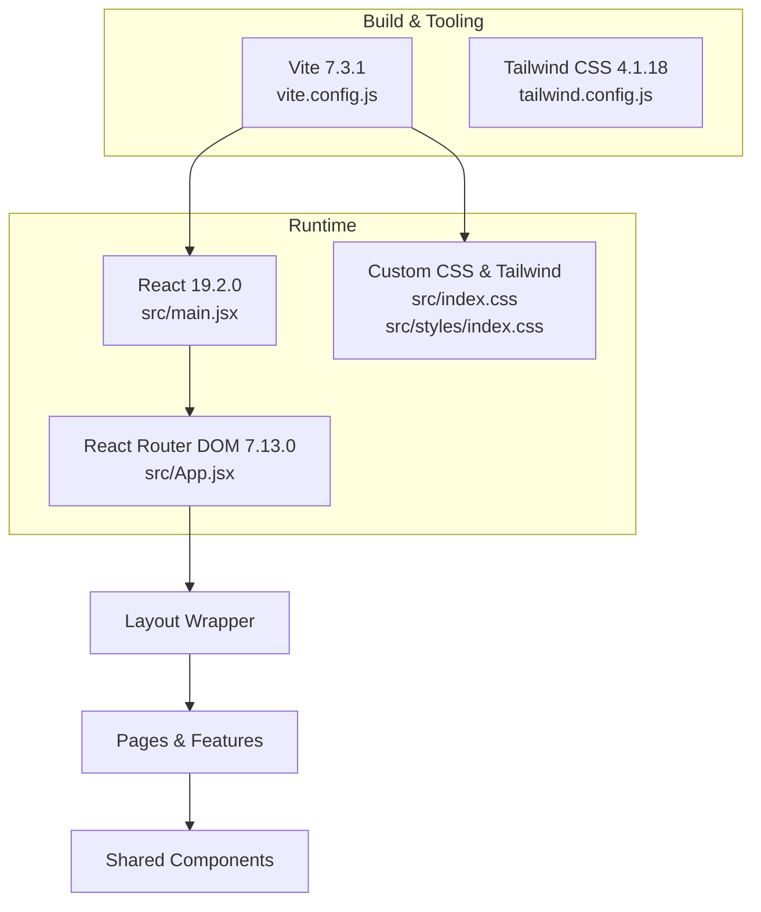
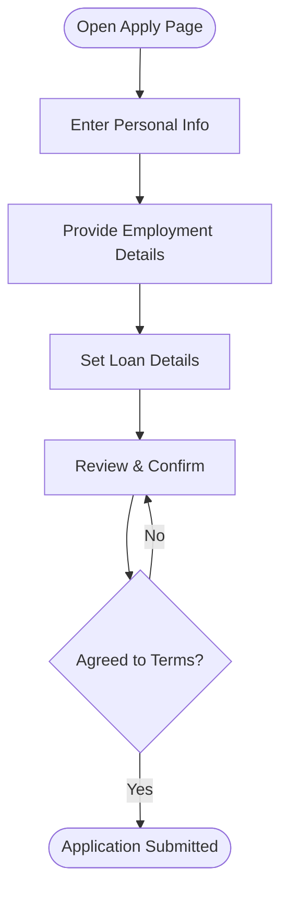
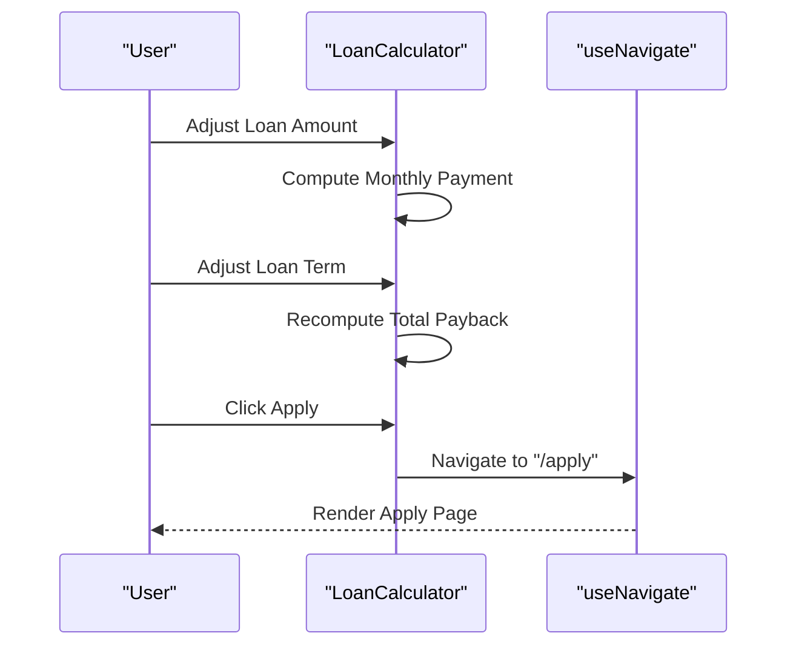
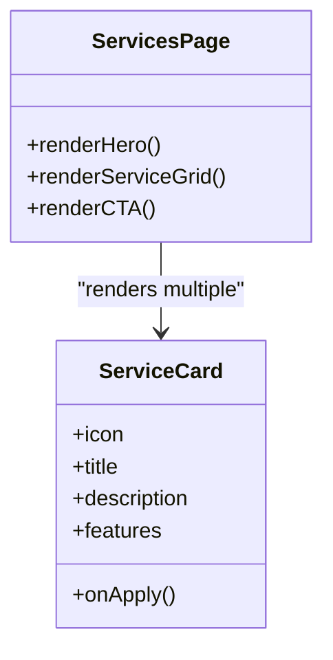
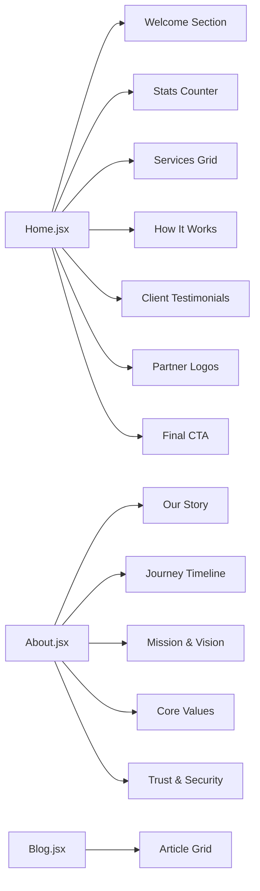
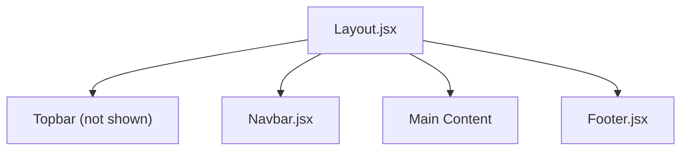
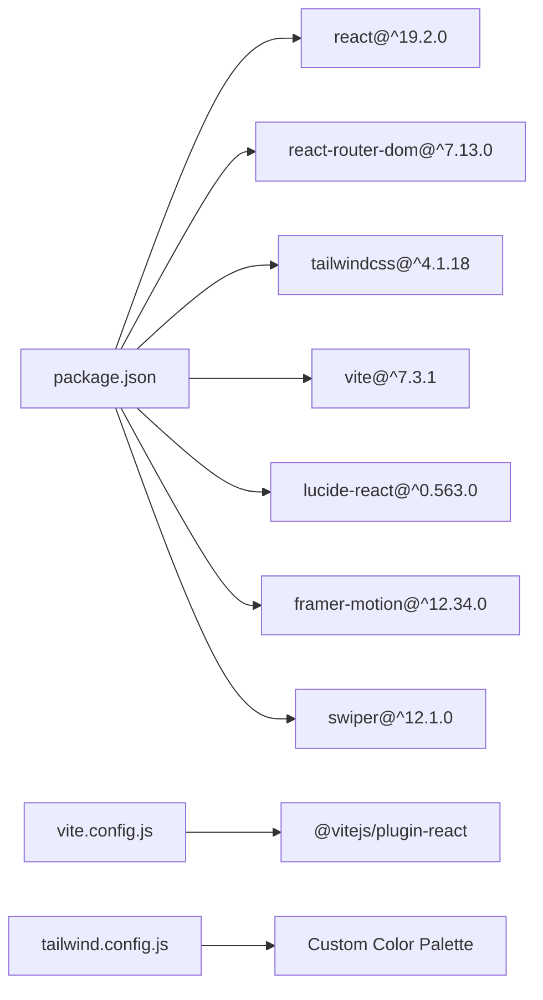

# Project Overview

<cite>
**Referenced Files in This Document**
- [package.json](file://package.json)
- [vite.config.js](file://vite.config.js)
- [tailwind.config.js](file://tailwind.config.js)
- [src/index.css](file://src/index.css)
- [src/styles/index.css](file://src/styles/index.css)
- [src/main.jsx](file://src/main.jsx)
- [src/App.jsx](file://src/App.jsx)
- [src/components/layout/Layout.jsx](file://src/components/layout/Layout.jsx)
- [src/components/layout/Navbar.jsx](file://src/components/layout/Navbar.jsx)
- [src/components/layout/Footer.jsx](file://src/components/layout/Footer.jsx)
- [src/components/loan/LoanCalculator.jsx](file://src/components/loan/LoanCalculator.jsx)
- [src/pages/Home.jsx](file://src/pages/Home.jsx)
- [src/pages/Services.jsx](file://src/pages/Services.jsx)
- [src/pages/ApplyForLoan.jsx](file://src/pages/ApplyForLoan.jsx)
- [src/pages/About.jsx](file://src/pages/About.jsx)
- [src/pages/Blog.jsx](file://src/pages/Blog.jsx)
</cite>

## Table of Contents
1. [Introduction](#introduction)
2. [Project Structure](#project-structure)
3. [Core Components](#core-components)
4. [Architecture Overview](#architecture-overview)
5. [Detailed Component Analysis](#detailed-component-analysis)
6. [Dependency Analysis](#dependency-analysis)
7. [Performance Considerations](#performance-considerations)
8. [Troubleshooting Guide](#troubleshooting-guide)
9. [Conclusion](#conclusion)

## Introduction
Easilon Financial Solutions is a comprehensive loan services platform designed to deliver a seamless digital experience for customers seeking financial solutions. The platform targets individuals and businesses requiring personal, home, auto, education, business, and other specialized loans. Its core value proposition centers on simplifying the loan journey through a streamlined multi-step application process, an interactive loan calculator, a curated showcase of financial services, a knowledge-driven blog, and a professional corporate website built with modern web technologies.

Key stakeholder benefits:
- Customers: Fast, transparent, and user-friendly loan application and estimation tools.
- Business: Scalable, maintainable frontend architecture enabling rapid iteration and deployment.
- Partners: Consistent brand experience across desktop and mobile with accessible navigation and clear CTAs.

## Project Structure
The project follows a React-based frontend architecture with a clear separation of concerns:
- Routing and entry point orchestrated via React Router DOM.
- Shared layout components (header, navigation, footer) wrapped around page-specific views.
- Feature-focused components (e.g., loan calculator) integrated into relevant pages.
- Styling powered by Tailwind CSS with a custom color palette and typography.

**Diagram sources**
- [src/main.jsx](file://src/main.jsx#L1-L11)
- [src/App.jsx](file://src/App.jsx#L1-L43)
- [src/components/layout/Layout.jsx](file://src/components/layout/Layout.jsx#L1-L20)
- [src/components/layout/Navbar.jsx](file://src/components/layout/Navbar.jsx#L1-L156)
- [src/components/layout/Footer.jsx](file://src/components/layout/Footer.jsx#L1-L117)
- [src/components/loan/LoanCalculator.jsx](file://src/components/loan/LoanCalculator.jsx#L1-L117)
- [src/pages/Home.jsx](file://src/pages/Home.jsx#L1-L297)
- [src/pages/Services.jsx](file://src/pages/Services.jsx#L1-L141)
- [src/pages/ApplyForLoan.jsx](file://src/pages/ApplyForLoan.jsx#L1-L479)
- [src/pages/About.jsx](file://src/pages/About.jsx#L1-L263)
- [src/pages/Blog.jsx](file://src/pages/Blog.jsx#L1-L154)

**Section sources**
- [src/main.jsx](file://src/main.jsx#L1-L11)
- [src/App.jsx](file://src/App.jsx#L1-L43)
- [src/components/layout/Layout.jsx](file://src/components/layout/Layout.jsx#L1-L20)

## Core Components
- Application shell and routing: Orchestrated in the root App component with route definitions for all major pages.
- Layout wrapper: Provides consistent header, navigation, and footer across pages.
- Navigation: Includes responsive desktop/mobile menus, a live search bar, and quick apply links.
- Loan calculator: Interactive widget to estimate monthly payments and total payback based on configurable loan amount and term.
- Multi-step application: Structured form with progress indicators, step-wise validation, and submission handling.
- Content pages: Home hero, services catalog, about story/timeline, and blog listings.

**Section sources**
- [src/App.jsx](file://src/App.jsx#L1-L43)
- [src/components/layout/Layout.jsx](file://src/components/layout/Layout.jsx#L1-L20)
- [src/components/layout/Navbar.jsx](file://src/components/layout/Navbar.jsx#L1-L156)
- [src/components/loan/LoanCalculator.jsx](file://src/components/loan/LoanCalculator.jsx#L1-L117)
- [src/pages/ApplyForLoan.jsx](file://src/pages/ApplyForLoan.jsx#L1-L479)
- [src/pages/Home.jsx](file://src/pages/Home.jsx#L1-L297)
- [src/pages/Services.jsx](file://src/pages/Services.jsx#L1-L141)
- [src/pages/About.jsx](file://src/pages/About.jsx#L1-L263)
- [src/pages/Blog.jsx](file://src/pages/Blog.jsx#L1-L154)

## Architecture Overview
The platform leverages a client-side routing model with React Router DOM. The Vite build tool compiles the React application, while Tailwind CSS provides utility-first styling with a cohesive brand identity. The architecture emphasizes:
- Component composition: Layout and shared UI elements encapsulate page-specific content.
- Progressive disclosure: The loan calculator and multi-step application guide users through financial decisions.
- Responsive design: Navigation adapts to mobile and desktop contexts.

**Diagram sources**
- [vite.config.js](file://vite.config.js#L1-L8)
- [tailwind.config.js](file://tailwind.config.js#L1-L24)
- [src/index.css](file://src/index.css#L1-L40)
- [src/styles/index.css](file://src/styles/index.css#L1-L12)
- [src/main.jsx](file://src/main.jsx#L1-L11)
- [src/App.jsx](file://src/App.jsx#L1-L43)

**Section sources**
- [package.json](file://package.json#L1-L36)
- [vite.config.js](file://vite.config.js#L1-L8)
- [tailwind.config.js](file://tailwind.config.js#L1-L24)
- [src/index.css](file://src/index.css#L1-L40)
- [src/styles/index.css](file://src/styles/index.css#L1-L12)
- [src/main.jsx](file://src/main.jsx#L1-L11)
- [src/App.jsx](file://src/App.jsx#L1-L43)

## Detailed Component Analysis

### Multi-step Loan Application Process
The application form is structured across four steps:
- Step 1: Personal information (names, contact, PAN, address).
- Step 2: Employment details (status, employer/business, monthly income).
- Step 3: Loan specifics (type, amount, preferred term).
- Step 4: Review and submission with terms agreement.

**Diagram sources**
- [src/pages/ApplyForLoan.jsx](file://src/pages/ApplyForLoan.jsx#L1-L479)

**Section sources**
- [src/pages/ApplyForLoan.jsx](file://src/pages/ApplyForLoan.jsx#L1-L479)

### Interactive Loan Calculator
The calculator enables prospective borrowers to explore loan affordability:
- Adjustable loan amount slider (₹10,000–₹10,00,000).
- Adjustable term slider (1–36 months).
- Real-time monthly payment and total payback computation.
- Navigation to the application page upon selection.

**Diagram sources**
- [src/components/loan/LoanCalculator.jsx](file://src/components/loan/LoanCalculator.jsx#L1-L117)

**Section sources**
- [src/components/loan/LoanCalculator.jsx](file://src/components/loan/LoanCalculator.jsx#L1-L117)

### Financial Services Showcase
The services page presents a grid of loan offerings with icons, descriptions, and feature lists. Each card includes a call-to-action to apply, reinforcing conversion pathways.

**Diagram sources**
- [src/pages/Services.jsx](file://src/pages/Services.jsx#L1-L141)

**Section sources**
- [src/pages/Services.jsx](file://src/pages/Services.jsx#L1-L141)

### Corporate Website Sections
- Home page: Hero, welcome, statistics, services grid, process explanation, testimonials, partner logos, and a final CTA.
- About page: Company story, timeline, mission/vision, values, and trust/security highlights.
- Blog page: Curated articles with categories, excerpts, and metadata.

**Diagram sources**
- [src/pages/Home.jsx](file://src/pages/Home.jsx#L1-L297)
- [src/pages/About.jsx](file://src/pages/About.jsx#L1-L263)
- [src/pages/Blog.jsx](file://src/pages/Blog.jsx#L1-L154)

**Section sources**
- [src/pages/Home.jsx](file://src/pages/Home.jsx#L1-L297)
- [src/pages/About.jsx](file://src/pages/About.jsx#L1-L263)
- [src/pages/Blog.jsx](file://src/pages/Blog.jsx#L1-L154)

### Navigation and Layout
The layout composes a sticky navbar with logo, menu, search, cart, and apply CTA. The footer consolidates company info, explore links, services, and contact details.

**Diagram sources**
- [src/components/layout/Layout.jsx](file://src/components/layout/Layout.jsx#L1-L20)
- [src/components/layout/Navbar.jsx](file://src/components/layout/Navbar.jsx#L1-L156)
- [src/components/layout/Footer.jsx](file://src/components/layout/Footer.jsx#L1-L117)

**Section sources**
- [src/components/layout/Layout.jsx](file://src/components/layout/Layout.jsx#L1-L20)
- [src/components/layout/Navbar.jsx](file://src/components/layout/Navbar.jsx#L1-L156)
- [src/components/layout/Footer.jsx](file://src/components/layout/Footer.jsx#L1-L117)

## Dependency Analysis
The project relies on a focused set of libraries and tools:
- Runtime: React, React DOM, React Router DOM.
- Styling: Tailwind CSS, custom CSS for brand tokens and sliders.
- Build: Vite with React plugin.
- Icons: Lucide React.
- Animations: Framer Motion.
- UI carousel: Swiper.

**Diagram sources**
- [package.json](file://package.json#L1-L36)
- [vite.config.js](file://vite.config.js#L1-L8)
- [tailwind.config.js](file://tailwind.config.js#L1-L24)

**Section sources**
- [package.json](file://package.json#L1-L36)
- [vite.config.js](file://vite.config.js#L1-L8)
- [tailwind.config.js](file://tailwind.config.js#L1-L24)

## Performance Considerations
- Bundle size: Keep component imports scoped; lazy-load heavy assets and avoid unnecessary re-renders.
- Routing: Use React Router’s built-in code-splitting via dynamic imports for large pages.
- Styling: Leverage Tailwind utilities to minimize custom CSS; purge unused styles in production builds.
- Images: Optimize hero and article images; consider responsive image strategies.
- Interactions: Debounce search input; avoid heavy computations in render cycles.

## Troubleshooting Guide
Common areas to inspect:
- Routing issues: Verify route paths and nested layouts in the App component.
- Styling inconsistencies: Confirm Tailwind configuration and custom CSS imports order.
- Build errors: Ensure Vite and plugin versions align with project scripts.
- Navigation/search: Validate active link states and dropdown visibility logic.

**Section sources**
- [src/App.jsx](file://src/App.jsx#L1-L43)
- [tailwind.config.js](file://tailwind.config.js#L1-L24)
- [src/styles/index.css](file://src/styles/index.css#L1-L12)
- [src/index.css](file://src/index.css#L1-L40)
- [vite.config.js](file://vite.config.js#L1-L8)

## Conclusion
Easilon Financial Solutions delivers a modern, finance-focused web experience combining intuitive navigation, a powerful loan application workflow, and an interactive calculator. Built with React 19.2.0, React Router DOM 7.13.0, Tailwind CSS 4.1.18, and Vite 7.3.1, the platform balances developer productivity with strong user outcomes. The modular architecture supports scalable enhancements, from expanded service offerings to advanced content management integrations.