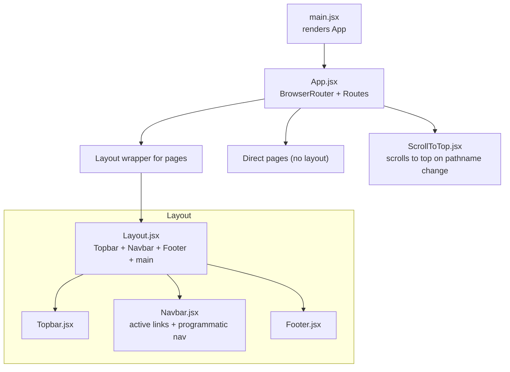
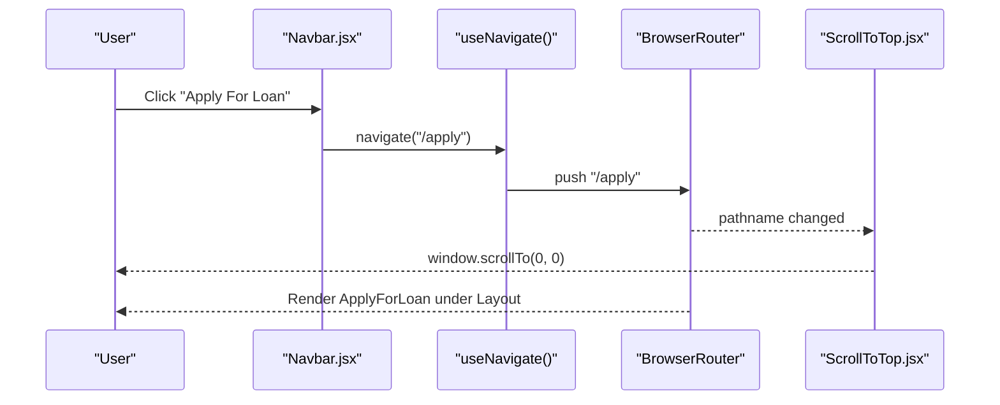
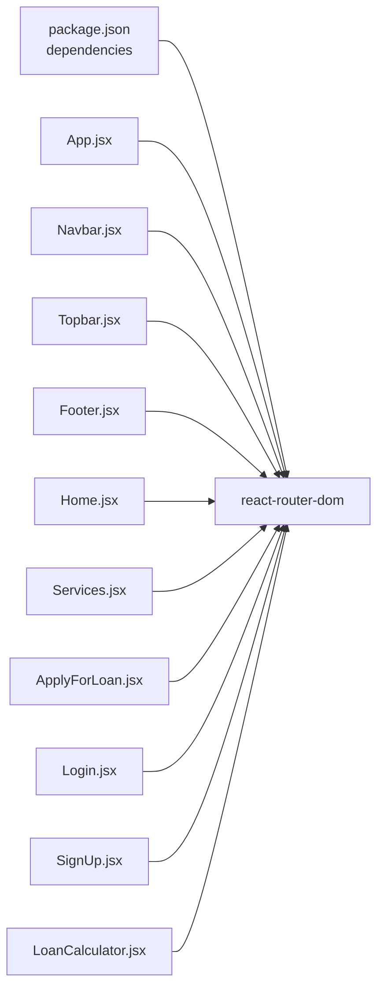

# Routing and Navigation

<cite>
**Referenced Files in This Document**
- [App.jsx](file://src/App.jsx)
- [main.jsx](file://src/main.jsx)
- [ScrollToTop.jsx](file://src/ScrollToTop.jsx)
- [Layout.jsx](file://src/components/layout/Layout.jsx)
- [Navbar.jsx](file://src/components/layout/Navbar.jsx)
- [Topbar.jsx](file://src/components/layout/Topbar.jsx)
- [Footer.jsx](file://src/components/layout/Footer.jsx)
- [Home.jsx](file://src/pages/Home.jsx)
- [Services.jsx](file://src/pages/Services.jsx)
- [ApplyForLoan.jsx](file://src/pages/ApplyForLoan.jsx)
- [Login.jsx](file://src/pages/Login.jsx)
- [SignUp.jsx](file://src/pages/SignUp.jsx)
- [LoanCalculator.jsx](file://src/components/loan/LoanCalculator.jsx)
- [package.json](file://package.json)
</cite>

## Table of Contents
1. [Introduction](#introduction)
2. [Project Structure](#project-structure)
3. [Core Components](#core-components)
4. [Architecture Overview](#architecture-overview)
5. [Detailed Component Analysis](#detailed-component-analysis)
6. [Dependency Analysis](#dependency-analysis)
7. [Performance Considerations](#performance-considerations)
8. [Troubleshooting Guide](#troubleshooting-guide)
9. [Conclusion](#conclusion)
10. [Appendices](#appendices)

## Introduction
This document explains the client-side routing and navigation system built with React Router DOM. It covers the route configuration in the application shell, layout wrapping for page components, scroll-to-top behavior, navigation state management, programmatic navigation, and navigation helpers. It also documents URL structure, SEO considerations for SPAs, browser history management, integration with layout components, active link highlighting, and accessibility features. Finally, it provides guidelines for adding new routes, modifying navigation patterns, and implementing advanced routing features.

## Project Structure
The routing system is centered around a single application shell that configures routes and wraps most pages with a shared layout. Programmatic navigation is used in several components to move users between views after actions. A dedicated scroll-to-top component ensures the viewport resets to the top on route changes.

**Diagram sources**
- [main.jsx](file://src/main.jsx#L1-L11)
- [App.jsx](file://src/App.jsx#L1-L43)
- [Layout.jsx](file://src/components/layout/Layout.jsx#L1-L20)
- [Topbar.jsx](file://src/components/layout/Topbar.jsx#L1-L55)
- [Navbar.jsx](file://src/components/layout/Navbar.jsx#L1-L156)
- [Footer.jsx](file://src/components/layout/Footer.jsx#L1-L117)
- [ScrollToTop.jsx](file://src/ScrollToTop.jsx#L1-L14)

**Section sources**
- [main.jsx](file://src/main.jsx#L1-L11)
- [App.jsx](file://src/App.jsx#L1-L43)
- [Layout.jsx](file://src/components/layout/Layout.jsx#L1-L20)
- [Topbar.jsx](file://src/components/layout/Topbar.jsx#L1-L55)
- [Navbar.jsx](file://src/components/layout/Navbar.jsx#L1-L156)
- [Footer.jsx](file://src/components/layout/Footer.jsx#L1-L117)
- [ScrollToTop.jsx](file://src/ScrollToTop.jsx#L1-L14)

## Core Components
- Application shell and router: The app initializes React Router DOM and defines all routes. Most routes render a layout wrapper around page components, while a small subset renders pages directly.
- Layout wrapper: Provides a consistent header, navigation bar, footer, and main content area for most pages.
- Scroll-to-top: Resets the viewport to the top whenever the URL path changes.
- Navigation helpers: Several components use programmatic navigation via the router’s imperative API to move users between views after actions.

Key implementation references:
- Router initialization and route definitions: [App.jsx](file://src/App.jsx#L20-L39)
- Layout wrapper composition: [Layout.jsx](file://src/components/layout/Layout.jsx#L6-L16)
- Scroll-to-top behavior: [ScrollToTop.jsx](file://src/ScrollToTop.jsx#L4-L12)
- Programmatic navigation examples:
  - Navbar cart action: [Navbar.jsx](file://src/components/layout/Navbar.jsx#L102-L108)
  - Login success redirect: [Login.jsx](file://src/pages/Login.jsx#L22-L24)
  - Sign-up completion redirect: [SignUp.jsx](file://src/pages/SignUp.jsx#L14-L16)
  - Calculator apply button: [LoanCalculator.jsx](file://src/components/loan/LoanCalculator.jsx#L106-L112)

**Section sources**
- [App.jsx](file://src/App.jsx#L20-L39)
- [Layout.jsx](file://src/components/layout/Layout.jsx#L6-L16)
- [ScrollToTop.jsx](file://src/ScrollToTop.jsx#L4-L12)
- [Navbar.jsx](file://src/components/layout/Navbar.jsx#L102-L108)
- [Login.jsx](file://src/pages/Login.jsx#L22-L24)
- [SignUp.jsx](file://src/pages/SignUp.jsx#L14-L16)
- [LoanCalculator.jsx](file://src/components/loan/LoanCalculator.jsx#L106-L112)

## Architecture Overview
The routing architecture follows a flat route configuration with a layout wrapper applied to most pages. Programmatic navigation is used in interactive components to improve UX. Active link highlighting is handled via the current location comparison in the navigation bar.

**Diagram sources**
- [Navbar.jsx](file://src/components/layout/Navbar.jsx#L102-L108)
- [App.jsx](file://src/App.jsx#L33-L33)
- [ScrollToTop.jsx](file://src/ScrollToTop.jsx#L4-L12)

**Section sources**
- [App.jsx](file://src/App.jsx#L20-L39)
- [Navbar.jsx](file://src/components/layout/Navbar.jsx#L102-L108)
- [ScrollToTop.jsx](file://src/ScrollToTop.jsx#L4-L12)

## Detailed Component Analysis

### Route Configuration and Layout Wrapping
- The application uses a single Router instance and enumerates all routes in a central file. Most routes render a layout wrapper around page components, ensuring consistent branding and navigation across content pages. Some pages (authentication and landing-type pages) render without the layout wrapper.
- The layout wrapper composes the top bar, navigation bar, and footer, with the page content rendered inside a main container.

References:
- Router and routes: [App.jsx](file://src/App.jsx#L20-L39)
- Layout composition: [Layout.jsx](file://src/components/layout/Layout.jsx#L6-L16)
- Topbar integration: [Topbar.jsx](file://src/components/layout/Topbar.jsx#L1-L55)
- Footer integration: [Footer.jsx](file://src/components/layout/Footer.jsx#L1-L117)

**Section sources**
- [App.jsx](file://src/App.jsx#L20-L39)
- [Layout.jsx](file://src/components/layout/Layout.jsx#L6-L16)
- [Topbar.jsx](file://src/components/layout/Topbar.jsx#L1-L55)
- [Footer.jsx](file://src/components/layout/Footer.jsx#L1-L117)

### Scroll-to-Top Functionality
- A dedicated component subscribes to location changes and scrolls the window to the top whenever the pathname changes. This ensures a consistent user experience when navigating between routes.

References:
- Scroll behavior: [ScrollToTop.jsx](file://src/ScrollToTop.jsx#L4-L12)

**Section sources**
- [ScrollToTop.jsx](file://src/ScrollToTop.jsx#L4-L12)

### Navigation State Management and Active Link Highlighting
- The navigation bar maintains active state by comparing the current location with target paths. This enables visual indication of the current page in desktop and mobile menus.
- The navigation bar also demonstrates programmatic navigation for actions that do not use declarative links (e.g., cart button).

References:
- Active link detection: [Navbar.jsx](file://src/components/layout/Navbar.jsx#L25-L25)
- Programmatic navigation (cart): [Navbar.jsx](file://src/components/layout/Navbar.jsx#L102-L108)

**Section sources**
- [Navbar.jsx](file://src/components/layout/Navbar.jsx#L25-L25)
- [Navbar.jsx](file://src/components/layout/Navbar.jsx#L102-L108)

### Programmatic Navigation Patterns
- Several components use the imperative navigation API to redirect users after successful actions:
  - Login component redirects to home after successful authentication.
  - Sign-up component redirects to login after form submission.
  - Loan calculator component navigates to the application page when the user clicks “Apply.”
  - Navbar component navigates to the cart route when the cart icon is clicked.

References:
- Login redirect: [Login.jsx](file://src/pages/Login.jsx#L22-L24)
- Sign-up redirect: [SignUp.jsx](file://src/pages/SignUp.jsx#L14-L16)
- Calculator apply: [LoanCalculator.jsx](file://src/components/loan/LoanCalculator.jsx#L106-L112)
- Navbar cart: [Navbar.jsx](file://src/components/layout/Navbar.jsx#L102-L108)

**Section sources**
- [Login.jsx](file://src/pages/Login.jsx#L22-L24)
- [SignUp.jsx](file://src/pages/SignUp.jsx#L14-L16)
- [LoanCalculator.jsx](file://src/components/loan/LoanCalculator.jsx#L106-L112)
- [Navbar.jsx](file://src/components/layout/Navbar.jsx#L102-L108)

### Dynamic Routing and Nested Routes
- Current implementation uses flat routes without nested routes or dynamic segments. There are no route parameters or nested layouts in the provided code.
- If dynamic routing is introduced later, typical patterns include:
  - Route parameters: define routes with placeholders and read them via the router’s hook.
  - Index and route groups: organize related routes under a shared parent layout.
  - Lazy loading: defer loading page components for performance.

[No sources needed since this section provides general guidance]

### Navigation Helpers and Utilities
- The navigation bar includes a search feature that filters suggestions and navigates to matching pages when selected. This demonstrates combining state, filtering, and programmatic navigation.
- The layout wrapper integrates the navigation bar and footer, ensuring consistent navigation across pages.

References:
- Search and filter: [Navbar.jsx](file://src/components/layout/Navbar.jsx#L21-L23)
- Navigation bar integration: [Layout.jsx](file://src/components/layout/Layout.jsx#L9-L11)

**Section sources**
- [Navbar.jsx](file://src/components/layout/Navbar.jsx#L21-L23)
- [Layout.jsx](file://src/components/layout/Layout.jsx#L9-L11)

### URL Structure and Browser History Management
- URL structure follows a flat hierarchy aligned with the route definitions. Examples include:
  - Home: "/"
  - Content: "/about", "/services", "/blog", "/contact", "/career", "/media", "/faq"
  - Application: "/apply"
  - Authentication: "/login", "/signup", "/forgot-password"
- Browser history is managed automatically by the router. Programmatic navigation uses the imperative API to push new entries onto the history stack.

References:
- Route definitions: [App.jsx](file://src/App.jsx#L24-L36)

**Section sources**
- [App.jsx](file://src/App.jsx#L24-L36)

### SEO Considerations for SPA
- The current implementation does not include meta tag management or server-side rendering. For improved SEO:
  - Add meta tags and structured data in individual pages.
  - Consider integrating a head management library to update document metadata per route.
  - Evaluate SSR/SSG for critical pages if SEO performance is a concern.

[No sources needed since this section provides general guidance]

### Accessibility Features in Navigation
- The navigation bar uses semantic markup and keyboard-accessible controls (toggle buttons, dropdowns).
- Active link highlighting improves focus visibility by changing color for the current page.
- Ensure ARIA roles and labels are added to dropdowns and modals if accessibility testing reveals gaps.

[No sources needed since this section provides general guidance]

## Dependency Analysis
React Router DOM is the primary external dependency for routing. The application relies on its declarative and imperative APIs for navigation and stateless route configuration.

**Diagram sources**
- [package.json](file://package.json#L12-L19)
- [App.jsx](file://src/App.jsx#L2-L2)
- [Navbar.jsx](file://src/components/layout/Navbar.jsx#L2-L2)
- [Topbar.jsx](file://src/components/layout/Topbar.jsx#L2-L2)
- [Footer.jsx](file://src/components/layout/Footer.jsx#L2-L2)
- [Home.jsx](file://src/pages/Home.jsx#L2-L2)
- [Services.jsx](file://src/pages/Services.jsx#L3-L3)
- [ApplyForLoan.jsx](file://src/pages/ApplyForLoan.jsx#L2-L2)
- [Login.jsx](file://src/pages/Login.jsx#L2-L2)
- [SignUp.jsx](file://src/pages/SignUp.jsx#L2-L2)
- [LoanCalculator.jsx](file://src/components/loan/LoanCalculator.jsx#L3-L3)

**Section sources**
- [package.json](file://package.json#L12-L19)
- [App.jsx](file://src/App.jsx#L2-L2)
- [Navbar.jsx](file://src/components/layout/Navbar.jsx#L2-L2)
- [Topbar.jsx](file://src/components/layout/Topbar.jsx#L2-L2)
- [Footer.jsx](file://src/components/layout/Footer.jsx#L2-L2)
- [Home.jsx](file://src/pages/Home.jsx#L2-L2)
- [Services.jsx](file://src/pages/Services.jsx#L3-L3)
- [ApplyForLoan.jsx](file://src/pages/ApplyForLoan.jsx#L2-L2)
- [Login.jsx](file://src/pages/Login.jsx#L2-L2)
- [SignUp.jsx](file://src/pages/SignUp.jsx#L2-L2)
- [LoanCalculator.jsx](file://src/components/loan/LoanCalculator.jsx#L3-L3)

## Performance Considerations
- Keep route components lightweight and lazy-load heavy pages if needed.
- Avoid unnecessary re-renders by using memoization for navigation lists and computed values.
- Minimize layout thrashing by avoiding synchronous layout reads during navigation.

[No sources needed since this section provides general guidance]

## Troubleshooting Guide
Common issues and resolutions:
- Links not scrolling to top: Verify the scroll-to-top component is mounted under the router and that pathname changes trigger the effect.
- Active link highlighting not working: Ensure the active path comparison uses the intended path and that the location object is current.
- Programmatic navigation not working: Confirm the navigate function is called within a Router context and that the target route exists.

References:
- Scroll behavior: [ScrollToTop.jsx](file://src/ScrollToTop.jsx#L4-L12)
- Active link detection: [Navbar.jsx](file://src/components/layout/Navbar.jsx#L25-L25)
- Programmatic navigation examples: [Login.jsx](file://src/pages/Login.jsx#L22-L24), [SignUp.jsx](file://src/pages/SignUp.jsx#L14-L16), [LoanCalculator.jsx](file://src/components/loan/LoanCalculator.jsx#L106-L112), [Navbar.jsx](file://src/components/layout/Navbar.jsx#L102-L108)

**Section sources**
- [ScrollToTop.jsx](file://src/ScrollToTop.jsx#L4-L12)
- [Navbar.jsx](file://src/components/layout/Navbar.jsx#L25-L25)
- [Login.jsx](file://src/pages/Login.jsx#L22-L24)
- [SignUp.jsx](file://src/pages/SignUp.jsx#L14-L16)
- [LoanCalculator.jsx](file://src/components/loan/LoanCalculator.jsx#L106-L112)
- [Navbar.jsx](file://src/components/layout/Navbar.jsx#L102-L108)

## Conclusion
The routing and navigation system is straightforward and effective for the current scope. It leverages React Router DOM for declarative routing, a layout wrapper for consistent UX, and programmatic navigation for interactive flows. The scroll-to-top behavior and active link highlighting enhance usability. As the application grows, consider introducing nested routes, dynamic parameters, and SEO enhancements to maintain a scalable and accessible navigation experience.

[No sources needed since this section summarizes without analyzing specific files]

## Appendices

### Guidelines for Adding New Routes
- Define the new route in the central route configuration with the appropriate path and element.
- Wrap page components with the layout unless they require a distinct presentation.
- Ensure programmatic navigation targets the new route consistently.

References:
- Route definitions: [App.jsx](file://src/App.jsx#L24-L36)

**Section sources**
- [App.jsx](file://src/App.jsx#L24-L36)

### Guidelines for Modifying Navigation Patterns
- Centralize navigation data (e.g., menu items) to avoid duplication across components.
- Use the location object to compute active states and avoid hard-coded styles.
- Prefer programmatic navigation for actions that depend on runtime conditions.

References:
- Active link detection: [Navbar.jsx](file://src/components/layout/Navbar.jsx#L25-L25)
- Programmatic navigation: [Login.jsx](file://src/pages/Login.jsx#L22-L24), [SignUp.jsx](file://src/pages/SignUp.jsx#L14-L16), [LoanCalculator.jsx](file://src/components/loan/LoanCalculator.jsx#L106-L112), [Navbar.jsx](file://src/components/layout/Navbar.jsx#L102-L108)

**Section sources**
- [Navbar.jsx](file://src/components/layout/Navbar.jsx#L25-L25)
- [Login.jsx](file://src/pages/Login.jsx#L22-L24)
- [SignUp.jsx](file://src/pages/SignUp.jsx#L14-L16)
- [LoanCalculator.jsx](file://src/components/loan/LoanCalculator.jsx#L106-L112)
- [Navbar.jsx](file://src/components/layout/Navbar.jsx#L102-L108)

### Implementing Advanced Routing Features
- Nested routes: Group related routes under a shared layout using nested Routes.
- Route parameters: Add placeholders to paths and read them via the router’s hook.
- Lazy loading: Defer loading page components to reduce initial bundle size.
- Guards: Implement route guards using a combination of hooks and conditional rendering.

[No sources needed since this section provides general guidance]