# State Management

<cite>
**Referenced Files in This Document**
- [App.jsx](file://src/App.jsx)
- [main.jsx](file://src/main.jsx)
- [Layout.jsx](file://src/components/layout/Layout.jsx)
- [Hero.jsx](file://src/components/home/Hero.jsx)
- [LoanCalculator.jsx](file://src/components/loan/LoanCalculator.jsx)
- [ApplyForLoan.jsx](file://src/pages/ApplyForLoan.jsx)
- [Home.jsx](file://src/pages/Home.jsx)
- [Navbar.jsx](file://src/components/layout/Navbar.jsx)
- [ScrollToTop.jsx](file://src/ScrollToTop.jsx)
- [ProtectedRoute.jsx](file://src/components/ProtectedRoute.jsx)
- [Login.jsx](file://src/pages/Login.jsx)
- [SignUp.jsx](file://src/pages/SignUp.jsx)
- [FAQ.jsx](file://src/pages/FAQ.jsx)
</cite>

## Table of Contents
1. [Introduction](#introduction)
2. [Project Structure](#project-structure)
3. [Core Components](#core-components)
4. [Architecture Overview](#architecture-overview)
5. [Detailed Component Analysis](#detailed-component-analysis)
6. [Dependency Analysis](#dependency-analysis)
7. [Performance Considerations](#performance-considerations)
8. [Troubleshooting Guide](#troubleshooting-guide)
9. [Conclusion](#conclusion)
10. [Appendices](#appendices)

## Introduction
This document explains state management patterns across the application. It covers React hooks usage (useState, useEffect), custom hooks, controlled components, and navigation state handling. It documents form state management in the multi-step loan application, real-time state updates in the loan calculator, and component communication patterns. It also outlines strategies for state persistence, validation state management, performance optimization, and guidelines for extending patterns and integrating backend state solutions.

## Project Structure
The application is a React client rendered by Vite and routed via react-router-dom. State is primarily managed locally within components and pages. Routing is configured in the root App component, and pages are wrapped in a shared Layout component.

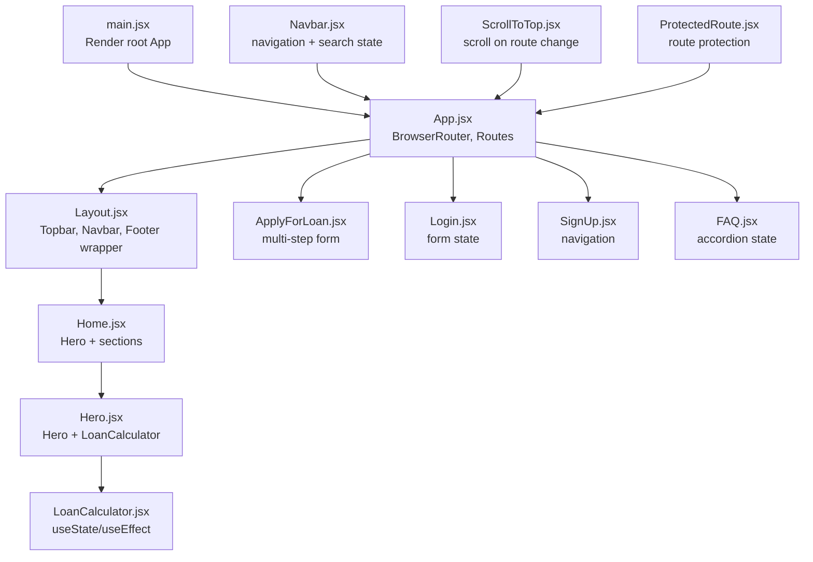

**Diagram sources**
- [main.jsx](file://src/main.jsx#L1-L11)
- [App.jsx](file://src/App.jsx#L1-L43)
- [Layout.jsx](file://src/components/layout/Layout.jsx#L1-L20)
- [Home.jsx](file://src/pages/Home.jsx#L1-L297)
- [Hero.jsx](file://src/components/home/Hero.jsx#L1-L125)
- [LoanCalculator.jsx](file://src/components/loan/LoanCalculator.jsx#L1-L117)
- [ApplyForLoan.jsx](file://src/pages/ApplyForLoan.jsx#L1-L479)
- [Login.jsx](file://src/pages/Login.jsx#L1-L45)
- [SignUp.jsx](file://src/pages/SignUp.jsx#L1-L50)
- [FAQ.jsx](file://src/pages/FAQ.jsx#L117-L143)
- [Navbar.jsx](file://src/components/layout/Navbar.jsx#L1-L156)
- [ScrollToTop.jsx](file://src/ScrollToTop.jsx#L1-L14)
- [ProtectedRoute.jsx](file://src/components/ProtectedRoute.jsx#L1-L17)

**Section sources**
- [main.jsx](file://src/main.jsx#L1-L11)
- [App.jsx](file://src/App.jsx#L1-L43)
- [Layout.jsx](file://src/components/layout/Layout.jsx#L1-L20)

## Core Components
- LoanCalculator: Demonstrates local state for inputs and derived state via useEffect, plus navigation on submit.
- ApplyForLoan: Multi-step form with a single state object for all fields, step navigation, and submission handling.
- Hero: Manages slideshow state and composes LoanCalculator.
- Navbar: Local state for mobile menu, search toggle, and search term; integrates with routing.
- ScrollToTop: Uses useEffect to reset scroll position on route changes.
- ProtectedRoute: Reads token from localStorage to guard routes.
- Login/SignUp: Controlled forms with local state and navigation after submission.
- FAQ: Accordion state toggled by index.

**Section sources**
- [LoanCalculator.jsx](file://src/components/loan/LoanCalculator.jsx#L1-L117)
- [ApplyForLoan.jsx](file://src/pages/ApplyForLoan.jsx#L1-L479)
- [Hero.jsx](file://src/components/home/Hero.jsx#L1-L125)
- [Navbar.jsx](file://src/components/layout/Navbar.jsx#L1-L156)
- [ScrollToTop.jsx](file://src/ScrollToTop.jsx#L1-L14)
- [ProtectedRoute.jsx](file://src/components/ProtectedRoute.jsx#L1-L17)
- [Login.jsx](file://src/pages/Login.jsx#L1-L45)
- [SignUp.jsx](file://src/pages/SignUp.jsx#L1-L50)
- [FAQ.jsx](file://src/pages/FAQ.jsx#L117-L143)

## Architecture Overview
The app follows a component-centric state model:
- Local state in components for UI and form data.
- Derived state computed via useEffect from primary state.
- Navigation state handled by react-router hooks.
- Shared layout composes child pages and subcomponents.

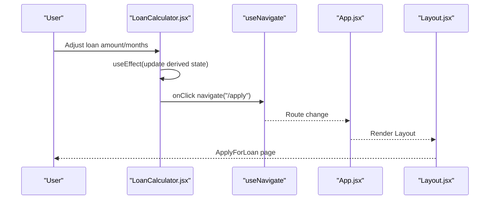

**Diagram sources**
- [LoanCalculator.jsx](file://src/components/loan/LoanCalculator.jsx#L1-L117)
- [App.jsx](file://src/App.jsx#L1-L43)
- [Layout.jsx](file://src/components/layout/Layout.jsx#L1-L20)

## Detailed Component Analysis

### LoanCalculator: Real-time derived state and navigation
- Primary state: loanAmount, loanMonths, monthlyPayment, totalPayback.
- Derived state: computed inside useEffect when inputs change.
- Formatting: currency formatting helper.
- Navigation: navigates to the application form on button click.

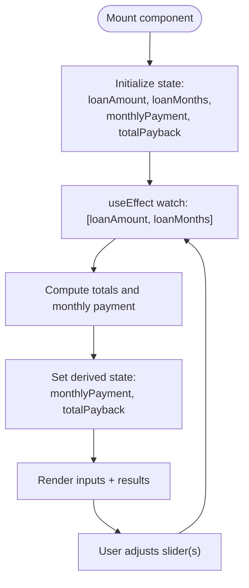

**Diagram sources**
- [LoanCalculator.jsx](file://src/components/loan/LoanCalculator.jsx#L1-L117)

**Section sources**
- [LoanCalculator.jsx](file://src/components/loan/LoanCalculator.jsx#L1-L117)

### ApplyForLoan: Multi-step form with controlled components
- Single state object holds all form fields.
- Controlled inputs: each field binds value and onChange handler.
- Step navigation: next/previous buttons update currentStep.
- Validation: required attributes on inputs; submit disabled until terms agreed.
- Submission: logs form data and shows a confirmation message.

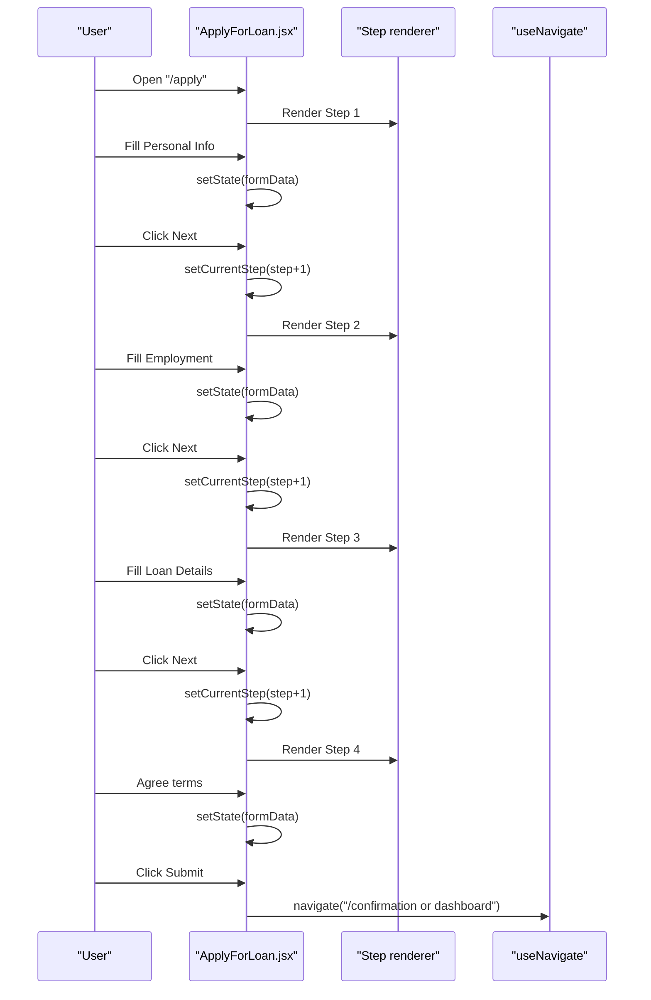

**Diagram sources**
- [ApplyForLoan.jsx](file://src/pages/ApplyForLoan.jsx#L1-L479)

**Section sources**
- [ApplyForLoan.jsx](file://src/pages/ApplyForLoan.jsx#L1-L479)

### Hero: Composition and slideshow state
- Manages slideshow index with useEffect interval.
- Composes LoanCalculator as a child component.

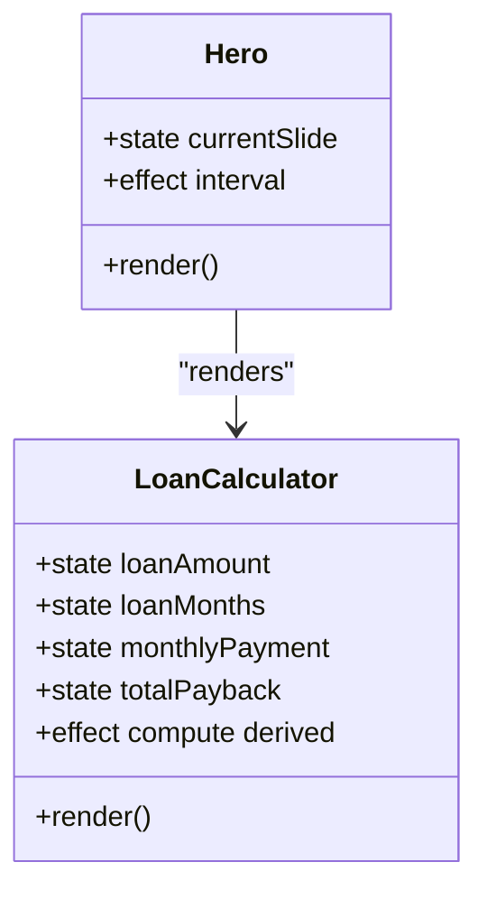

**Diagram sources**
- [Hero.jsx](file://src/components/home/Hero.jsx#L1-L125)
- [LoanCalculator.jsx](file://src/components/loan/LoanCalculator.jsx#L1-L117)

**Section sources**
- [Hero.jsx](file://src/components/home/Hero.jsx#L1-L125)

### Navbar: Navigation and search state
- Local state for mobile menu, search visibility, and search term.
- Filters navigation items based on search term.
- Integrates with react-router for navigation.

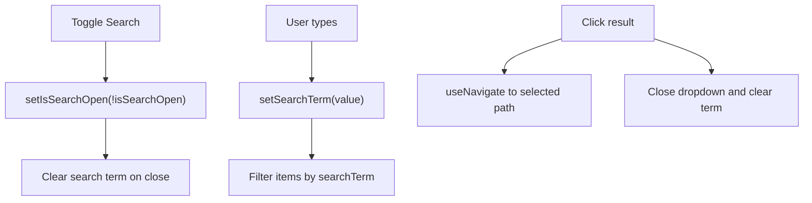

**Diagram sources**
- [Navbar.jsx](file://src/components/layout/Navbar.jsx#L1-L156)

**Section sources**
- [Navbar.jsx](file://src/components/layout/Navbar.jsx#L1-L156)

### ScrollToTop: Route-driven scroll reset
- On every pathname change, scrolls window to top.

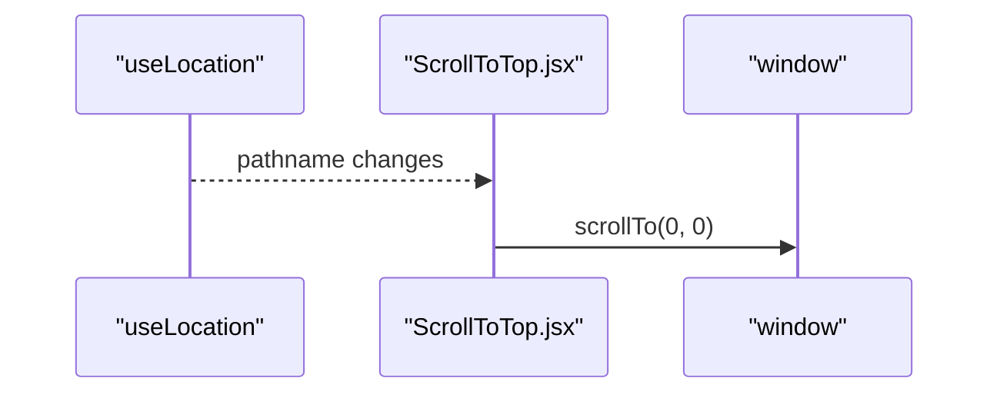

**Diagram sources**
- [ScrollToTop.jsx](file://src/ScrollToTop.jsx#L1-L14)

**Section sources**
- [ScrollToTop.jsx](file://src/ScrollToTop.jsx#L1-L14)

### ProtectedRoute: Token-based route protection
- Reads token from localStorage.
- Redirects to login if missing; otherwise renders children.

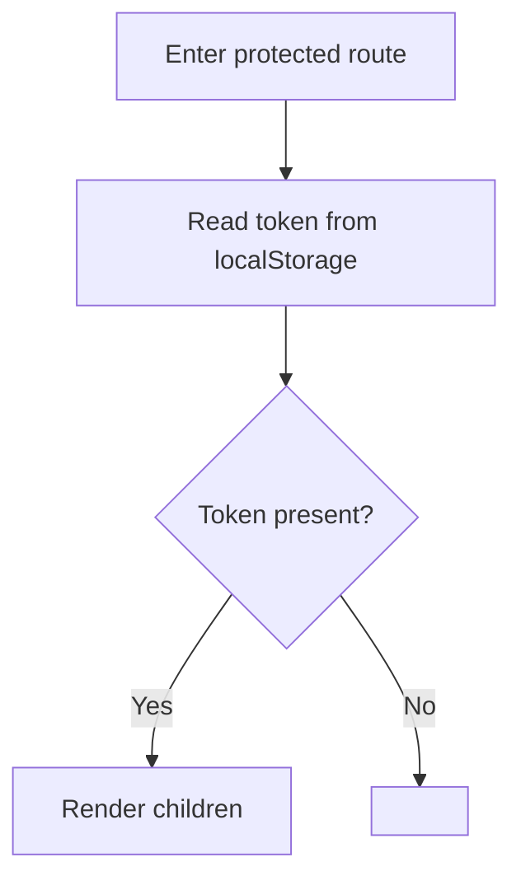

**Diagram sources**
- [ProtectedRoute.jsx](file://src/components/ProtectedRoute.jsx#L1-L17)

**Section sources**
- [ProtectedRoute.jsx](file://src/components/ProtectedRoute.jsx#L1-L17)

### Login and SignUp: Controlled forms and navigation
- Controlled inputs bound to local state.
- Navigation after form submission.

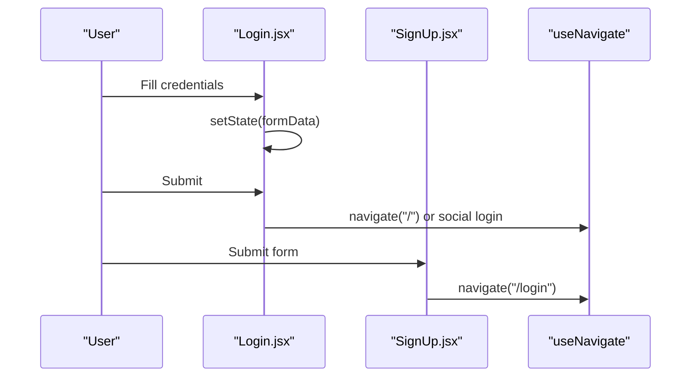

**Diagram sources**
- [Login.jsx](file://src/pages/Login.jsx#L1-L45)
- [SignUp.jsx](file://src/pages/SignUp.jsx#L1-L50)

**Section sources**
- [Login.jsx](file://src/pages/Login.jsx#L1-L45)
- [SignUp.jsx](file://src/pages/SignUp.jsx#L1-L50)

### FAQ: Accordion state management
- Tracks open index globally to expand/collapse questions.
- Uses a computed global index for category+question mapping.

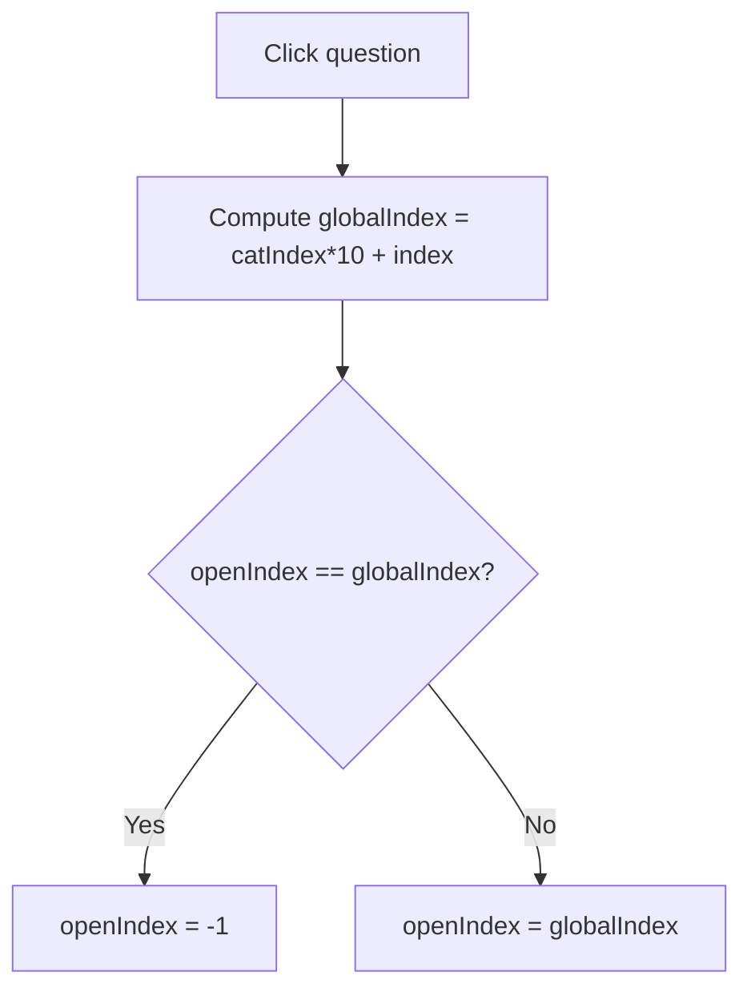

**Diagram sources**
- [FAQ.jsx](file://src/pages/FAQ.jsx#L117-L143)

**Section sources**
- [FAQ.jsx](file://src/pages/FAQ.jsx#L117-L143)

## Dependency Analysis
- App wraps pages in Layout and registers routes.
- Layout composes Topbar, Navbar, and Footer.
- Hero composes LoanCalculator.
- ApplyForLoan depends on react-router for navigation.
- Navbar depends on react-router for navigation and location state.
- ScrollToTop depends on react-router for pathname.
- ProtectedRoute depends on localStorage for token.

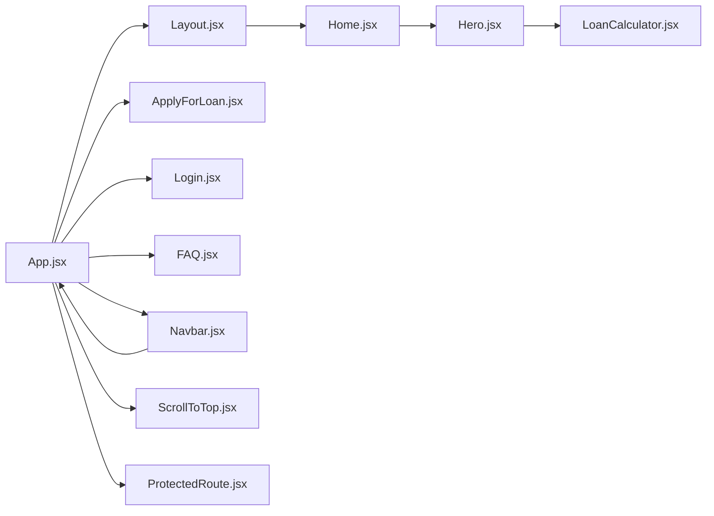

**Diagram sources**
- [App.jsx](file://src/App.jsx#L1-L43)
- [Layout.jsx](file://src/components/layout/Layout.jsx#L1-L20)
- [Home.jsx](file://src/pages/Home.jsx#L1-L297)
- [Hero.jsx](file://src/components/home/Hero.jsx#L1-L125)
- [LoanCalculator.jsx](file://src/components/loan/LoanCalculator.jsx#L1-L117)
- [ApplyForLoan.jsx](file://src/pages/ApplyForLoan.jsx#L1-L479)
- [Login.jsx](file://src/pages/Login.jsx#L1-L45)
- [FAQ.jsx](file://src/pages/FAQ.jsx#L117-L143)
- [Navbar.jsx](file://src/components/layout/Navbar.jsx#L1-L156)
- [ScrollToTop.jsx](file://src/ScrollToTop.jsx#L1-L14)
- [ProtectedRoute.jsx](file://src/components/ProtectedRoute.jsx#L1-L17)

**Section sources**
- [App.jsx](file://src/App.jsx#L1-L43)
- [Layout.jsx](file://src/components/layout/Layout.jsx#L1-L20)
- [Hero.jsx](file://src/components/home/Hero.jsx#L1-L125)
- [LoanCalculator.jsx](file://src/components/loan/LoanCalculator.jsx#L1-L117)
- [ApplyForLoan.jsx](file://src/pages/ApplyForLoan.jsx#L1-L479)
- [Navbar.jsx](file://src/components/layout/Navbar.jsx#L1-L156)
- [ScrollToTop.jsx](file://src/ScrollToTop.jsx#L1-L14)
- [ProtectedRoute.jsx](file://src/components/ProtectedRoute.jsx#L1-L17)

## Performance Considerations
- Prefer splitting large state objects into focused slices when forms grow larger to reduce re-renders.
- Memoize derived computations using useMemo when computation cost increases.
- Batch related state updates with a single setState call when possible.
- Use stable callbacks (via useCallback) for event handlers passed to child components to avoid unnecessary prop changes.
- Debounce expensive search/filter operations (as in Navbar) to limit re-computation frequency.
- Keep derived state minimal and derived only from explicit dependencies in useEffect watchers.
- Avoid storing transient UI state in persistent storage; rely on localStorage only for tokens or persisted preferences.

[No sources needed since this section provides general guidance]

## Troubleshooting Guide
- Multi-step form submission disabled: ensure the terms checkbox is checked to enable the submit button.
- Sliders not updating results: verify useEffect dependencies include all inputs used in calculations.
- Navigation not working: confirm useNavigate is called within a routing context and routes are defined in App.
- Protected route redirect loop: ensure a valid token exists in localStorage or remove invalid entries.
- Search dropdown not closing: verify toggle logic clears searchTerm on close and that clicks outside close the dropdown.

**Section sources**
- [ApplyForLoan.jsx](file://src/pages/ApplyForLoan.jsx#L453-L470)
- [LoanCalculator.jsx](file://src/components/loan/LoanCalculator.jsx#L14-L20)
- [App.jsx](file://src/App.jsx#L20-L40)
- [ProtectedRoute.jsx](file://src/components/ProtectedRoute.jsx#L4-L13)
- [Navbar.jsx](file://src/components/layout/Navbar.jsx#L67-L98)

## Conclusion
The application relies on local React state for UI and form management, with clear patterns for controlled components, derived state, and navigation. The multi-step loan application centralizes form state, while the loan calculator demonstrates real-time derived state updates. Navigation state is handled via react-router hooks, and route protection is enforced through a dedicated component. These patterns are straightforward to extend and integrate with backend state solutions by replacing local state with centralized stores or server-backed state.

[No sources needed since this section summarizes without analyzing specific files]

## Appendices

### State Patterns Reference
- Controlled components: inputs bind value and onChange to local state.
- Derived state: computed inside useEffect from primary state.
- Navigation state: managed via useNavigate and route guards.
- Component composition: parent manages child state and passes callbacks.

**Section sources**
- [LoanCalculator.jsx](file://src/components/loan/LoanCalculator.jsx#L1-L117)
- [ApplyForLoan.jsx](file://src/pages/ApplyForLoan.jsx#L1-L479)
- [Hero.jsx](file://src/components/home/Hero.jsx#L1-L125)
- [Navbar.jsx](file://src/components/layout/Navbar.jsx#L1-L156)
- [ProtectedRoute.jsx](file://src/components/ProtectedRoute.jsx#L1-L17)