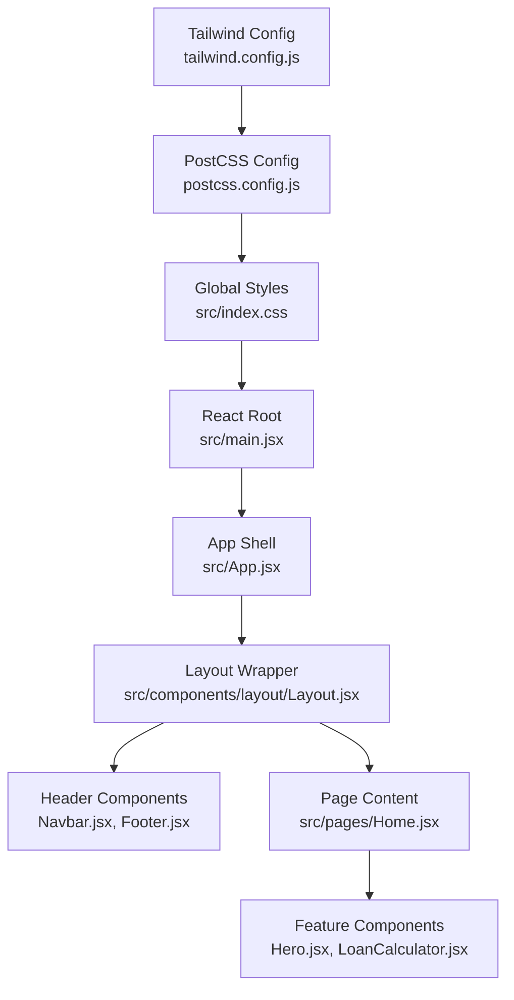
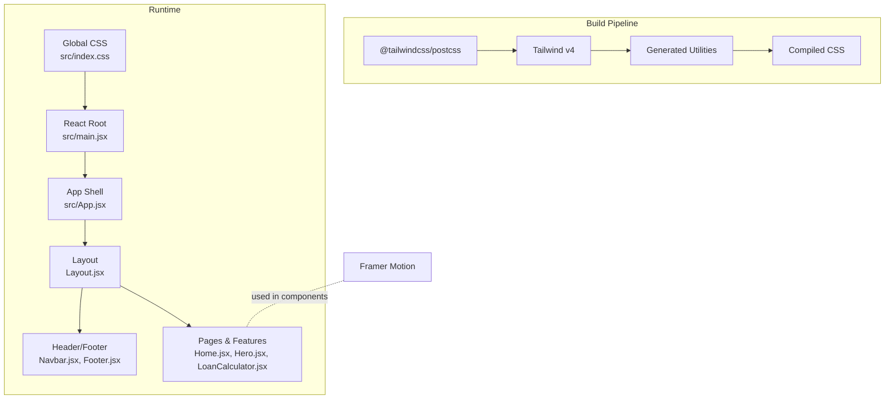
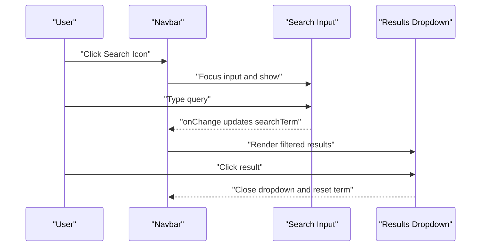
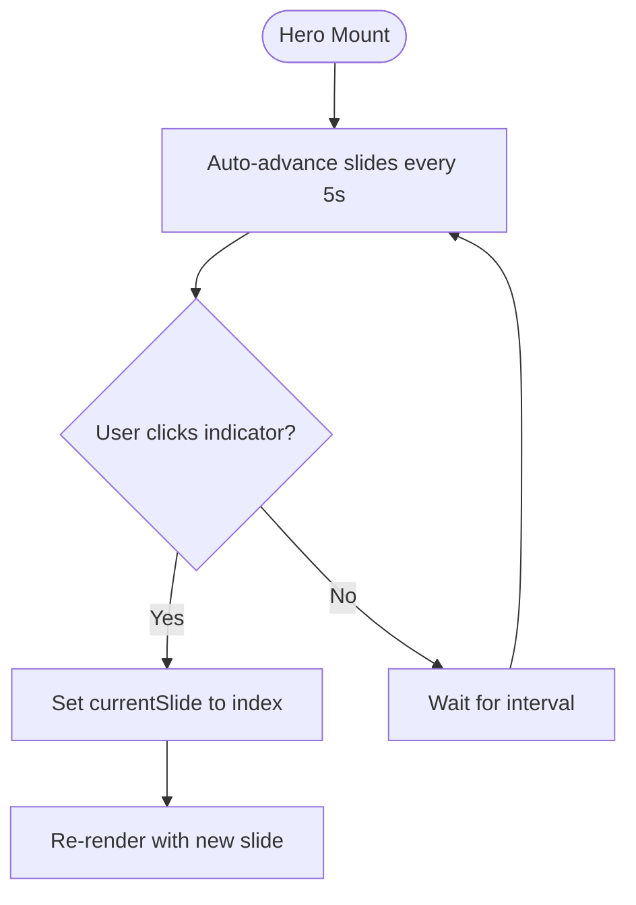
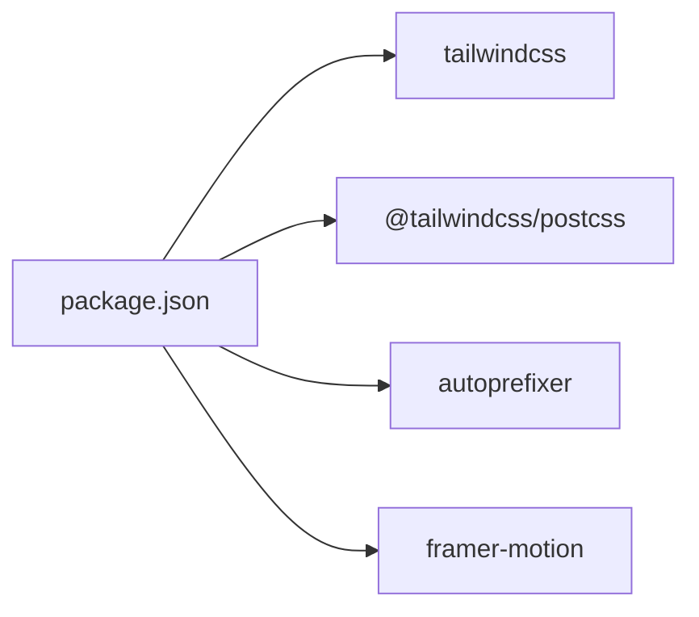

# Styling and Design System

<cite>
**Referenced Files in This Document**
- [tailwind.config.js](file://tailwind.config.js)
- [postcss.config.js](file://postcss.config.js)
- [src/styles/index.css](file://src/styles/index.css)
- [src/index.css](file://src/index.css)
- [package.json](file://package.json)
- [src/main.jsx](file://src/main.jsx)
- [src/App.jsx](file://src/App.jsx)
- [src/components/layout/Layout.jsx](file://src/components/layout/Layout.jsx)
- [src/components/layout/Navbar.jsx](file://src/components/layout/Navbar.jsx)
- [src/components/layout/Footer.jsx](file://src/components/layout/Footer.jsx)
- [src/components/home/Hero.jsx](file://src/components/home/Hero.jsx)
- [src/pages/Home.jsx](file://src/pages/Home.jsx)
- [src/components/loan/LoanCalculator.jsx](file://src/components/loan/LoanCalculator.jsx)
</cite>

## Table of Contents
1. [Introduction](#introduction)
2. [Project Structure](#project-structure)
3. [Core Components](#core-components)
4. [Architecture Overview](#architecture-overview)
5. [Detailed Component Analysis](#detailed-component-analysis)
6. [Dependency Analysis](#dependency-analysis)
7. [Performance Considerations](#performance-considerations)
8. [Troubleshooting Guide](#troubleshooting-guide)
9. [Conclusion](#conclusion)
10. [Appendices](#appendices)

## Introduction
This document describes the styling and design system for the application, focusing on the Tailwind CSS configuration, global CSS architecture, color and typography systems, responsive design patterns, and component styling conventions. It also outlines guidelines for extending the design system, creating custom components with Tailwind utilities, and maintaining visual consistency across the application. Examples of styling patterns, motion integration with Framer Motion, and mobile-first responsive strategies are included.

## Project Structure
The styling system is organized around Tailwind v4 configuration and PostCSS processing, with global CSS applied at the root and component-level Tailwind utilities used extensively. The configuration defines a custom color palette aligned with a financial services brand identity, a custom font stack, and minimal custom utilities.

**Diagram sources**
- [tailwind.config.js](file://tailwind.config.js#L1-L24)
- [postcss.config.js](file://postcss.config.js#L1-L6)
- [src/index.css](file://src/index.css#L1-L40)
- [src/main.jsx](file://src/main.jsx#L1-L11)
- [src/App.jsx](file://src/App.jsx#L1-L43)
- [src/components/layout/Layout.jsx](file://src/components/layout/Layout.jsx#L1-L20)
- [src/components/layout/Navbar.jsx](file://src/components/layout/Navbar.jsx#L1-L156)
- [src/components/layout/Footer.jsx](file://src/components/layout/Footer.jsx#L1-L117)
- [src/pages/Home.jsx](file://src/pages/Home.jsx#L1-L297)
- [src/components/home/Hero.jsx](file://src/components/home/Hero.jsx#L1-L125)
- [src/components/loan/LoanCalculator.jsx](file://src/components/loan/LoanCalculator.jsx#L1-L117)

**Section sources**
- [tailwind.config.js](file://tailwind.config.js#L1-L24)
- [postcss.config.js](file://postcss.config.js#L1-L6)
- [src/index.css](file://src/index.css#L1-L40)
- [src/main.jsx](file://src/main.jsx#L1-L11)
- [src/App.jsx](file://src/App.jsx#L1-L43)

## Core Components
- Tailwind configuration extends colors and fonts for the brand and enables content scanning for utility generation.
- Global CSS sets base font families, smooth rendering, and custom range slider styling.
- Layout components wrap pages and apply consistent spacing and typography.
- Feature components demonstrate motion, transitions, and responsive patterns.

Key configuration highlights:
- Color palette keys: primary, accent, cyan, navy, dark, gray, lightgray.
- Font family keys: manrope and sans mapped to Manrope.
- PostCSS pipeline integrates Tailwind and autoprefixer.

**Section sources**
- [tailwind.config.js](file://tailwind.config.js#L4-L21)
- [src/index.css](file://src/index.css#L3-L21)
- [src/styles/index.css](file://src/styles/index.css#L1-L12)
- [postcss.config.js](file://postcss.config.js#L1-L6)

## Architecture Overview
The design system architecture centers on:
- Centralized Tailwind configuration for consistent tokens.
- Global CSS for base styles and custom controls.
- Component-level Tailwind utilities for layout, color, and typography.
- Motion integration via Framer Motion for interactive transitions.

**Diagram sources**
- [postcss.config.js](file://postcss.config.js#L1-L6)
- [tailwind.config.js](file://tailwind.config.js#L1-L24)
- [src/index.css](file://src/index.css#L1-L40)
- [src/main.jsx](file://src/main.jsx#L1-L11)
- [src/App.jsx](file://src/App.jsx#L1-L43)
- [src/components/layout/Layout.jsx](file://src/components/layout/Layout.jsx#L1-L20)
- [src/components/layout/Navbar.jsx](file://src/components/layout/Navbar.jsx#L1-L156)
- [src/components/layout/Footer.jsx](file://src/components/layout/Footer.jsx#L1-L117)
- [src/pages/Home.jsx](file://src/pages/Home.jsx#L1-L297)
- [src/components/home/Hero.jsx](file://src/components/home/Hero.jsx#L1-L125)
- [src/components/loan/LoanCalculator.jsx](file://src/components/loan/LoanCalculator.jsx#L1-L117)

## Detailed Component Analysis

### Tailwind Configuration and Tokens
- Colors: easilon.primary (#1c2c52), easilon.accent (#22c5fe), easilon.cyan (#00cde5), easilon.navy (#1c2c52), easilon.dark (#2b2b5e), easilon.gray (#828282), easilon.lightgray (#f6f6f8).
- Typography: manrope and sans mapped to Manrope.
- Plugins: empty array (no additional plugins).

Design token usage patterns:
- Semantic color tokens are applied directly as Tailwind utilities (e.g., text-easilon-cyan, bg-easilon-cyan).
- Brand-consistent hover and transition utilities are used across interactive elements.

**Section sources**
- [tailwind.config.js](file://tailwind.config.js#L6-L20)

### Global CSS Architecture
- Tailwind layers: base, components, utilities imported in order.
- Body font stack set to Inter; smooth font rendering enabled.
- Custom range slider styling for inputs to align with brand visuals.

Responsive and motion utilities:
- Components leverage Tailwind responsive modifiers (e.g., lg:, md:).
- Motion utilities (animate-in, slide-in-from-* variants) are used for entrance animations.

**Section sources**
- [src/styles/index.css](file://src/styles/index.css#L1-L12)
- [src/index.css](file://src/index.css#L1-L40)

### Layout and Navigation Styling Patterns
- Sticky header with shadow and z-index for overlay behavior.
- Active link highlighting using brand color tokens.
- Mobile-first menu with animated transitions.
- Interactive elements use hover states with brand color transitions.

**Diagram sources**
- [src/components/layout/Navbar.jsx](file://src/components/layout/Navbar.jsx#L55-L98)

**Section sources**
- [src/components/layout/Navbar.jsx](file://src/components/layout/Navbar.jsx#L28-L152)

### Hero Section and Motion Integration
- Hero uses layered overlays, gradient masks, and SVG decorative elements.
- Animated transitions for CTA buttons and slide indicators.
- Motion utilities support entrance animations for mobile menu and search panel.

**Diagram sources**
- [src/components/home/Hero.jsx](file://src/components/home/Hero.jsx#L25-L30)
- [src/components/home/Hero.jsx](file://src/components/home/Hero.jsx#L100-L112)

**Section sources**
- [src/components/home/Hero.jsx](file://src/components/home/Hero.jsx#L33-L121)

### Loan Calculator Styling and Interactions
- Dual sliders with gradient-filled track segments to reflect selected values.
- Real-time calculation display with formatted currency output.
- Apply button styled with brand colors and hover transitions.

**Section sources**
- [src/components/loan/LoanCalculator.jsx](file://src/components/loan/LoanCalculator.jsx#L32-L113)

### Footer and Brand Consistency
- Dark-themed footer with brand-accented links and newsletter input.
- Social icons with hover states transitioning to brand color.

**Section sources**
- [src/components/layout/Footer.jsx](file://src/components/layout/Footer.jsx#L9-L113)

### Page-Level Styling Conventions
- Home page sections use consistent padding, grid layouts, and brand color accents.
- Hover states and transitions maintain visual continuity across cards, buttons, and stats.

**Section sources**
- [src/pages/Home.jsx](file://src/pages/Home.jsx#L19-L292)

## Dependency Analysis
External dependencies relevant to styling and motion:
- Tailwind CSS v4 and PostCSS plugin for Tailwind.
- Autoprefixer for vendor prefixing.
- Framer Motion for motion primitives and animations.

**Diagram sources**
- [package.json](file://package.json#L12-L34)

**Section sources**
- [package.json](file://package.json#L12-L34)

## Performance Considerations
- Keep Tailwind content globs scoped to reduce rebuild times.
- Prefer utility-first composition to avoid large custom CSS blocks.
- Use motion sparingly and leverage hardware-accelerated transforms for smooth animations.
- Optimize images and overlays to minimize render cost in hero sections.

## Troubleshooting Guide
Common styling issues and resolutions:
- Utilities not generated: verify content globs in Tailwind config include component paths.
- Fonts not loading: ensure Google Fonts URL is reachable and font families are declared in global CSS.
- Animations not appearing: confirm motion utilities are supported and used with compatible elements.
- Range slider styling inconsistent: check custom CSS selectors and ensure specificity alignment.

**Section sources**
- [tailwind.config.js](file://tailwind.config.js#L3)
- [src/index.css](file://src/index.css#L14-L21)
- [src/styles/index.css](file://src/styles/index.css#L5)

## Conclusion
The design system combines a focused color palette, consistent typography, and utility-first Tailwind styling with motion enhancements. By adhering to established patterns—brand tokens, responsive modifiers, and motion utilities—developers can extend components while preserving visual consistency across the application.

## Appendices

### Color Scheme for Financial Services Branding
- Primary: easilon.primary (#1c2c52) — used for headings and key text.
- Accent: easilon.accent (#22c5fe) — used for highlights and secondary actions.
- Bright Cyan: easilon.cyan (#00cde5) — used for buttons, interactive elements, and gradients.
- Navy: easilon.navy (#1c2c52) — used for backgrounds and dark-themed sections.
- Gray: easilon.gray (#828282) — used for secondary text.
- Light Gray: easilon.lightgray (#f6f6f8) — used for backgrounds and subtle surfaces.

**Section sources**
- [tailwind.config.js](file://tailwind.config.js#L6-L15)

### Typography System
- Sans-serif stack: Manrope for modern readability.
- Headings: extrabold and black weights for hierarchy.
- Body: medium weights for readability; transitions and hover states for interactivity.

**Section sources**
- [tailwind.config.js](file://tailwind.config.js#L17-L20)
- [src/index.css](file://src/index.css#L10-L11)

### Responsive Breakpoints and Mobile-First Strategy
- Breakpoints: lg, md, sm, and base defaults.
- Mobile-first patterns: hide desktop elements on small screens, reveal mobile menus, and adjust grid layouts.

**Section sources**
- [src/components/layout/Navbar.jsx](file://src/components/layout/Navbar.jsx#L38-L50)
- [src/components/layout/Navbar.jsx](file://src/components/layout/Navbar.jsx#L119-L121)
- [src/pages/Home.jsx](file://src/pages/Home.jsx#L20-L69)

### Extending the Design System
- Add new tokens: extend colors and font families in Tailwind config.
- Create custom utilities: define utilities in global CSS for repeated patterns.
- Enforce naming: use semantic tokens (e.g., text-easilon-cyan) consistently.
- Motion: integrate Framer Motion for entrance/exit animations and hover effects.

**Section sources**
- [tailwind.config.js](file://tailwind.config.js#L4-L21)
- [src/index.css](file://src/index.css#L24-L40)
- [package.json](file://package.json#L14)

### Creating Custom Components with Tailwind Utilities
- Use container utilities (mx-auto, max-w-7xl) for consistent widths.
- Apply responsive spacing (py-, px-, gap-) for padding and margins.
- Combine hover and transition utilities for interactive states.
- Leverage motion utilities for entrance animations.

**Section sources**
- [src/components/layout/Layout.jsx](file://src/components/layout/Layout.jsx#L8)
- [src/components/layout/Navbar.jsx](file://src/components/layout/Navbar.jsx#L111-L115)
- [src/components/home/Hero.jsx](file://src/components/home/Hero.jsx#L82-L96)

### Animation Implementations with Framer Motion
- Entrance animations: animate-in, slide-in-from-* for menus and panels.
- Hover transforms: translate-x, scale, and opacity transitions for CTAs.
- Motion primitives: integrate with existing Tailwind utilities for seamless motion.

**Section sources**
- [src/components/layout/Navbar.jsx](file://src/components/layout/Navbar.jsx#L64)
- [src/components/layout/Navbar.jsx](file://src/components/layout/Navbar.jsx#L126)
- [src/components/home/Hero.jsx](file://src/components/home/Hero.jsx#L84-L96)